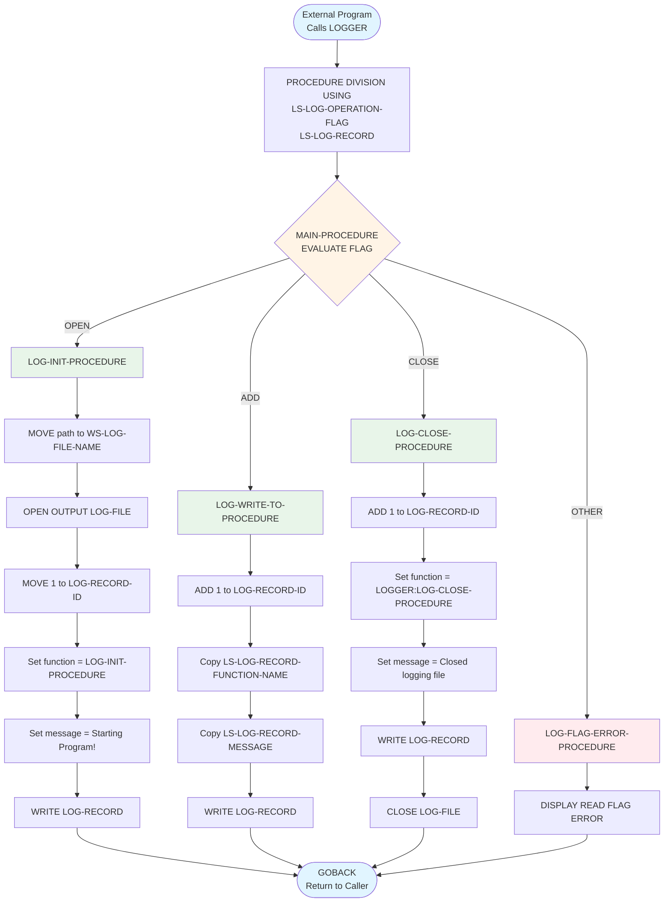
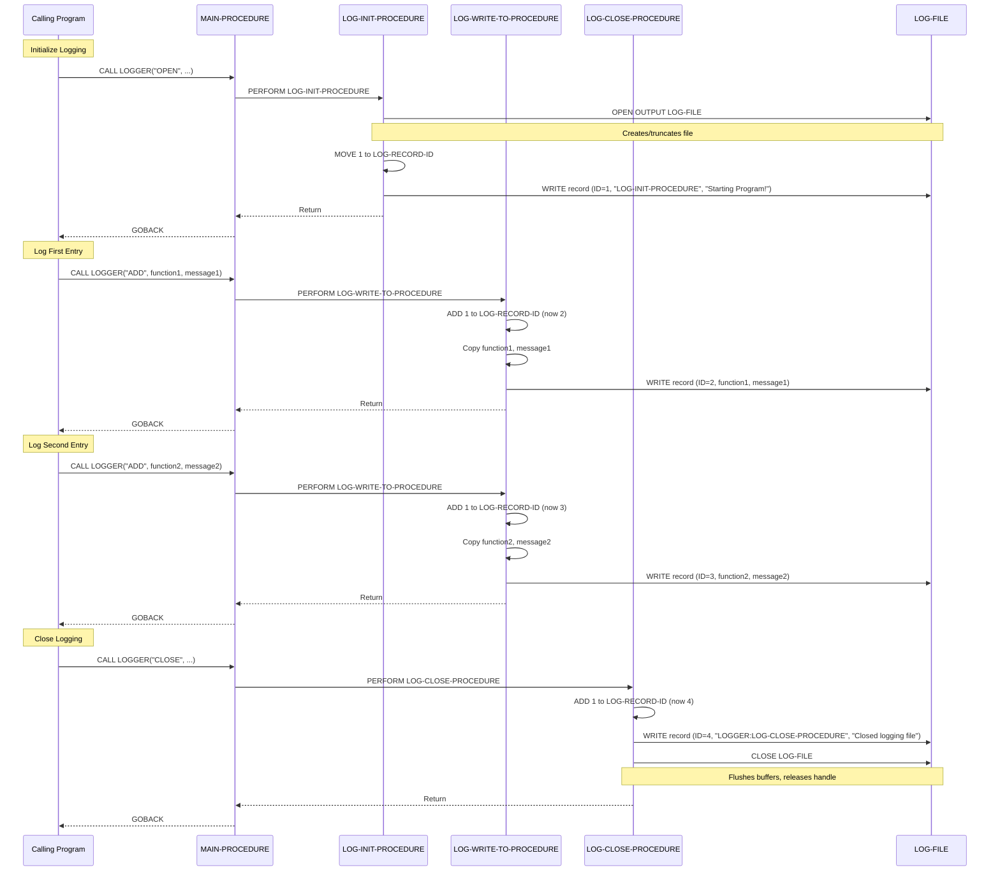
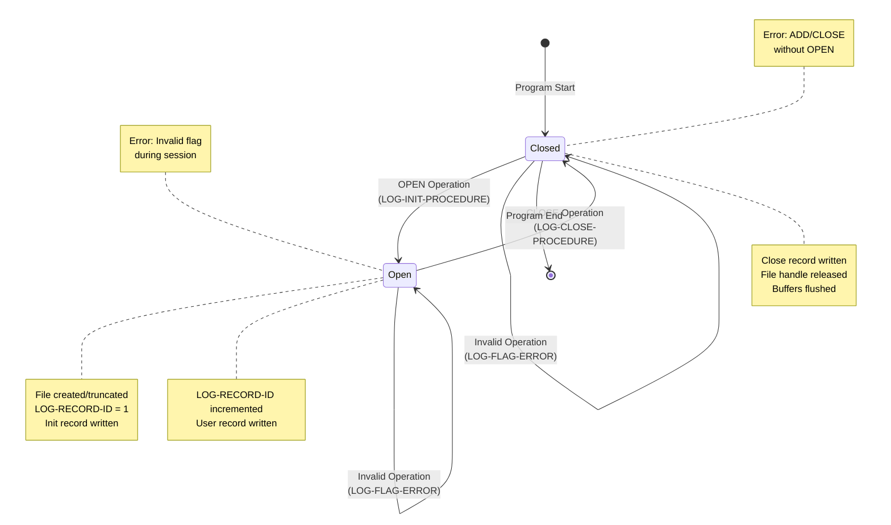
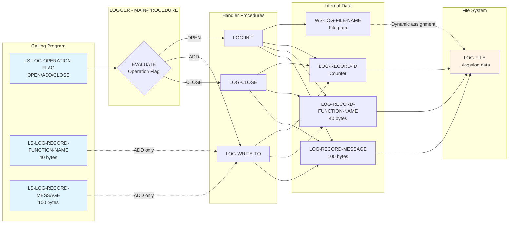
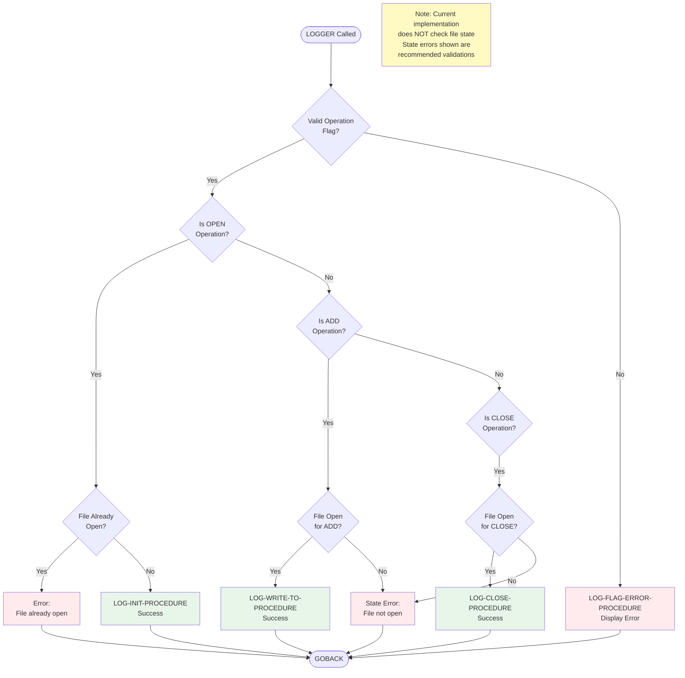
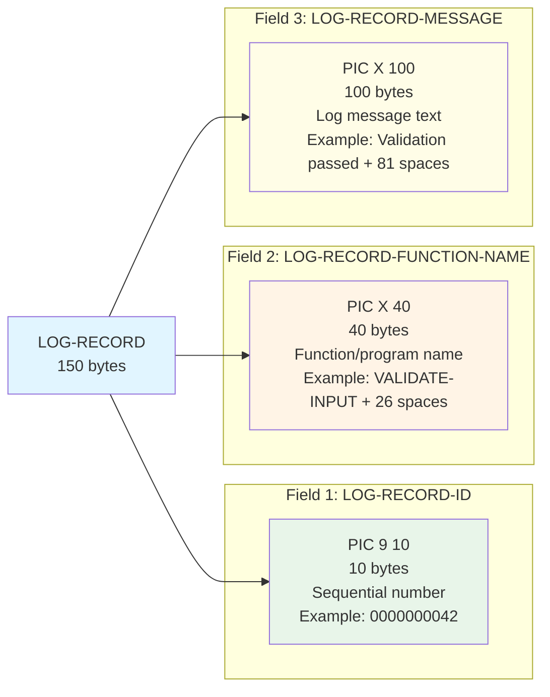

# LOGGER Mermaid Diagrams

**Program**: LOGGER  
**Repository**: lauryndbrown/Cisp  
**Last Updated**: January 20, 2026  
**Purpose**: Visual diagrams for understanding LOGGER program structure and flow

---

## Table of Contents

1. [Program Structure Diagram](#program-structure-diagram)
2. [Call Graph (Flowchart)](#call-graph-flowchart)
3. [Normal Logging Session Sequence](#normal-logging-session-sequence)
4. [State Machine Diagram](#state-machine-diagram)
5. [Data Flow Diagram](#data-flow-diagram)
6. [Error Handling Flow](#error-handling-flow)
7. [Record Structure](#record-structure)

---

## Program Structure Diagram

```mermaid
graph TB
    PROG[LOGGER Program]
    
    subgraph "IDENTIFICATION DIVISION"
        PID[PROGRAM-ID: LOGGER<br/>Author: Lauryn Brown<br/>Purpose: Log activity]
    end
    
    subgraph "ENVIRONMENT DIVISION"
        FC[FILE-CONTROL<br/>LOG-FILE: OPTIONAL, DYNAMIC<br/>LINE SEQUENTIAL]
    end
    
    subgraph "DATA DIVISION"
        FS[FILE SECTION<br/>LOG-RECORD 150 bytes]
        WS[WORKING-STORAGE<br/>WS-LOG-FILE-NAME 20 bytes]
        LS[LINKAGE SECTION<br/>LS-LOG-OPERATION-FLAG<br/>LS-LOG-RECORD]
    end
    
    subgraph "PROCEDURE DIVISION"
        MAIN[MAIN-PROCEDURE<br/>Dispatcher]
        INIT[LOG-INIT-PROCEDURE<br/>OPEN Handler]
        WRITE[LOG-WRITE-TO-PROCEDURE<br/>ADD Handler]
        CLOSE[LOG-CLOSE-PROCEDURE<br/>CLOSE Handler]
        ERROR[LOG-FLAG-ERROR-PROCEDURE<br/>Error Handler]
    end
    
    PROG --> PID
    PROG --> FC
    PROG --> FS
    PROG --> WS
    PROG --> LS
    PROG --> MAIN
    
    MAIN -->|WHEN "OPEN"| INIT
    MAIN -->|WHEN "ADD"| WRITE
    MAIN -->|WHEN "CLOSE"| CLOSE
    MAIN -->|WHEN OTHER| ERROR
    
    style PROG fill:#e1f5ff
    style MAIN fill:#fff4e6
    style INIT fill:#e8f5e9
    style WRITE fill:#e8f5e9
    style CLOSE fill:#e8f5e9
    style ERROR fill:#ffebee
```

---

## Call Graph (Flowchart)



---

## Normal Logging Session Sequence



---

## State Machine Diagram



---

## Data Flow Diagram



---

## Error Handling Flow



---

## Record Structure



### Record Layout Example

```
Byte Position:  1         11                                51                                                    151
                |---------|----------------------------------|---------------------------------------------------|
Field:          ID (10)   FUNCTION-NAME (40)                 MESSAGE (100)
                |---------|----------------------------------|---------------------------------------------------|
Example:        0000000001LOG-INIT-PROCEDURE                 Starting Program!                                        
                0000000002PROCESS-RECORDS                    Processed 1000 records successfully                      
                0000000003LOGGER:LOG-CLOSE-PROCEDURE        Closed logging file                                      
```

---

## LOG-RECORD-ID Mutation Timeline

```mermaid
graph TD
    START([Program Start])
    UNDEF[LOG-RECORD-ID: Undefined]
    
    OPEN_OP[OPEN Operation<br/>LOG-INIT-PROCEDURE]
    ID1[LOG-RECORD-ID = 1<br/>MOVE 1 TO LOG-RECORD-ID]
    WRITE1[WRITE: ID=1<br/>LOG-INIT-PROCEDURE<br/>Starting Program!]
    
    ADD1_OP[ADD Operation #1<br/>LOG-WRITE-TO-PROCEDURE]
    ID2[LOG-RECORD-ID = 2<br/>ADD 1 TO LOG-RECORD-ID]
    WRITE2[WRITE: ID=2<br/>User function<br/>User message]
    
    ADD2_OP[ADD Operation #2<br/>LOG-WRITE-TO-PROCEDURE]
    ID3[LOG-RECORD-ID = 3<br/>ADD 1 TO LOG-RECORD-ID]
    WRITE3[WRITE: ID=3<br/>User function<br/>User message]
    
    CLOSE_OP[CLOSE Operation<br/>LOG-CLOSE-PROCEDURE]
    ID4[LOG-RECORD-ID = 4<br/>ADD 1 TO LOG-RECORD-ID]
    WRITE4[WRITE: ID=4<br/>LOGGER:LOG-CLOSE-PROCEDURE<br/>Closed logging file]
    
    END([Program End<br/>Final ID = 4])
    
    START --> UNDEF
    UNDEF --> OPEN_OP
    OPEN_OP --> ID1
    ID1 --> WRITE1
    
    WRITE1 --> ADD1_OP
    ADD1_OP --> ID2
    ID2 --> WRITE2
    
    WRITE2 --> ADD2_OP
    ADD2_OP --> ID3
    ID3 --> WRITE3
    
    WRITE3 --> CLOSE_OP
    CLOSE_OP --> ID4
    ID4 --> WRITE4
    
    WRITE4 --> END
    
    style START fill:#e1f5ff
    style UNDEF fill:#ffebee
    style ID1 fill:#e8f5e9
    style ID2 fill:#e8f5e9
    style ID3 fill:#e8f5e9
    style ID4 fill:#e8f5e9
    style END fill:#e1f5ff
```



---

## File Operations Timeline

```mermaid
gantt
    title LOGGER File Operations Timeline
    dateFormat X
    axisFormat %s

    section File State
    Closed           :closed1, 0, 1s
    Open (Session)   :active, open1, 1s, 10s
    Closed           :closed2, 11s, 12s

    section Operations
    OPEN             :milestone, m1, 1s, 0s
    WRITE (Init)     :crit, w1, 1s, 1s
    WRITE (ADD #1)   :w2, 3s, 1s
    WRITE (ADD #2)   :w3, 5s, 1s
    WRITE (ADD #3)   :w4, 7s, 1s
    WRITE (Close)    :crit, w5, 10s, 1s
    CLOSE            :milestone, m2, 11s, 0s
    Buffer Flush     :crit, flush, 11s, 1s

    section Record ID
    ID = 1           :id1, 1s, 3s
    ID = 2           :id2, 3s, 2s
    ID = 3           :id3, 5s, 2s
    ID = 4           :id4, 7s, 3s
    ID = 5           :id5, 10s, 2s
```

---

## Usage Notes

### Rendering These Diagrams

These Mermaid diagrams can be rendered in:

1. **GitHub**: Native Mermaid support in markdown files
2. **VS Code**: Install "Markdown Preview Mermaid Support" extension
3. **Online**: [mermaid.live](https://mermaid.live/) - paste code to visualize
4. **Documentation Tools**: Sphinx, MkDocs, etc. with Mermaid plugins

### Customization

To modify these diagrams:
1. Copy the mermaid code block
2. Paste into [mermaid.live](https://mermaid.live/)
3. Edit and visualize changes
4. Copy back updated code

---

## Related Documentation

- **[logger_COMPREHENSIVE_DOC.md](logger_COMPREHENSIVE_DOC.md)** - Complete program documentation
- **[logger_CALL_GRAPH.md](logger_CALL_GRAPH.md)** - Text-based call graph with detailed analysis
- **[logger_DATA_DICTIONARY.md](logger_DATA_DICTIONARY.md)** - Data structure details
- **[logger_ERROR_HANDLING.md](logger_ERROR_HANDLING.md)** - Error scenarios and handling

---

## Expert Review Status

**⚠️ AI-GENERATED DOCUMENTATION**: These diagrams were generated by AI and should be reviewed by COBOL experts for accuracy.

**Review Checklist**:
- [ ] Verify diagrams accurately represent program flow
- [ ] Confirm state transitions are correct
- [ ] Validate sequence diagrams match actual execution
- [ ] Review data flow for completeness
- [ ] Verify error handling paths

**Expert Notes**: _[To be filled during review]_
