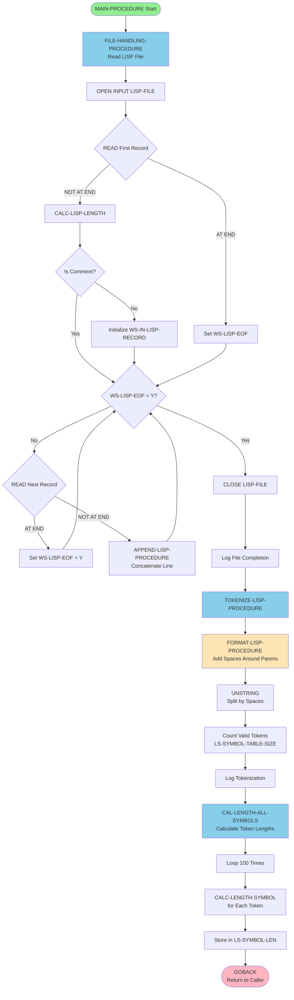
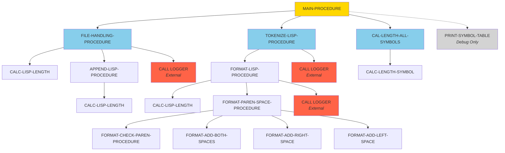
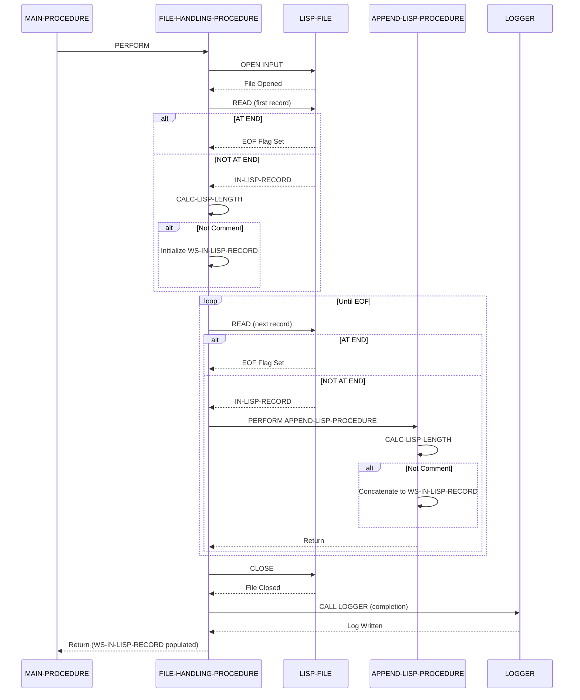
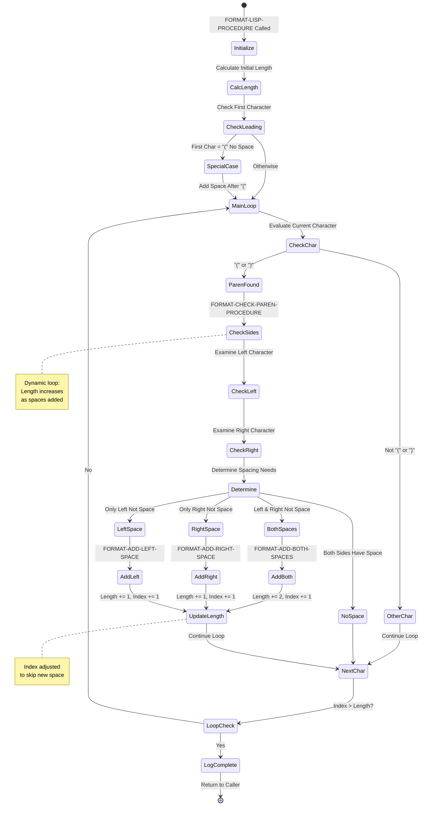
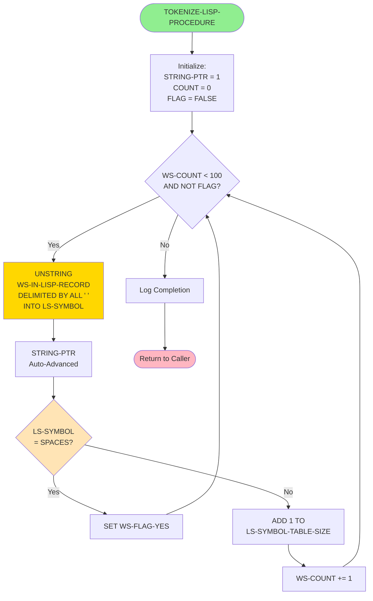
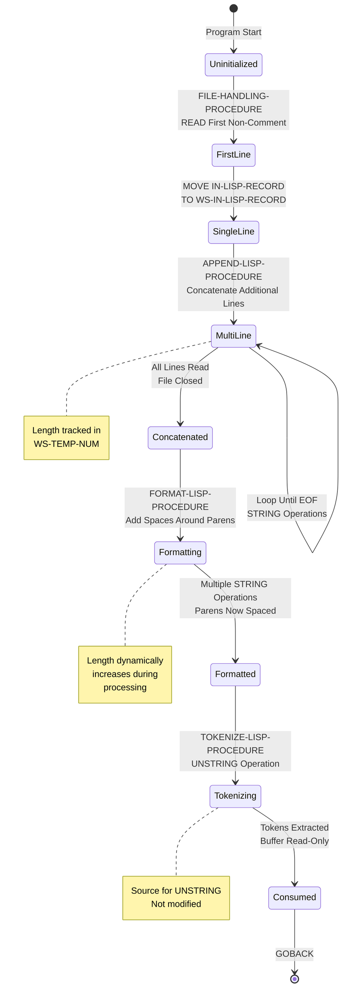
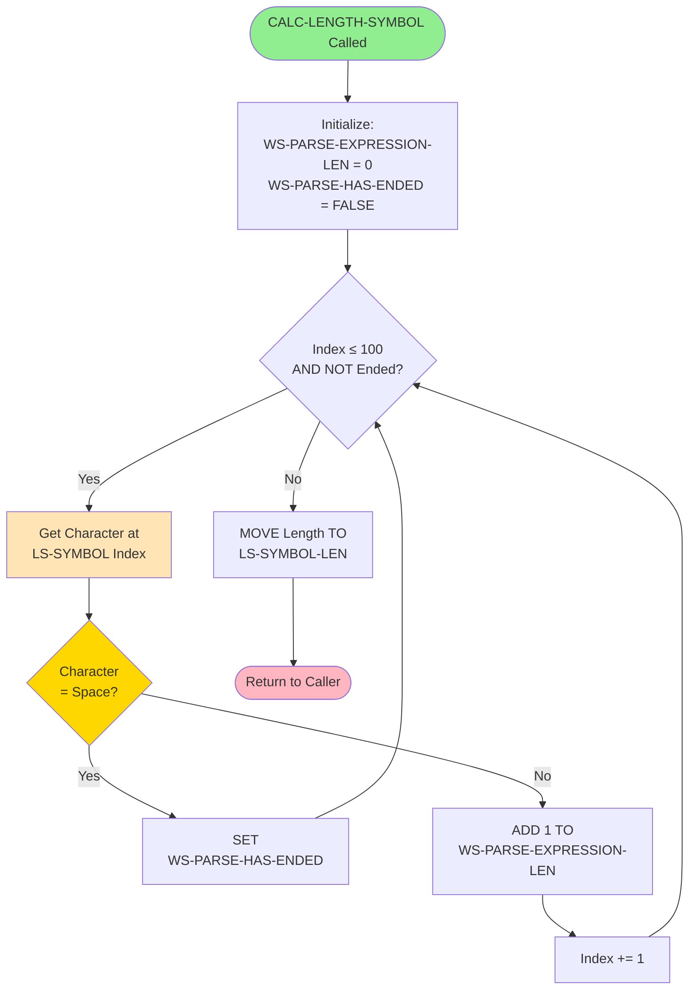

# TOKENIZER Program - Visual Diagrams (Mermaid)

## Program Information
- **Program Name**: TOKENIZER
- **Repository**: Cisp
- **Generated**: 2026-01-20

---

## Purpose

This document contains **mandatory** Mermaid visual representations of the TOKENIZER program structure. These diagrams are essential for:
- Understanding program flow without reading raw COBOL
- Knowledge transfer to developers unfamiliar with COBOL
- Identifying refactoring opportunities
- Documenting dependencies for modernization
- Compliance and audit documentation

All diagrams render automatically in GitHub, GitLab, VS Code (with Mermaid extension), and most modern Markdown viewers.

---

## 1. Program Flow Diagram

This flowchart shows the main processing logic from program start to end, including decision points and major processing sections.

**Key Insights**:
- Three main processing phases: File I/O → Tokenization → Length calculation
- Comment detection in file reading prevents invalid data from entering pipeline
- Fixed 100-iteration loop for length calculation (processes all array slots)
- No error handling paths (all errors cause runtime abend)

---

## 2. PERFORM Hierarchy (Call Graph)

This graph shows all paragraph call relationships, illustrating the program's modular structure.

**Key Insights**:
- Main procedure orchestrates 3 primary operations (clean separation of concerns)
- CALC-LISP-LENGTH is shared utility (called from 3 different procedures)
- Formatting has deepest nesting (4 levels: Main → Tokenize → Format → FormatParen → Add*)
- External dependency on LOGGER (3 audit points)
- Debug procedure (PRINT-SYMBOL-TABLE) isolated from main flow

---

## 3. Data Flow Diagram

This flowchart illustrates how data moves through the program from input file to output symbol table.

```mermaid
flowchart LR
    Input[(LISP-FILE<br/>Source Code)] --> ReadBuf[IN-LISP-RECORD<br/>Line Buffer]
    ReadBuf --> CalcStr[WS-CALC-LENGTH-STR<br/>Length Analysis]
    CalcStr --> Comment{Is Comment<br/>Semicolon?}
    Comment -->|Yes| Skip[Skip Line]
    Comment -->|No| Accum[WS-IN-LISP-RECORD<br/>Accumulated Buffer]
    
    Accum --> Format[WS-PAREN-TEMP-STR<br/>Formatting Buffer]
    Format --> Formatted[WS-IN-LISP-RECORD<br/>Spaced Parens]
    Formatted --> Unstring[UNSTRING<br/>Operation]
    
    Unstring --> SymArray[LS-SYMBOL Array<br/>100 Tokens]
    Unstring --> SymCount[LS-SYMBOL-TABLE-SIZE<br/>Token Count]
    
    SymArray --> LenCalc[Length<br/>Calculation]
    LenCalc --> LenArray[LS-SYMBOL-LEN Array<br/>Token Lengths]
    
    SymArray --> Output1[Output to Caller]
    SymCount --> Output1
    LenArray --> Output1
    Output1 --> Caller[CISP Program]
    
    style Input fill:#90EE90
    style ReadBuf fill:#FFE4B5
    style CalcStr fill:#FFE4B5
    style Accum fill:#87CEEB
    style Format fill:#FFE4B5
    style Formatted fill:#87CEEB
    style SymArray fill:#FFD700
    style SymCount fill:#FFD700
    style LenArray fill:#FFD700
    style Caller fill:#FFB6C1
```

**Key Insights**:
- Data flows through 4 distinct buffers (IN-LISP-RECORD → WS-IN-LISP-RECORD → WS-PAREN-TEMP-STR → LS-SYMBOL)
- Comment detection acts as filter (prevents invalid data from progressing)
- Single input file produces 3 outputs (symbol array, count, lengths)
- No intermediate file I/O (all processing in memory)

---

## 4. File I/O Operations Timeline

This sequence diagram shows all file operations in execution order, illustrating the read-process-close pattern.

**Key Insights**:
- Single file opened (LISP-FILE) - no output files
- Read operations: 1 initial + N loop iterations (N = line count)
- Comment filtering happens inline during reading (not post-processing)
- LOGGER called after file closed (ensures all I/O complete)
- File handle lifecycle: OPEN → READ (multiple) → CLOSE (clean pattern)

---

## 5. Formatting Algorithm State Diagram

This state diagram shows how the formatting procedure processes parentheses to add appropriate spacing.

**Key Insights**:
- State machine handles 4 spacing scenarios (both, left, right, none)
- Dynamic termination condition (length increases during processing)
- Special case handling for leading parenthesis (optimization)
- Index manipulation ensures newly inserted spaces aren't re-processed

---

## 6. Token Extraction Process

This flowchart details the tokenization logic using COBOL's UNSTRING operation.

**Key Insights**:
- UNSTRING is single operation (COBOL handles all parsing)
- `ALL ' '` delimiter collapses multiple spaces (treats as single delimiter)
- STRING-PTR automatically advanced by UNSTRING (tracks position)
- Early termination on SPACES (indicates no more tokens)
- Maximum 100 tokens (hard limit)

---

## 7. Variable Mutation Timeline

This diagram shows the lifecycle and state transitions of the primary data buffer (WS-IN-LISP-RECORD).

**Key Insights**:
- Buffer serves 3 distinct roles: accumulator, formatter target, tokenization source
- State transitions are one-way (no rollback or undo)
- Formatting phase most complex (multiple intermediate states)
- Final state is read-only consumption (buffer not modified by UNSTRING)

---

## 8. Symbol Length Calculation Flow

This flowchart shows the character-level scanning used to calculate actual token length.

**Key Insights**:
- Scans character-by-character until space found
- Fixed-length COBOL strings padded with spaces (need trimming)
- Maximum 100 characters scanned per token
- Length stored immediately after calculation (used by caller)

---

## Diagram Usage Guide

### Viewing Diagrams
- **GitHub/GitLab**: Native Mermaid rendering (automatic)
- **VS Code**: Install "Markdown Preview Mermaid Support" extension
- **Online**: https://mermaid.live (paste Mermaid code)
- **Export**: Mermaid Live Editor allows PNG/SVG export

### Editing Diagrams
1. Copy Mermaid code block
2. Paste into Mermaid Live Editor
3. Edit syntax (real-time preview)
4. Validate rendering
5. Copy back into documentation

### Mermaid Resources
- **Documentation**: https://mermaid.js.org/intro/
- **Syntax Guide**: https://mermaid.js.org/intro/syntax-reference.html
- **Examples**: https://mermaid.js.org/ecosystem/integrations.html

---

## Cross-References

These diagrams complement the following documentation:
- [tokenizer_COMPREHENSIVE_DOC.md](tokenizer_COMPREHENSIVE_DOC.md) - Narrative description
- [tokenizer_CALL_GRAPH.md](tokenizer_CALL_GRAPH.md) - Detailed call hierarchy
- [tokenizer_VARIABLE_MUTATIONS.md](tokenizer_VARIABLE_MUTATIONS.md) - State analysis
- [tokenizer_DATA_DICTIONARY.md](tokenizer_DATA_DICTIONARY.md) - Variable details

---

*These Mermaid diagrams are AI-generated and should be reviewed by COBOL experts for accuracy. Last updated: 2026-01-20*
