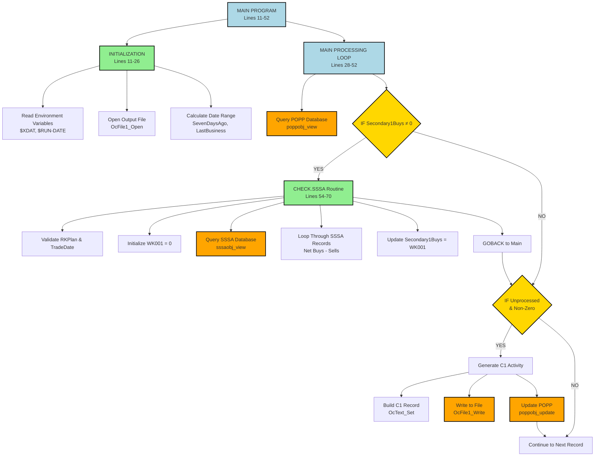
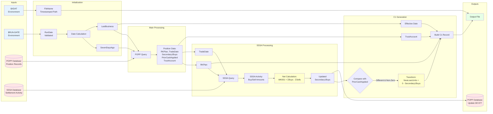
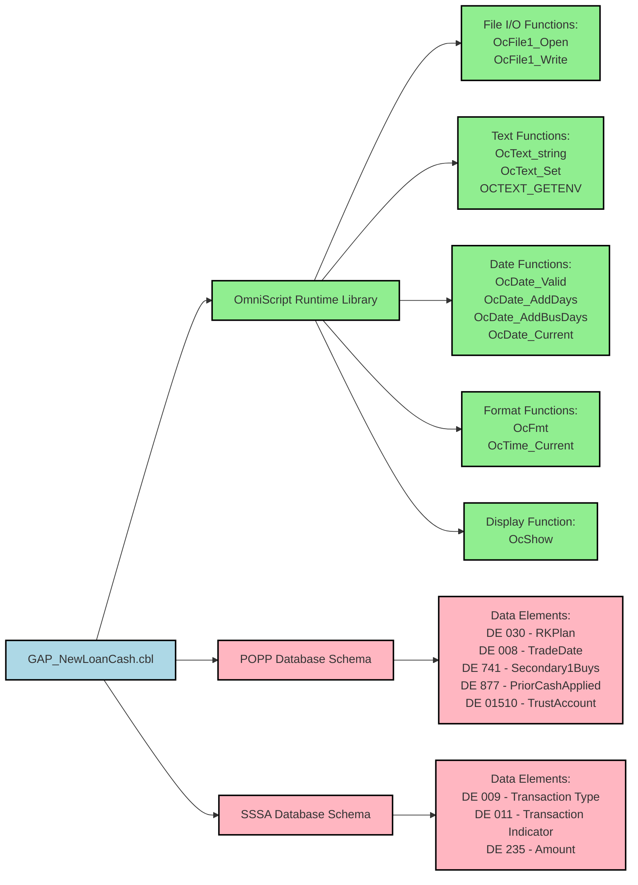
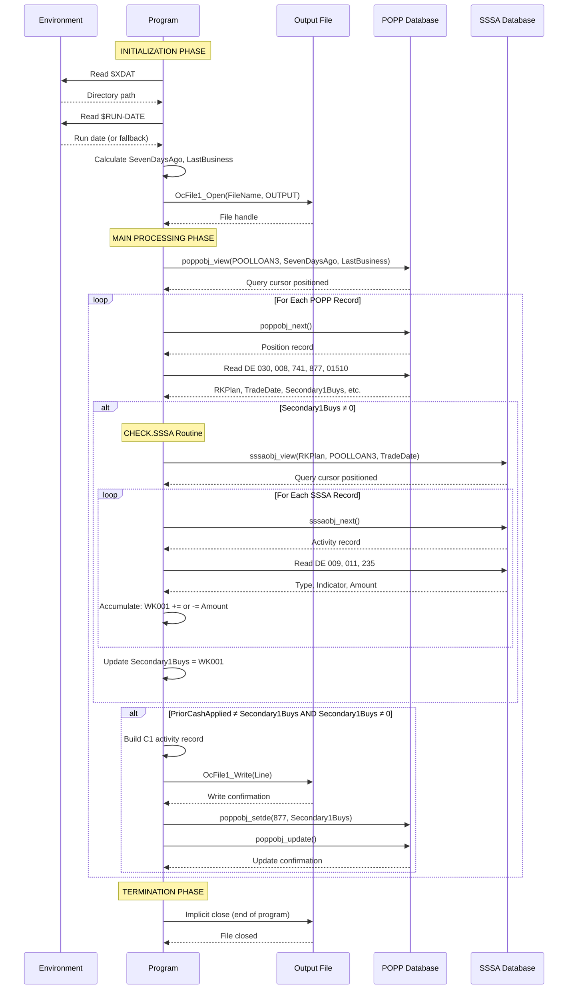
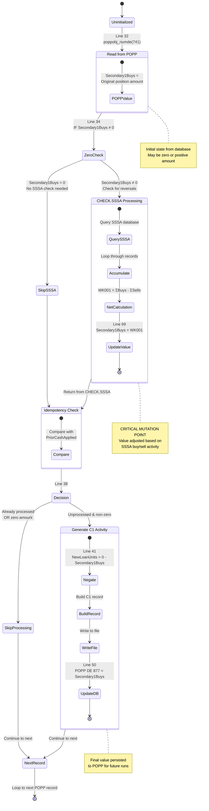
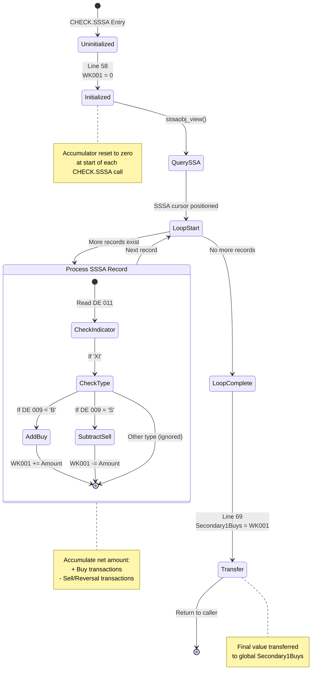

# GAP_NewLoanCash Visual Diagrams (Mermaid)

This document contains mandatory Mermaid diagrams for the GAP_NewLoanCash OmniScript program. These visualizations aid in understanding program flow, dependencies, and data transformations for modernization and knowledge transfer efforts.

---

## 1. Program Flow Diagram

This flowchart shows the main processing logic from program start to termination.

```mermaid
flowchart TD
    Start([Program Start]) --> Init1[Set sd080 = 99999999]
    Init1 --> Init2[Declare Variables]
    Init2 --> Init3[Construct FileName with Timestamp]
    Init3 --> Init4[Display FileName]
    Init4 --> Init5[Open Output File]
    Init5 --> Init6[Read $RUN-DATE Environment Variable]
    Init6 --> DateValid{Is RunDate Valid?}
    
    DateValid -->|YES| Calc1[SevenDaysAgo = RunDate - 7 days<br/>LastBusiness = RunDate - 1 business day]
    DateValid -->|NO| Calc2[SevenDaysAgo = Current - 7 days<br/>LastBusiness = Current - 1 business day]
    
    Calc1 --> Display1[Display Dates]
    Calc2 --> Display1
    
    Display1 --> QueryPOPP[Query POPP Database:<br/>POOLLOAN3 positions<br/>Date Range: SevenDaysAgo to LastBusiness]
    
    QueryPOPP --> LoopStart{More POPP<br/>Records?}
    
    LoopStart -->|NO| EndProgram([End Program])
    
    LoopStart -->|YES| ReadPOPP[Read Position Data:<br/>RKPlan, TradeDate<br/>Secondary1Buys, PriorCashApplied<br/>TrustAccount]
    
    ReadPOPP --> CheckZero{Secondary1Buys<br/>≠ 0?}
    
    CheckZero -->|YES| CallSSSA[PERFORM CHECK.SSSA<br/>Recalculate Secondary1Buys]
    CheckZero -->|NO| CheckIdem
    
    CallSSSA --> CheckIdem{PriorCashApplied<br/>≠ Secondary1Buys<br/>AND<br/>Secondary1Buys ≠ 0?}
    
    CheckIdem -->|NO<br/>Already Processed| LoopStart
    
    CheckIdem -->|YES<br/>New Activity| ReRead[Re-read Position Data]
    ReRead --> CalcUnits[Calculate:<br/>NewLoanUnits = 0 - Secondary1Buys]
    CalcUnits --> BuildRecord[Build C1 Activity Record:<br/>Type='C100', Plan, Date,<br/>Account, Amount, Code='00339']
    BuildRecord --> WriteFile[Write Record to Output File]
    WriteFile --> UpdatePOPP[Update POPP DE 877 = Secondary1Buys<br/>Mark as Processed]
    UpdatePOPP --> LoopStart
    
    style Start fill:#90EE90
    style EndProgram fill:#FFB6C1
    style CallSSSA fill:#ADD8E6
    style CheckIdem fill:#FFD700
    style WriteFile fill:#FFA500
    style UpdatePOPP fill:#FFA500
```

**Key Insights**: 
- Main processing loop handles records until EOF
- Two validation stages: zero check and idempotency check
- File write and DB update are sequential (not atomic - risk of duplicate records on failure)

---

## 2. PERFORM Hierarchy (Call Graph)

This graph shows all routine call relationships in the program.

**Key Insights**:
- Simple two-level hierarchy: Main → CHECK.SSSA
- CHECK.SSSA called conditionally (only for non-zero Secondary1Buys)
- No recursion, maximum call depth of 2

---

## 3. Data Flow Diagram

This diagram shows how data moves and transforms through the program.

**Key Insights**:
- Environment variables drive file naming and date calculations
- POPP provides primary position data
- SSSA provides adjustment/reversal data
- Secondary1Buys is the critical variable that flows through entire process
- Outputs are: C1 file records + POPP database updates

---

## 4. Copybook Dependencies

This program does not use traditional COBOL COPY statements. However, it has implicit dependencies on OmniScript runtime libraries and database schemas.

**Key Insights**:
- No traditional COPY books (native OmniScript program)
- Heavy dependency on OmniScript runtime library
- Direct coupling to POPP and SSSA database schemas
- Any schema changes to DE 030, 741, 877, 01510 in POPP would require program changes
- Any schema changes to DE 009, 011, 235 in SSSA would require program changes

---

## 5. File I/O Operations Timeline

This sequence diagram shows the order of file and database operations during execution.

**Key Insights**:
- File opened once at start, written multiple times during loop
- POPP query executed once, cursor iterated for all records
- SSSA query executed once per POPP record with non-zero Secondary1Buys (nested query pattern)
- File write and POPP update are sequential (not transactional - risk of inconsistency)
- No explicit file close (relies on program termination)

---

## 6. Variable Lifecycle State Diagrams

### Secondary1Buys Variable Lifecycle

This state diagram shows the critical transformations of the Secondary1Buys variable.

**State Descriptions**:
1. **Uninitialized**: Variable declared but not assigned
2. **ReadFromPOPP**: Initial value from POPP DE 741
3. **ZeroCheck**: Decision point - check SSSA or skip?
4. **CallSSSA**: Recalculation phase (may modify value)
5. **IdempotencyCheck**: Compare with previous run
6. **Decision**: Generate C1 or skip?
7. **GenerateC1**: Use in output and persist
8. **NextRecord**: Ready for next iteration

**State Transitions**:
- **Normal Path**: Uninitialized → ReadFromPOPP → CallSSSA → GenerateC1 → NextRecord
- **Zero Amount Path**: Uninitialized → ReadFromPOPP → SkipSSSA → SkipProcessing → NextRecord
- **Already Processed Path**: Uninitialized → ReadFromPOPP → CallSSSA → SkipProcessing → NextRecord

**Key Insights**:
- Secondary1Buys has one critical mutation point (CHECK.SSSA)
- Final state is persisted to database for future idempotency checks
- Value can transition from non-zero → zero (full reversal case)
- No validation of negative values (potential data integrity risk)

---

### WK001 Accumulator Lifecycle

**Key Insights**:
- WK001 is local to CHECK.SSSA routine, reset each call
- Accumulation pattern: sum of buys minus sum of sells
- Final value replaces Secondary1Buys (critical mutation)
- No bounds checking (risk of overflow with extreme values)

---

## Diagram Usage Guide

### For New Developers
**Recommended Order**:
1. **Program Flow Diagram** - Understand overall processing logic
2. **Data Flow Diagram** - See how data moves through the system
3. **Variable Lifecycle (Secondary1Buys)** - Understand critical variable mutations
4. **File I/O Timeline** - Grasp database and file interaction patterns

### For Maintenance Developers
**Focus Areas**:
1. **PERFORM Hierarchy** - Understand call relationships before modifying routines
2. **File I/O Timeline** - Identify transaction boundaries and error handling gaps
3. **Variable Lifecycle** - Trace mutation points when debugging data issues

### For Modernization Teams
**Key Diagrams**:
1. **Copybook Dependencies** - Identify external dependencies for migration
2. **Data Flow Diagram** - Map data transformations for new architecture
3. **Program Flow Diagram** - Identify refactoring opportunities

### For QA/Testing
**Testing Paths**:
1. **Program Flow Diagram** - Identify test scenarios (zero amounts, full reversals, etc.)
2. **Variable Lifecycle** - Create test cases for each state transition
3. **File I/O Timeline** - Design integration tests for database and file operations

---

## Mermaid Rendering Notes

These diagrams are written in Mermaid syntax and will render automatically in:
- GitHub/GitLab Markdown viewers
- VS Code with Mermaid Preview extension
- Mermaid Live Editor: https://mermaid.live
- Most modern documentation platforms (Confluence, Notion, etc.)

To validate or modify diagrams, copy the Mermaid code blocks to https://mermaid.live

---

*AI-Generated Documentation - Review with OmniScript/COBOL experts for accuracy. Diagrams represent interpreted program logic based on source code analysis.*
