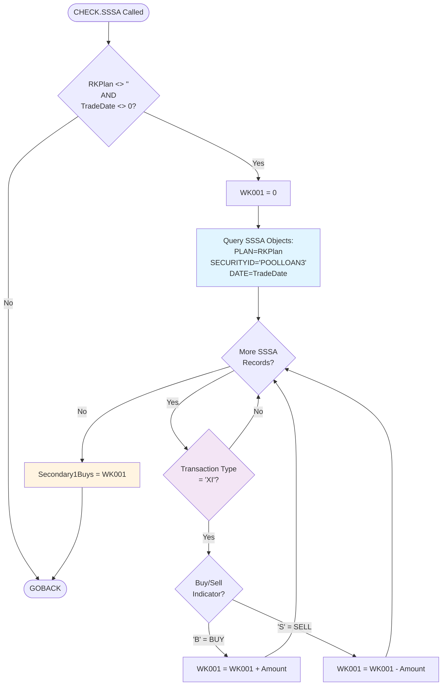

# GAP_NewLoanCash Call Graph

**Program**: GAP_NewLoanCash.cbl  
**Last Updated**: February 4, 2026  
**Purpose**: Document program flow, control structures, and routine relationships

---

## Program Structure Overview

```
GAP_NewLoanCash (Main Program)
├── Initialization (Lines 13-19)
├── Date Calculation (Lines 21-29)
├── Main Processing Loop (Lines 31-57)
│   ├── Position Object Iteration
│   ├── CHECK.SSSA Routine (Conditional, Line 38)
│   └── C1 Record Generation (Conditional, Lines 40-56)
└── CHECK.SSSA Routine Definition (Lines 59-75)
```

## Call Hierarchy

### Main Program → CHECK.SSSA
- **Call Site**: Line 38
- **Call Type**: PERFORM statement
- **Condition**: `If (Secondary1Buys <> 0)`
- **Frequency**: Once per position record with non-zero Secondary1Buys
- **Purpose**: Validate and adjust loan activity amounts by checking for reversals

**Data Flow**:
```
Main Program                     CHECK.SSSA Routine
─────────────                    ──────────────────
RKPlan           ─────────────→  [Input: RKPlan]
TradeDate        ─────────────→  [Input: TradeDate]
Secondary1Buys   ─────────────→  [Input: Original value]
                                 [Process: Query SSSA]
                                 [Calculate: Net BUYS - SELLS]
Secondary1Buys   ←─────────────  [Output: Updated value]
```

## Control Flow Diagram

```mermaid
flowchart TD
    Start([Program Start]) --> Init[Initialize sd080 = 99999999]
    Init --> BuildFile[Construct FileName from $XDAT]
    BuildFile --> OpenFile[Open Output File]
    OpenFile --> GetRunDate[Get $RUN-DATE from Environment]
    GetRunDate --> ValidDate{RunDate Valid?}
    
    ValidDate -->|Yes| CalcValid[SevenDaysAgo = RunDate - 7<br/>LastBusiness = RunDate - 1 Business Day]
    ValidDate -->|No| CalcCurrent[SevenDaysAgo = Current - 7<br/>LastBusiness = Current - 1 Business Day]
    
    CalcValid --> ShowDates[Display RunDate, SevenDaysAgo, LastBusiness]
    CalcCurrent --> ShowDates
    
    ShowDates --> QueryPos[Query Position Objects:<br/>POOLLOAN3, SevenDaysAgo to LastBusiness]
    QueryPos --> NextPos{More Position<br/>Records?}
    
    NextPos -->|No| EndProg([Program End])
    NextPos -->|Yes| ReadPos[Read Position Record:<br/>RKPlan, TradeDate, Secondary1Buys, PriorCashApplied, TrustAccount]
    
    ReadPos --> CheckSec{Secondary1Buys<br/><> 0?}
    CheckSec -->|Yes| CallCheck[PERFORM CHECK.SSSA]
    CheckSec -->|No| CheckPrior
    
    CallCheck --> CheckPrior{PriorCashApplied<br/><> Secondary1Buys<br/>AND<br/>Secondary1Buys <> 0?}
    CheckPrior -->|No| NextPos
    CheckPrior -->|Yes| CalcUnits[NewLoanUnits = 0 - Secondary1Buys]
    
    CalcUnits --> BuildRecord[Build C1 Record:<br/>- Type: C100<br/>- Plan: RKPlan<br/>- Date: LastBusiness<br/>- Account: TrustAccount<br/>- Units: NewLoanUnits<br/>- Code: 00339]
    
    BuildRecord --> WriteRecord[Write Record to Output File]
    WriteRecord --> UpdatePos[Update Position Object:<br/>UDF1 (DE 877) = Secondary1Buys]
    UpdatePos --> NextPos
    
    style CallCheck fill:#e1f5ff
    style CheckPrior fill:#fff4e1
    style WriteRecord fill:#e8f5e9
```

## CHECK.SSSA Routine Flow



## Database Operations Sequence

### Main Program Database Operations
1. **poppobj_view()** (Line 31): Query position objects for date range
2. **poppobj_next()** (Line 32): Iterate through position records (loop)
3. **poppobj_de(030)** (Line 33): Read RKPlan field
4. **poppobj_numde(008)** (Line 34): Read TradeDate field
5. **poppobj_numde(741)** (Line 35): Read Secondary1Buys field
6. **poppobj_numde(877)** (Line 36): Read PriorCashApplied field
7. **poppobj_de(01510)** (Line 44): Read TrustAccount field
8. **poppobj_setde(877, Secondary1Buys)** (Line 54): Update UDF1 field
9. **poppobj_update()** (Line 55): Commit position object changes

### CHECK.SSSA Database Operations
1. **sssaobj_view()** (Line 62): Query settlement activity records
2. **sssaobj_next()** (Line 63): Iterate through SSSA records (loop)
3. **sssaobj_de(011)** (Line 64): Read transaction type field
4. **sssaobj_de(009)** (Lines 65, 68): Read buy/sell indicator field
5. **sssaobj_numde(235)** (Lines 66, 69): Read transaction amount field

## File Operations Sequence

1. **OcText_string()** (Line 16): Construct output filename
2. **OcFile1_Open()** (Line 19): Open output file in OUTPUT mode
3. **Loop Processing**: For each qualifying position record:
   - **OcText_Set()** (Lines 45-52): Build C1 record string
   - **OcFile1_Write()** (Line 53): Write C1 record to file
4. **Implicit Close**: File closed at program termination

## Processing Flow Summary

### Initialization Phase
1. Set sd080 system variable
2. Build output filename from environment and timestamp
3. Open output file
4. Retrieve run date from environment
5. Calculate date range (7 days ago to last business day)

### Main Processing Loop
For each position record in date range:
1. **Read** position data (plan, date, amounts, account)
2. **Validate** Secondary1Buys amount via CHECK.SSSA if non-zero
3. **Check** if record needs processing (PriorCashApplied <> Secondary1Buys)
4. **Generate** C1 activity record if needed
5. **Write** C1 record to output file
6. **Update** position object with new PriorCashApplied value

### CHECK.SSSA Subroutine
1. **Validate** input parameters (plan and date)
2. **Query** SSSA for matching loan activity
3. **Net** BUY and SELL transactions
4. **Update** global Secondary1Buys variable

## Conditional Logic Summary

### Main Program Conditions

**Line 22: Date Validation**
```omniscript
if OcDate_Valid(RunDate);
```
- **Purpose**: Determine date calculation method
- **True Path**: Use RunDate from environment
- **False Path**: Use current system date as fallback

**Line 37: SSSA Check Trigger**
```omniscript
If (Secondary1Buys <> 0);
```
- **Purpose**: Optimize by skipping SSSA query for zero amounts
- **True Path**: Call CHECK.SSSA to validate amount
- **False Path**: Skip SSSA validation

**Line 40: Processing Gate**
```omniscript
if (PriorCashApplied <> Secondary1Buys) and (Secondary1Buys <> 0);
```
- **Purpose**: Idempotency check and zero-amount filter
- **True Path**: Generate C1 record and update position object
- **False Path**: Skip to next record (already processed or no activity)
- **Logic**: Prevents duplicate C1 records for previously processed positions

### CHECK.SSSA Conditions

**Line 60: Parameter Validation**
```omniscript
if (RKPlan <> '') and (TradeDate <> 0);
```
- **Purpose**: Ensure valid query parameters
- **True Path**: Proceed with SSSA query
- **False Path**: Exit routine immediately

**Line 64: Transaction Type Filter**
```omniscript
if sssaobj_de(011) = 'XI';
```
- **Purpose**: Filter for loan-related transactions only
- **True Path**: Process buy/sell logic
- **False Path**: Skip to next SSSA record

**Line 65: Buy Transaction**
```omniscript
if sssaobj_de(009) = 'B';
```
- **Purpose**: Identify purchase transactions
- **True Path**: Add amount to accumulator (cash outflow)

**Line 68: Sell Transaction**
```omniscript
if sssaobj_de(009) = 'S';
```
- **Purpose**: Identify sale/reversal transactions
- **True Path**: Subtract amount from accumulator (cash inflow)

## Variable Scope and Lifetime

### Global Variables (Program Lifetime)
- sd080, FileName, RunDate, SevenDaysAgo, LastBusiness
- RKPlan, TradeDate, Secondary1Buys, PriorCashApplied
- NewLoanUnits, TrustAccount

### Routine-Local Variables (CHECK.SSSA Lifetime)
- WK001: Exists only during CHECK.SSSA execution

### Implicit Variables (Database Cursors)
- poppobj cursor: Main loop iteration state
- sssaobj cursor: CHECK.SSSA loop iteration state

## Performance Characteristics

### Database Query Complexity
- **Main Query**: O(n) where n = position records in 7-day window
- **SSSA Queries**: O(m) where m = SSSA records per position (typically small)
- **Overall**: O(n * m) - nested loop structure

### File I/O
- **Writes**: One C1 record per qualifying position (filtered by conditions)
- **Updates**: One position object update per C1 record written
- **Batch Characteristics**: Sequential writes, suitable for large datasets

### Optimization Opportunities
1. Secondary1Buys check reduces SSSA queries (Line 37 guard)
2. PriorCashApplied check prevents duplicate processing
3. Early exit in CHECK.SSSA for invalid parameters

---

## Notes

1. **Idempotency**: Program can be re-run safely - PriorCashApplied prevents duplicate C1 records
2. **Date Handling**: Fallback logic ensures program runs even with invalid $RUN-DATE
3. **Reversals**: CHECK.SSSA routine correctly handles partial and full loan reversals
4. **Single Output File**: All C1 records written to one timestamped file per execution
5. **Position 92 Update**: C1 record format changed 06/27/2024 (GPD-1704) - position 92 value changed from 1 to 2

**Review Status**: Generated by automated analysis - requires expert validation of business logic flow and edge case handling
