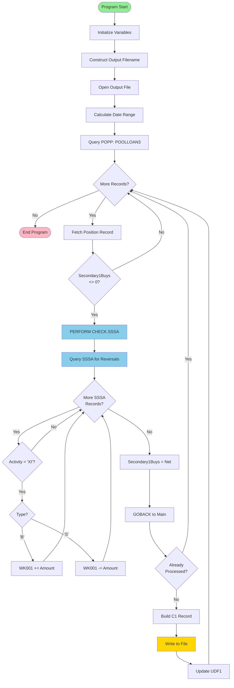

# GAP_NewLoanCash Call Graph

## Program Call Hierarchy

### Call Tree Structure
```
GAP_NewLoanCash (Main Program)
├── OcText_string() - Line 16
├── OCTEXT_GETENV() - Line 16
├── OcFmt() - Lines 16, 17, 47
├── OcDate_Current() - Lines 17, 26, 27
├── OcTime_Current() - Line 17
├── OcShow() - Lines 18, 29
├── OcFile1_Open() - Line 19
├── OcDate_Valid() - Line 22
├── OcDate_AddDays() - Lines 23, 26
├── OcDate_AddBusDays() - Lines 24, 27
├── poppobj_view() - Line 31
├── poppobj_next() - Line 32
├── poppobj_de() - Lines 33, 41, 44
├── poppobj_numde() - Lines 34, 35, 36, 42
├── PERFORM 'CHECK.SSSA' - Line 38
│   └── CHECK.SSSA (Routine)
│       ├── sssaobj_view() - Line 62
│       ├── sssaobj_next() - Line 63
│       ├── sssaobj_de() - Lines 64, 65, 68
│       └── sssaobj_numde() - Lines 66, 69
├── OcText_Set() - Lines 45-52
├── OcFile1_Write() - Line 53
├── poppobj_setde() - Line 54
└── poppobj_update() - Line 55
```

---

## Detailed Call Analysis

### Main Program Flow

#### Phase 1: Initialization and Setup (Lines 13-19)
```
sd080 = 99999999
  ↓
OcLVar_Define() - Define all global variables
  ↓
OcText_string() - Construct output filename
  ├── OCTEXT_GETENV('$XDAT')
  ├── OcFmt(OcDate_Current(), 'Z8')
  └── OcFmt(OcTime_Current(), 'Z6')
  ↓
OcShow(FileName) - Display filename
  ↓
OcFile1_Open(name:FileName mode:'OUTPUT') - Open output file
```

**Dependencies**:
- Environment variable: $XDAT
- File system: Write access to output directory
- System date/time functions

**Purpose**: Set up output file for C1 activity records

---

#### Phase 2: Date Range Calculation (Lines 21-29)
```
OCTEXT_GETENV('$RUN-DATE')
  ↓
OcText_tonum() - Convert to numeric date
  ↓
OcDate_Valid(RunDate) - Validate date
  ↓
[If Valid]                              [If Invalid]
  ↓                                       ↓
OcDate_AddDays(RunDate, -7)           OcDate_AddDays(OcDate_Current(), -7)
  ↓                                       ↓
OcDate_AddBusDays(RunDate, -1)        OcDate_AddBusDays(OcDate_Current(), -1)
  ↓                                       ↓
  └──────────────── [Merge] ─────────────┘
                      ↓
            OcShow(RunDate, SevenDaysAgo, LastBusiness)
```

**Dependencies**:
- Environment variable: $RUN-DATE (optional)
- System date functions
- Business day calendar (for OcDate_AddBusDays)

**Purpose**: Determine 7-day lookback window with business day boundaries

---

#### Phase 3: Main Processing Loop (Lines 31-57)
```
poppobj_view(securityid:'POOLLOAN3', datelo:SevenDaysAgo, datehi:LastBusiness)
  ↓
loop while poppobj_next()
  ↓
  ├── poppobj_de(030) → RKPlan
  ├── poppobj_numde(008) → TradeDate
  ├── poppobj_numde(741) → Secondary1Buys
  └── poppobj_numde(877) → PriorCashApplied
  ↓
  [If Secondary1Buys <> 0]
    ↓
    PERFORM 'CHECK.SSSA' → Modifies Secondary1Buys
  ↓
  [If (PriorCashApplied <> Secondary1Buys) and (Secondary1Buys <> 0)]
    ↓
    ├── poppobj_de(030) → RKPlan (re-fetch)
    ├── poppobj_numde(008) → TradeDate (re-fetch)
    ├── 0 - Secondary1Buys → NewLoanUnits
    └── poppobj_de(01510) → TrustAccount
    ↓
    Build C1 Record:
    ├── OcText_Set(Line, 1, 'C100', 4)
    ├── OcText_Set(Line, 5, RKPlan, 6)
    ├── OcText_Set(Line, 31, OcFmt(LastBusiness, 'Z8'), 8)
    ├── OcText_Set(Line, 40, TrustAccount, 32)
    ├── OcText_Set(Line, 73, '000000000000000    2', 20)
    ├── OcText_Set(Line, 115, '0', 1)
    ├── OcText_Set(Line, 116, OcFmt(NewLoanUnits, 'Z,12V2-'), 15)
    └── OcText_Set(Line, 134, '00339', 5)
    ↓
    OcFile1_Write(Line) - Write C1 record to file
    ↓
    poppobj_setde(denum:877, value:Secondary1Buys) - Mark as processed
    ↓
    poppobj_update() - Commit position record update
  ↓
endloop
```

**Dependencies**:
- POPP database (Plan Position)
- SSSA database (Secondary Activity)
- Output file (C1 records)

**Purpose**: Process position records, calculate net activity, generate C1 offsets

---

### CHECK.SSSA Routine (Lines 59-75)

```
ROUTINE 'CHECK.SSSA'
  ↓
  [If (RKPlan <> '') and (TradeDate <> 0)]
    ↓
    WK001 = 0
    ↓
    sssaobj_view(PLAN:RKPlan, SECURITYID:'POOLLOAN3', DATE:TradeDate)
    ↓
    loop while sssaobj_next()
      ↓
      [If sssaobj_de(011) = 'XI']
        ↓
        [If sssaobj_de(009) = 'B']
          ↓
          WK001 = WK001 + sssaobj_numde(235)
        ↓
        [If sssaobj_de(009) = 'S']
          ↓
          WK001 = WK001 - sssaobj_numde(235)
    ↓
    endloop
    ↓
    Secondary1Buys = WK001
  ↓
  GOBACK
```

**Dependencies**:
- SSSA database (Secondary Activity)
- Global variables: RKPlan, TradeDate, Secondary1Buys

**Purpose**: Calculate net loan activity by accounting for reversals

---

## Database Object Call Patterns

### poppobj (Plan Position Object)
| Operation | Line(s) | Purpose | Parameters |
|-----------|---------|---------|------------|
| poppobj_view() | 31 | Initialize query | securityid:'POOLLOAN3', datelo:SevenDaysAgo, datehi:LastBusiness |
| poppobj_next() | 32 | Fetch next record | None (loop iterator) |
| poppobj_de() | 33, 41, 44 | Get string field | DE 030 (RKPlan), DE 01510 (TrustAccount) |
| poppobj_numde() | 34, 35, 36, 42 | Get numeric field | DE 008 (TradeDate), DE 741 (Secondary1Buys), DE 877 (PriorCashApplied) |
| poppobj_setde() | 54 | Update field | DE 877 (set to Secondary1Buys) |
| poppobj_update() | 55 | Commit update | None |

**Call Sequence**: view → next (loop) → de/numde (read) → setde (write) → update (commit)

**Record Processing Count**: Variable (depends on 7-day window and POOLLOAN3 activity)

---

### sssaobj (Secondary Activity Object)
| Operation | Line(s) | Purpose | Parameters |
|-----------|---------|---------|------------|
| sssaobj_view() | 62 | Initialize query | PLAN:RKPlan, SECURITYID:'POOLLOAN3', DATE:TradeDate |
| sssaobj_next() | 63 | Fetch next record | None (loop iterator) |
| sssaobj_de() | 64, 65, 68 | Get string field | DE 011 (Activity Code), DE 009 (Transaction Type) |
| sssaobj_numde() | 66, 69 | Get numeric field | DE 235 (Transaction Amount) |

**Call Sequence**: view → next (loop) → de/numde (read)

**Record Processing Count**: Typically 1-3 per position record (buys and potential sells)

**Called From**: CHECK.SSSA routine only

---

## OmniScript Built-in Function Calls

### Date/Time Functions
| Function | Lines Called | Purpose | Return Type |
|----------|--------------|---------|-------------|
| OcDate_Current() | 17, 26, 27 | Get current system date | Numeric (date) |
| OcDate_Valid() | 22 | Validate date format | Boolean |
| OcDate_AddDays() | 23, 26 | Add calendar days | Numeric (date) |
| OcDate_AddBusDays() | 24, 27 | Add business days | Numeric (date) |
| OcTime_Current() | 17 | Get current system time | Numeric (time) |

**Call Pattern**: Date functions primarily used in initialization (Phase 2)

---

### File I/O Functions
| Function | Lines Called | Purpose | Return Type |
|----------|--------------|---------|-------------|
| OcFile1_Open() | 19 | Open output file | Status (implicit) |
| OcFile1_Write() | 53 | Write record to file | Status (implicit) |

**Call Pattern**: Open once (initialization), write per qualifying record (loop)

**File Handle**: OcFile1 (implicit channel 1)

---

### Text/String Functions
| Function | Lines Called | Purpose | Return Type |
|----------|--------------|---------|-------------|
| OcText_string() | 16 | Construct string with dynamic values | String |
| OcText_Set() | 45-52 | Set substring at position | None (modifies variable) |
| OcFmt() | 16, 17, 47, 50 | Format numeric values | String |
| OCTEXT_GETENV() | 16, 21 | Get environment variable | String |
| OcText_tonum() | 21 | Convert string to number | Numeric |

**Call Pattern**: Heavy text manipulation during C1 record construction (Lines 45-52)

---

### Display/Debug Functions
| Function | Lines Called | Purpose | Return Type |
|----------|--------------|---------|-------------|
| OcShow() | 18, 29 | Display values (logging) | None |

**Call Pattern**: Display key values at initialization (filename, dates)

---

## Call Frequency Analysis

### One-Time Initialization Calls
- OcFile1_Open() - Once per program execution
- OcDate calculation functions - Once per program execution
- OCTEXT_GETENV() - Twice per program execution

### Per-Record Calls (Main Loop)
- poppobj_next() - Once per position record
- poppobj_de/numde() - 4-6 times per position record
- CHECK.SSSA routine - Once per record with Secondary1Buys <> 0
- OcText_Set() - 8 times per qualifying record (C1 generation)
- OcFile1_Write() - Once per qualifying record
- poppobj_setde/update() - Once per qualifying record

### Per-Reversal-Record Calls (CHECK.SSSA Loop)
- sssaobj_next() - Once per SSSA transaction
- sssaobj_de/numde() - 2-3 times per transaction

### Estimated Total Call Volume (7-Day Window)
Assuming 50 position records, 30 with non-zero Secondary1Buys, 60 SSSA transactions:
- Main loop iterations: 50
- CHECK.SSSA invocations: 30
- SSSA loop iterations: 60
- C1 records written: ~25-30 (after duplicate filtering)
- Total function calls: ~1,500-2,000

---

## Critical Call Paths

### Path 1: New Loan with Reversal
```
poppobj_view → poppobj_next → poppobj_numde(741) → CHECK.SSSA
  → sssaobj_view → sssaobj_next (buy) → sssaobj_next (sell)
  → [Calculate net] → [Return to main]
  → OcText_Set (x8) → OcFile1_Write → poppobj_update
```

**Scenario**: Position has Secondary1Buys; SSSA has buy + sell; net > 0

**Expected Result**: C1 record written with net amount; UDF1 updated

---

### Path 2: Already Processed Record
```
poppobj_view → poppobj_next → poppobj_numde(741, 877)
  → [PriorCashApplied = Secondary1Buys]
  → [Skip to next record]
```

**Scenario**: Position UDF1 already matches Secondary1Buys

**Expected Result**: No C1 record; no database update; continue to next

---

### Path 3: Full Reversal
```
poppobj_view → poppobj_next → poppobj_numde(741) → CHECK.SSSA
  → sssaobj_view → sssaobj_next (buy) → sssaobj_next (sell - full amount)
  → [Calculate net = 0] → [Return to main]
  → [Secondary1Buys = 0, skip record]
```

**Scenario**: Buy and sell amounts equal; net activity is zero

**Expected Result**: No C1 record; no database update; continue to next

---

### Path 4: Simple New Loan (No Reversal)
```
poppobj_view → poppobj_next → poppobj_numde(741) → CHECK.SSSA
  → sssaobj_view → sssaobj_next (no records)
  → [WK001 = 0, Secondary1Buys unchanged] → [Return to main]
  → OcText_Set (x8) → OcFile1_Write → poppobj_update
```

**Scenario**: Position has Secondary1Buys; no SSSA records found

**Expected Result**: C1 record written with original amount; UDF1 updated

---

## Call Dependencies and Ordering

### Strict Ordering Requirements

1. **File Open Before Write**
   - OcFile1_Open() MUST precede any OcFile1_Write() calls
   - Violation: Program failure (file not open error)

2. **poppobj_view Before poppobj_next**
   - Database view MUST be initialized before iteration
   - Violation: No records returned or error

3. **poppobj_next Before Field Access**
   - Record MUST be fetched before poppobj_de/numde calls
   - Violation: Accessing invalid/stale data

4. **poppobj_setde Before poppobj_update**
   - Field changes MUST be staged before commit
   - Violation: No data updated

5. **CHECK.SSSA Before Secondary1Buys Use**
   - Reversal calculation MUST complete before using Secondary1Buys
   - Violation: Incorrect C1 amounts

### Flexible Ordering (No Dependencies)

- OcShow() calls can occur anywhere (debugging/logging only)
- OcDate_AddDays() vs OcDate_AddBusDays() order doesn't matter
- OcText_Set() calls within C1 construction (positions don't overlap)

---

## External System Dependencies

### Environment Variables (OCTEXT_GETENV)
1. **$XDAT** - Required
   - Purpose: Output directory path
   - Impact if Missing: File open failure
   - Default: None (error)

2. **$RUN-DATE** - Optional
   - Purpose: Specify processing date
   - Impact if Missing: Uses current date
   - Default: OcDate_Current()

### Database Systems
1. **POPP (Plan Position)**
   - Required: Always
   - Impact if Unavailable: Program failure
   - Rollback Behavior: Unknown (no explicit transaction management)

2. **SSSA (Secondary Activity)**
   - Required: Only if Secondary1Buys > 0
   - Impact if Unavailable: Incorrect net calculations
   - Rollback Behavior: Read-only (no updates)

### File System
1. **Output Directory**
   - Required: Always ($XDAT path)
   - Impact if Unavailable: File open failure
   - Permissions: Write access required

---

## Call Graph Visualization (Mermaid)



---

## Related Documentation
- [GAP_NewLoanCash Data Dictionary](GAP_NewLoanCash_DATA_DICTIONARY.md) - Variable definitions and usage
- [GAP_NewLoanCash Comprehensive Documentation](GAP_NewLoanCash_OVERVIEW.md) - Complete program overview
- [CHECK.SSSA Procedure](procedures/CHECK.SSSA.md) - Detailed procedure documentation
