# GAP_NewLoanCash Diagrams and Visualizations

## Program: GAP_NewLoanCash
**Purpose**: Visual representations of program flow, data flow, and architecture  
**Last Updated**: 2026-02-03

---

## 1. High-Level Process Flow

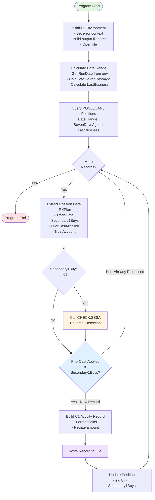

---

## 2. CHECK.SSSA Reversal Detection Flow

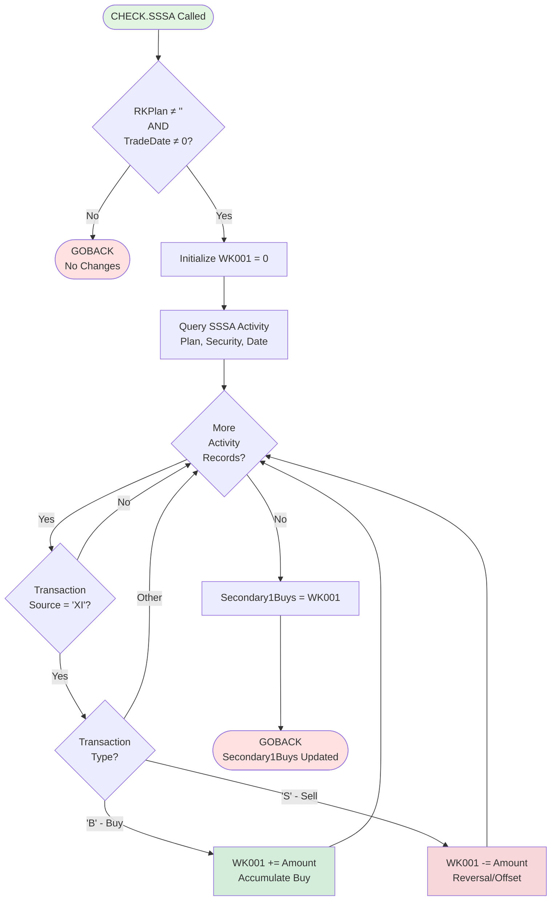

---

## 3. Data Flow Diagram

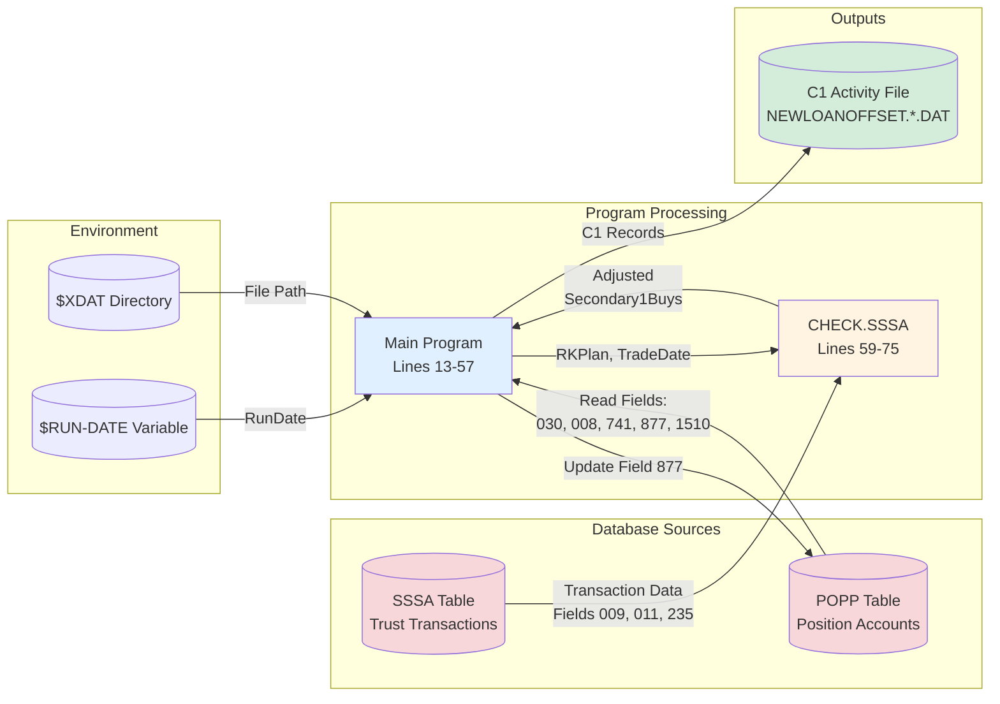

---

## 4. State Machine: Record Processing States

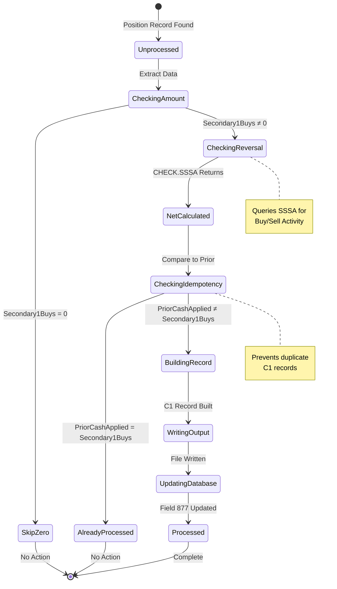

---

## 5. Sequence Diagram: Complete Processing Flow

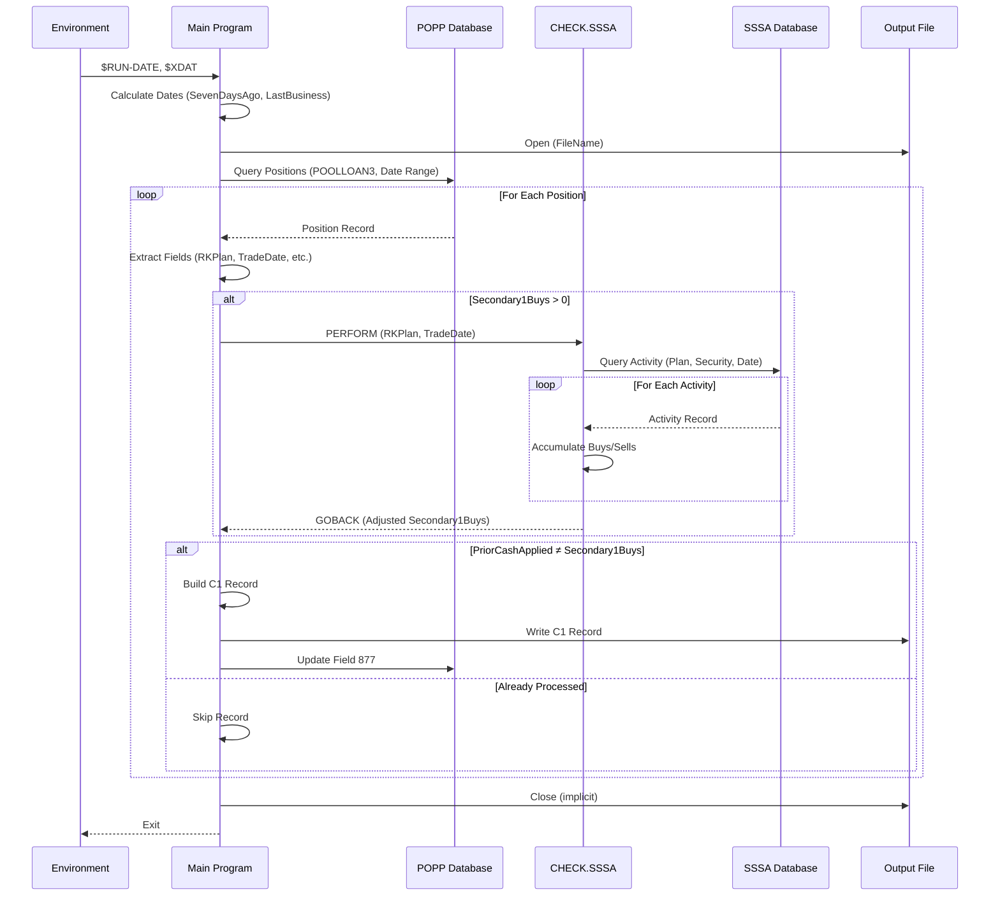

---

## 6. Entity Relationship: Database Schema

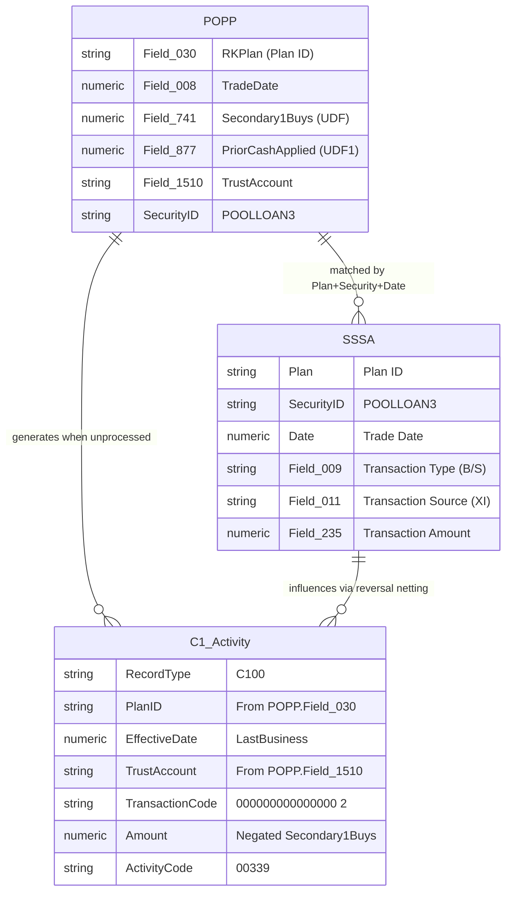

---

## 7. Component Interaction Diagram

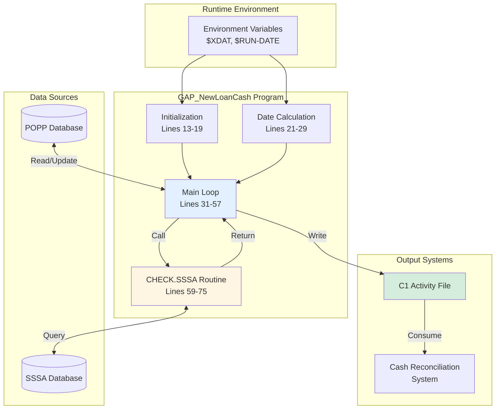

---

## 8. C1 Record Layout Diagram

```mermaid
block-beta
    columns 10
    
    block:header
        columns 1
        H["C1 Activity Record Layout<br/>(Fixed Length)"]
    end
    
    space
    
    block:RecType
        RT["Positions 1-4<br/>Record Type<br/>'C100'"]
    end
    
    block:Plan
        PL["Positions 5-10<br/>Plan ID<br/>(RKPlan)"]
    end
    
    block:Spacer1
        SP1["Positions 11-30<br/>Unused<br/>(20 bytes)"]
    end
    
    block:Date
        DT["Positions 31-38<br/>Effective Date<br/>(LastBusiness)"]
    end
    
    block:Spacer2
        SP2["Position 39<br/>Unused"]
    end
    
    block:Account
        AC["Positions 40-71<br/>Trust Account<br/>(32 bytes)"]
    end
    
    block:TxCode
        TX["Positions 73-92<br/>Transaction Code<br/>'000000000000000    2'"]
    end
    
    block:Spacer3
        SP3["Positions 93-114<br/>Unused<br/>(22 bytes)"]
    end
    
    block:Sign
        SG["Position 115<br/>Sign<br/>'0'"]
    end
    
    block:Amount
        AM["Positions 116-130<br/>Amount<br/>(NewLoanUnits)<br/>Format: Z,12V2-"]
    end
    
    block:Spacer4
        SP4["Positions 131-133<br/>Unused"]
    end
    
    block:ActCode
        CD["Positions 134-138<br/>Activity Code<br/>'00339'"]
    end
    
    style RT fill:#d4edda
    style PL fill:#d4edda
    style DT fill:#d4edda
    style AC fill:#d4edda
    style TX fill:#d4edda
    style AM fill:#f8d7da
    style CD fill:#d4edda
```

---

## 9. Timeline: Processing Sequence

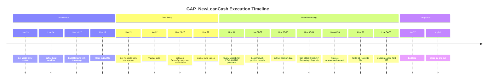

---

## 10. Decision Tree: Processing Logic

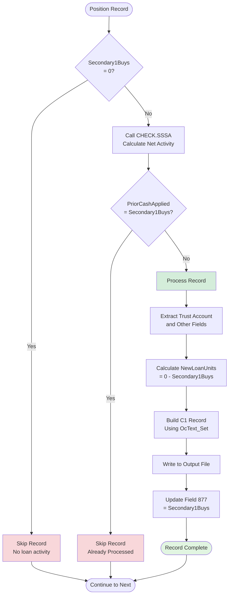

---

## 11. System Context Diagram

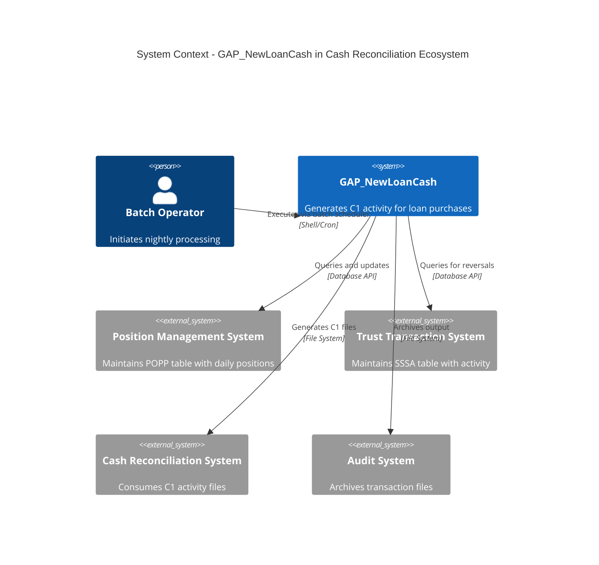

---

## 12. Deployment Diagram

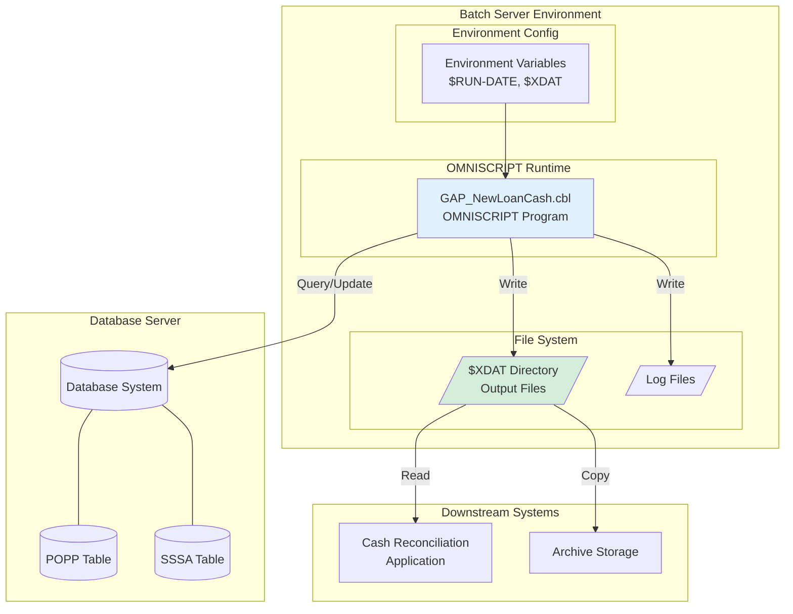

---

## Diagram Usage Guide

### Quick Reference

| Diagram | Best For | Use Case |
|---------|----------|----------|
| 1. Process Flow | Understanding overall logic | Initial code review, training |
| 2. Reversal Detection | Understanding CHECK.SSSA | Debugging reversal issues |
| 3. Data Flow | Understanding data movement | Integration analysis |
| 4. State Machine | Understanding record states | Troubleshooting status issues |
| 5. Sequence Diagram | Understanding timing/order | Performance analysis |
| 6. Entity Relationship | Understanding data structure | Database schema review |
| 7. Component Interaction | Understanding system integration | Architecture documentation |
| 8. Record Layout | Understanding C1 format | File format debugging |
| 9. Timeline | Understanding execution order | Step-by-step debugging |
| 10. Decision Tree | Understanding conditional logic | Business rule validation |
| 11. System Context | Understanding ecosystem | System architecture |
| 12. Deployment | Understanding infrastructure | Operations setup |

---

*These diagrams were created using Mermaid syntax and can be rendered in any Mermaid-compatible viewer.*  
*Last Generated*: 2026-02-03
