# GAP_NewLoanCash Diagrams

## Data Flow Diagram

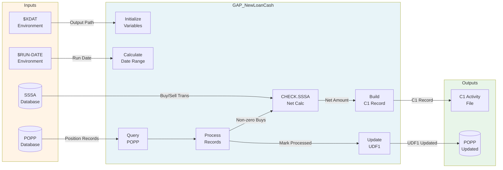

---

## State Transition Diagram

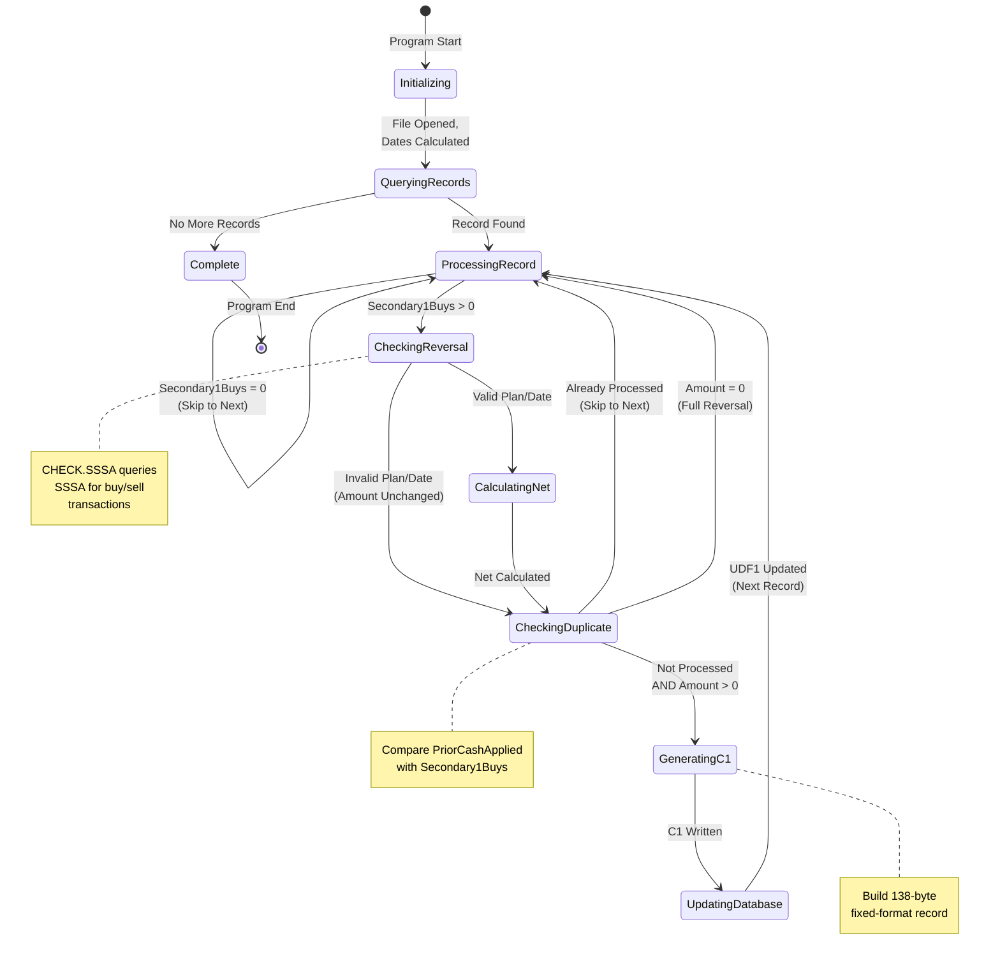

---

## Sequence Diagram: Main Processing Flow

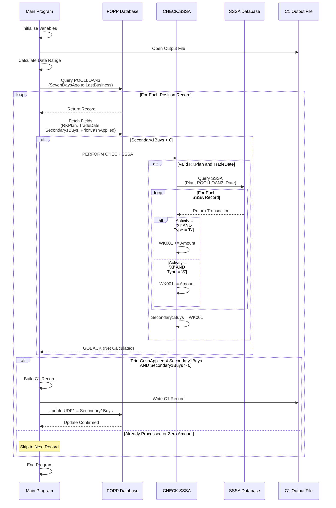

---

## Entity Relationship Diagram

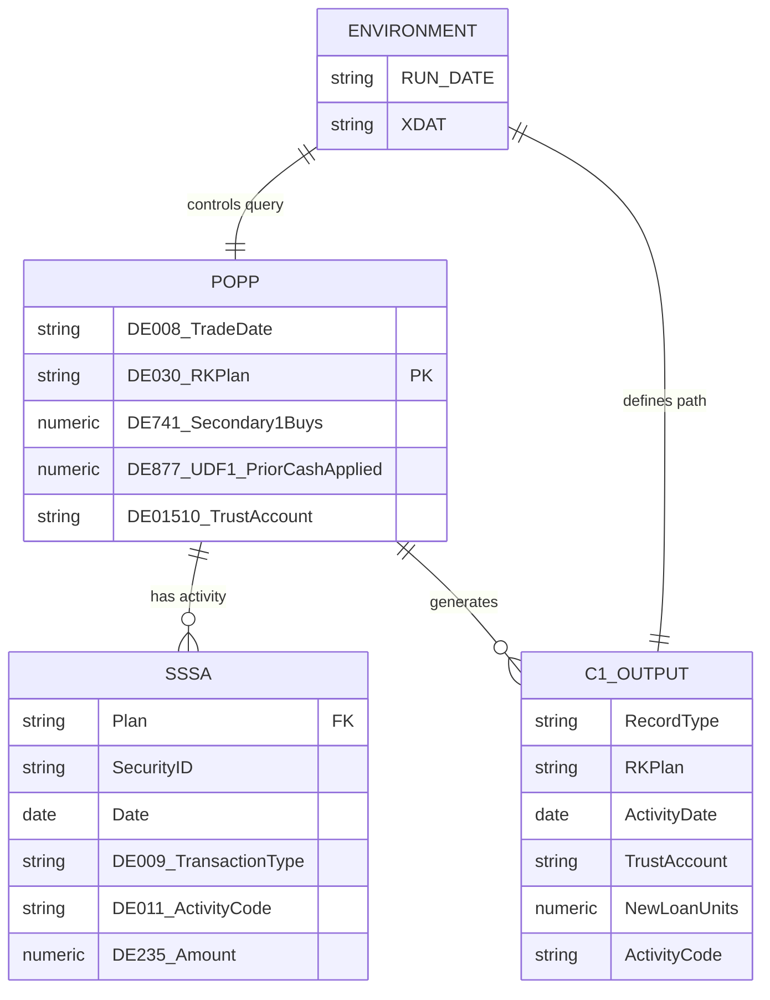

---

## Decision Tree: Record Processing Logic

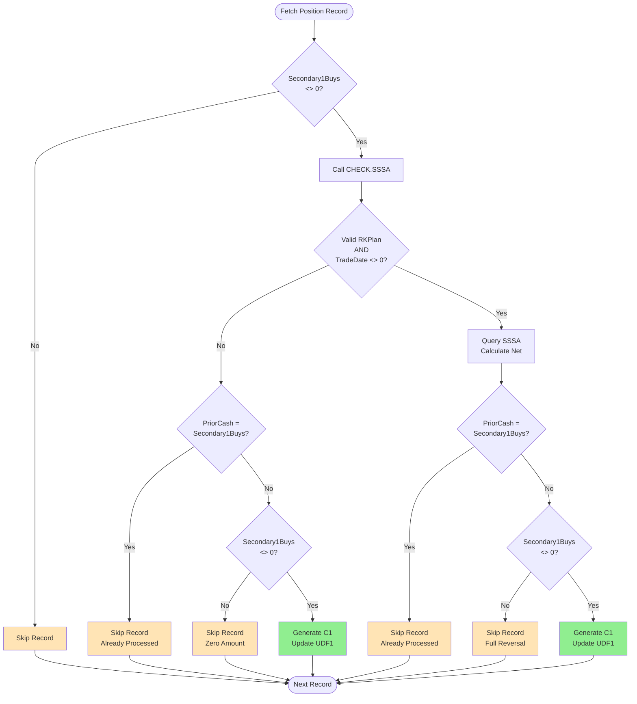

---

## Component Interaction Diagram

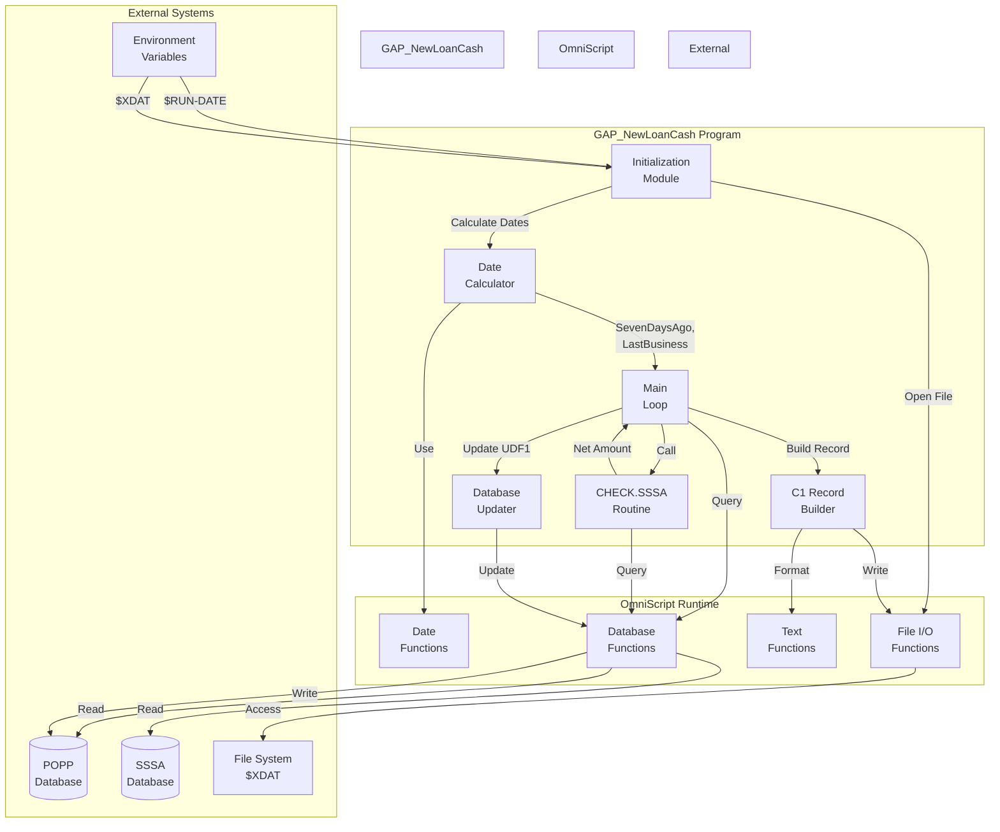

---

## Timeline: Processing Sequence

```mermaid
gantt
    title GAP_NewLoanCash Execution Timeline
    dateFormat X
    axisFormat %L ms
    
    section Initialization
    Set Variables           :0, 10
    Build Filename          :10, 20
    Open Output File        :20, 30
    
    section Date Calc
    Get Run Date            :30, 40
    Validate Date           :40, 50
    Calculate Ranges        :50, 80
    
    section Main Loop
    Query POPP              :80, 100
    
    Record 1 Processing     :100, 150
    CHECK.SSSA Call 1       :120, 140
    C1 Write 1              :145, 150
    UDF1 Update 1           :150, 155
    
    Record 2 Processing     :155, 180
    CHECK.SSSA Call 2       :165, 175
    Skip (Duplicate)        :180, 180
    
    Record 3 Processing     :180, 230
    CHECK.SSSA Call 3       :190, 220
    C1 Write 3              :225, 230
    UDF1 Update 3           :230, 235
    
    section Completion
    End Loop                :235, 240
    Close Resources         :240, 250
```

---

## Activity Diagram: CHECK.SSSA Routine

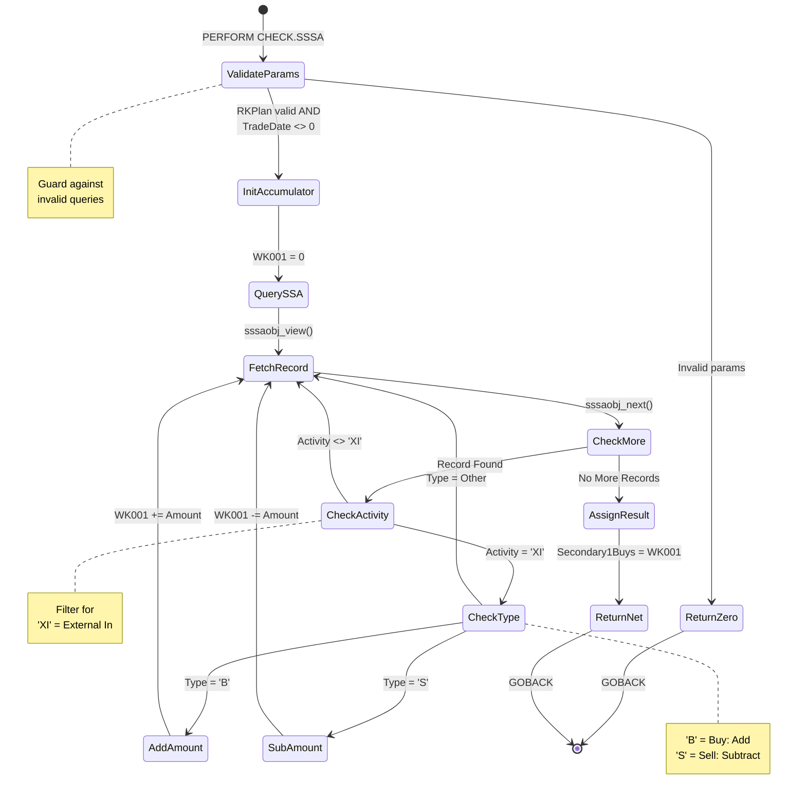

---

## Data Transformation Flow

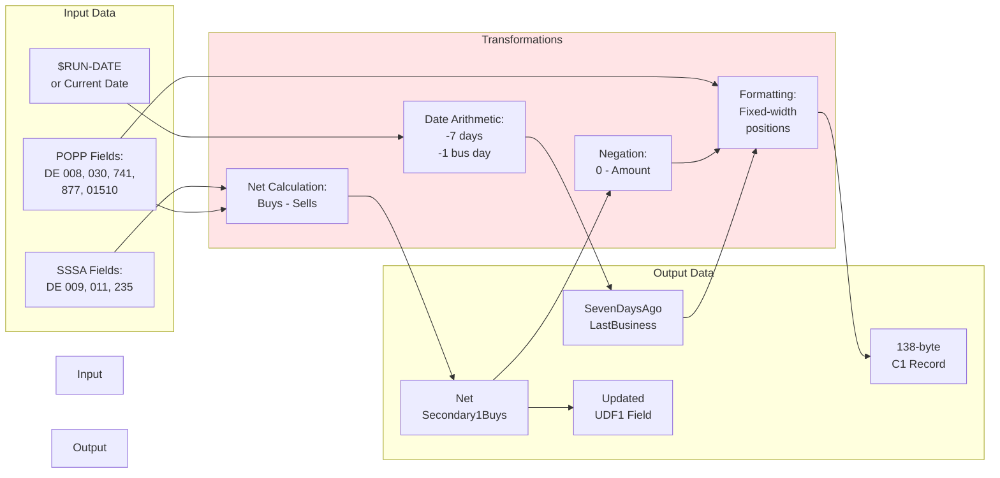

---

## Error Handling Flow

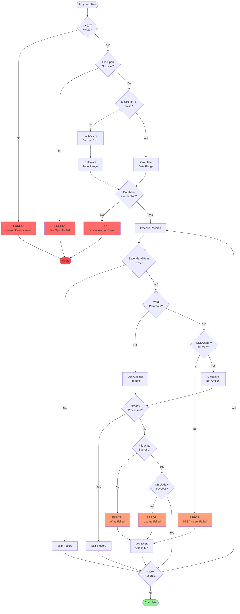

---

## C1 Record Format Diagram

```mermaid
graph LR
    subgraph C1 Record Structure - 138 Bytes
        direction TB
        
        P1["Pos 1-4<br/>'C100'<br/>(Type)"]
        P2["Pos 5-10<br/>RKPlan<br/>(6 chars)"]
        P3["Pos 11-30<br/>(Unused)"]
        P4["Pos 31-38<br/>Date<br/>(YYYYMMDD)"]
        P5["Pos 39<br/>(Unused)"]
        P6["Pos 40-71<br/>TrustAccount<br/>(32 chars)"]
        P7["Pos 72<br/>(Unused)"]
        P8["Pos 73-92<br/>Type/Pos<br/>'...2'<br/>(20 chars)"]
        P9["Pos 93-114<br/>(Unused)"]
        P10["Pos 115<br/>Sign<br/>'0'"]
        P11["Pos 116-130<br/>Amount<br/>Z,12V2-<br/>(15 chars)"]
        P12["Pos 131-133<br/>(Unused)"]
        P13["Pos 134-138<br/>Activity<br/>'00339'<br/>(5 chars)"]
    end
    
    style P1 fill:#FFE4E6
    style P2 fill:#E8F5E9
    style P4 fill:#E8F5E9
    style P6 fill:#E8F5E9
    style P8 fill:#FFF9C4
    style P10 fill:#FFE4E6
    style P11 fill:#E8F5E9
    style P13 fill:#FFF9C4
```

---

## Related Documentation
- [GAP_NewLoanCash Overview](GAP_NewLoanCash_OVERVIEW.md)
- [GAP_NewLoanCash Call Graph](GAP_NewLoanCash_CALL_GRAPH.md)
- [GAP_NewLoanCash Data Dictionary](GAP_NewLoanCash_DATA_DICTIONARY.md)
- [CHECK.SSSA Procedure](procedures/CHECK.SSSA.md)
