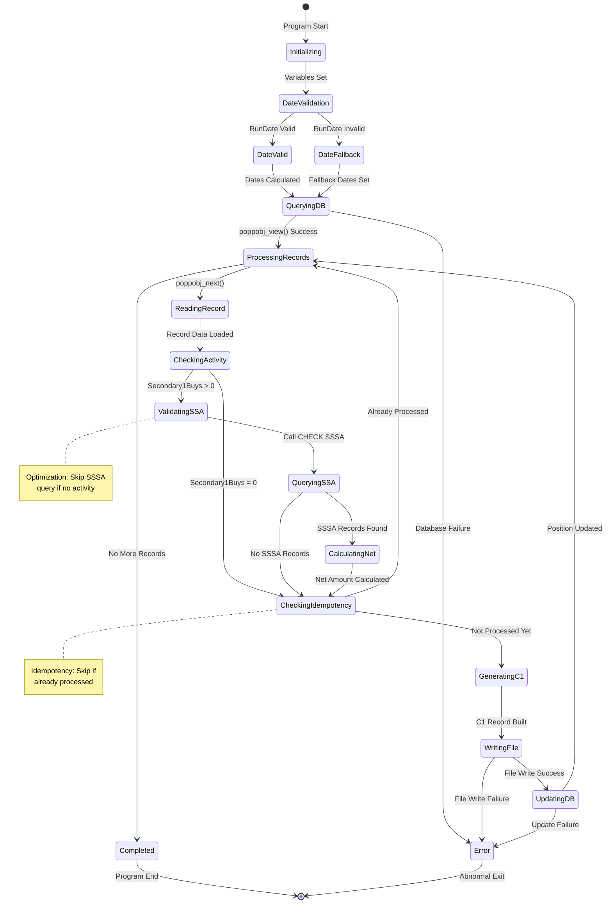
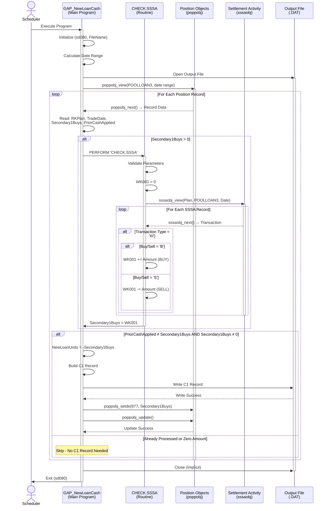
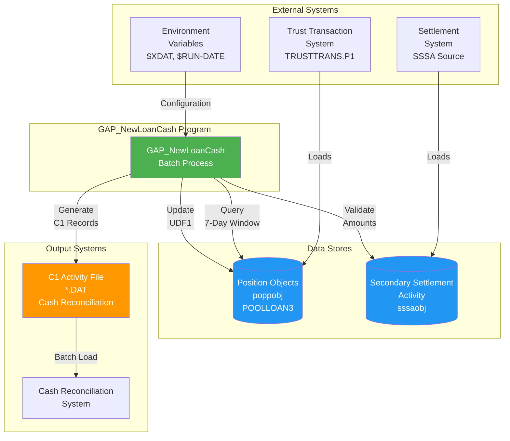
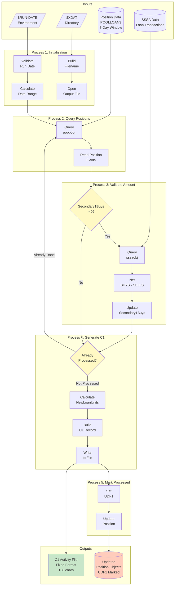
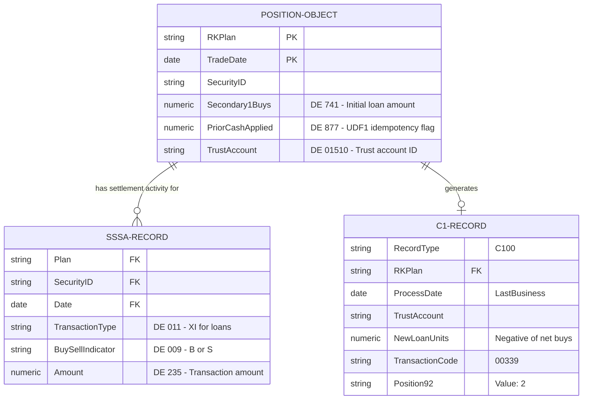
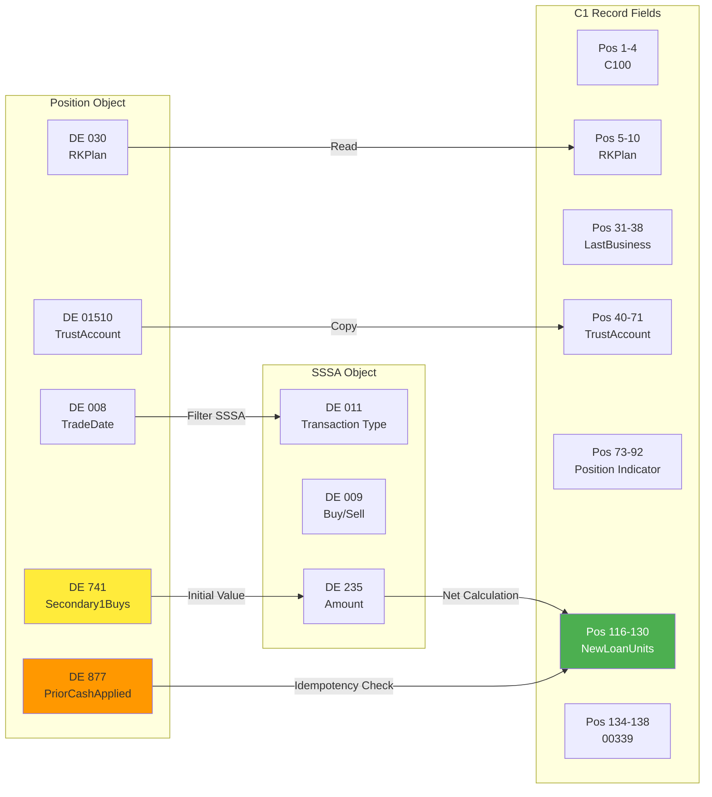
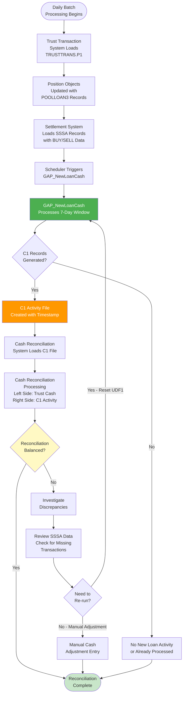
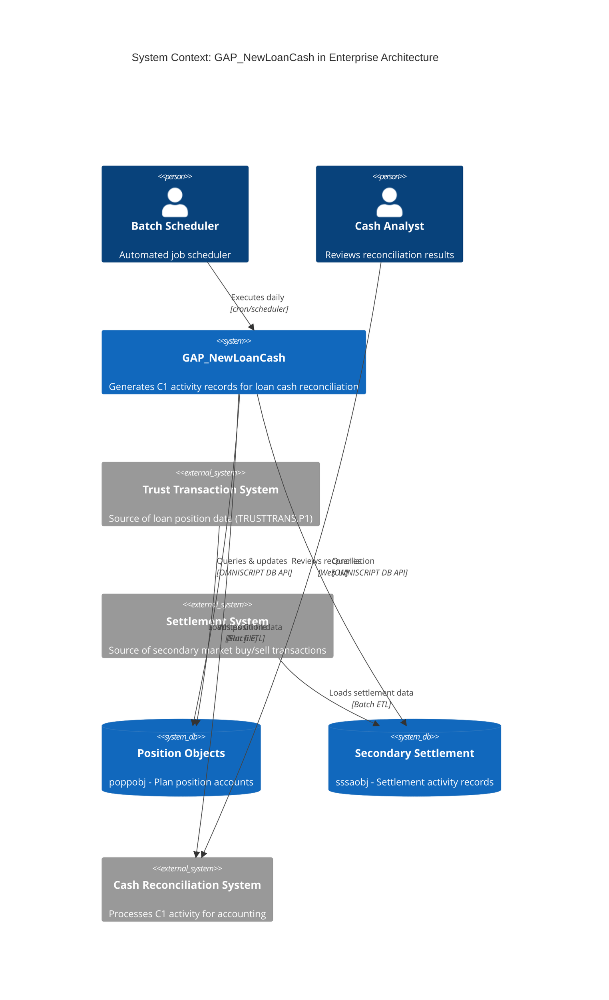
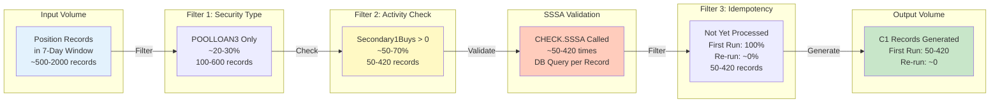
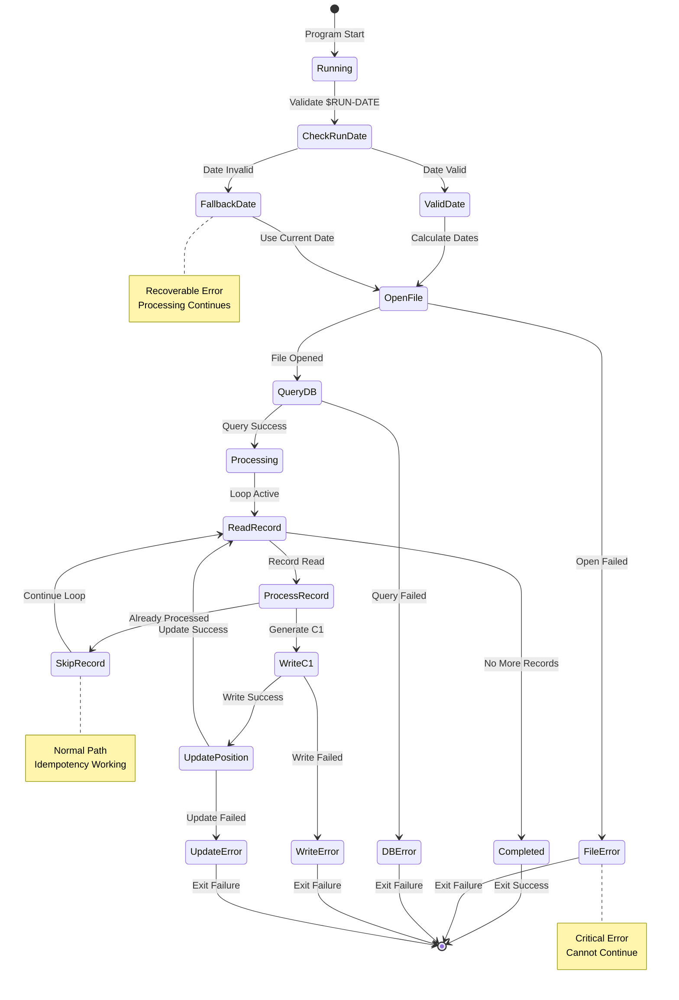

# GAP_NewLoanCash - Diagrams and Visualizations

**Program**: GAP_NewLoanCash.cbl  
**Last Updated**: February 4, 2026  
**Purpose**: Visual representations of program logic, data flow, and system interactions

---

## Table of Contents

1. [State Machine Diagram](#state-machine-diagram)
2. [Sequence Diagram](#sequence-diagram)
3. [Data Flow Diagram](#data-flow-diagram)
4. [Entity Relationship Diagram](#entity-relationship-diagram)

---

## State Machine Diagram

### Program Execution States

This diagram shows the lifecycle states of the program execution and position record processing.

---

## Sequence Diagram

### Main Program Flow with CHECK.SSSA Interaction

This diagram shows the interaction between the main program, databases, and the CHECK.SSSA routine.

---

## Data Flow Diagram

### Level 0: System Context

### Level 1: Detailed Data Flow

---

## Entity Relationship Diagram

### Database Objects and Relationships

### Data Element Cross-Reference

---

## Business Process Diagram

### Loan Cash Reconciliation Workflow

---

## Integration Architecture

### System Integration Points

---

## Performance Visualization

### Processing Volume by Phase

---

## Error State Diagram

### Error Handling State Transitions

---

## Notes

All diagrams follow Mermaid syntax and can be rendered in GitHub, GitLab, and most Markdown viewers with Mermaid support.

For diagram updates or modifications, edit the Mermaid code blocks directly and preview in a Mermaid-compatible viewer.

**Review Status**: Generated by automated analysis - diagrams represent inferred logic and should be validated by OmniScript experts

**Generated**: February 4, 2026
