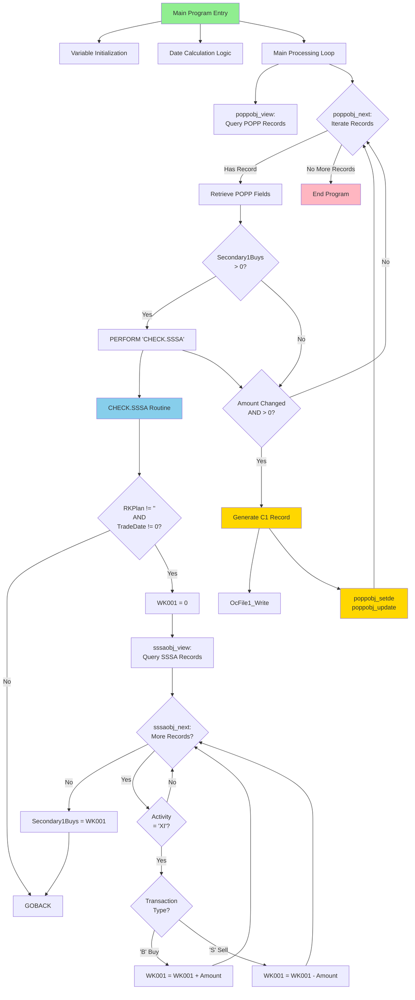
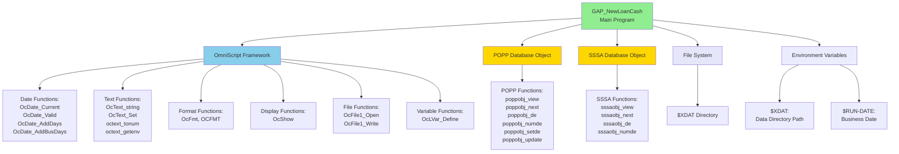
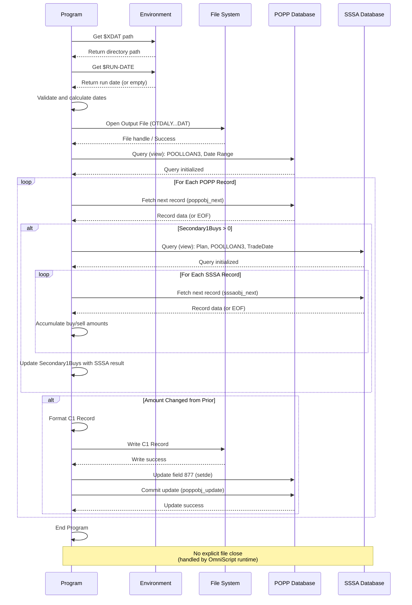
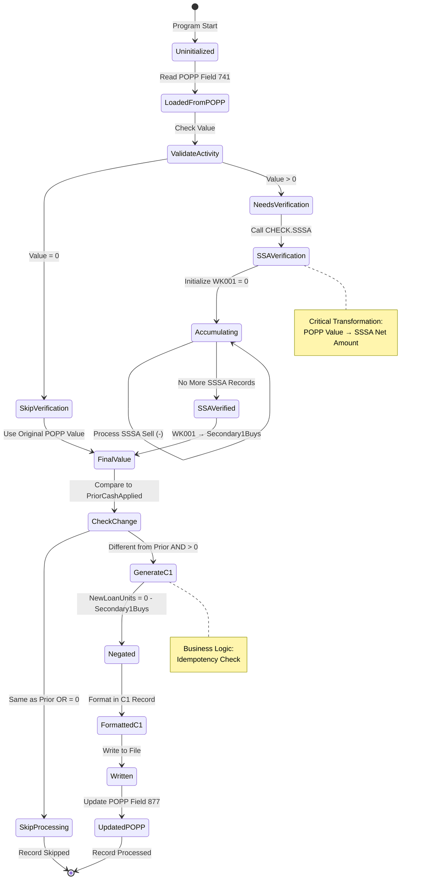
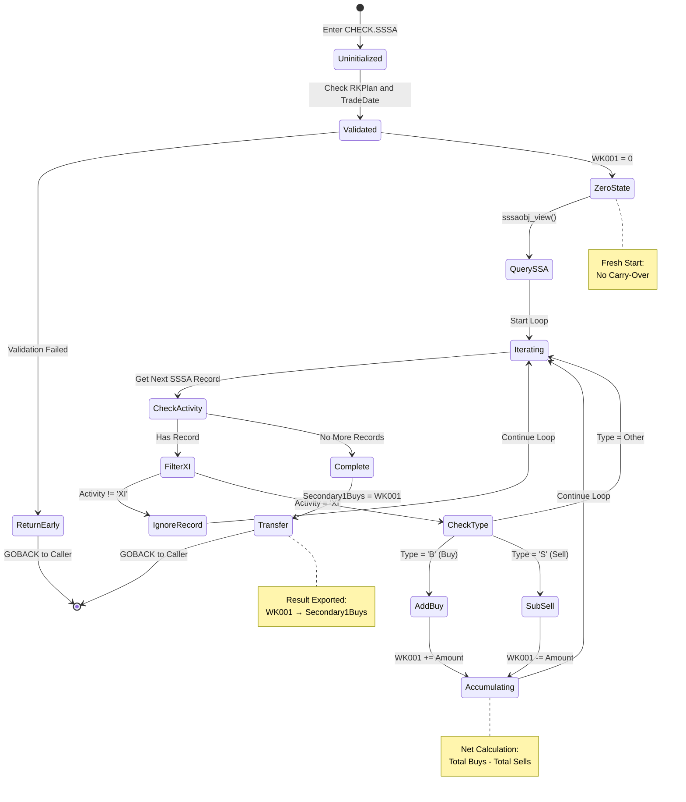

# GAP_NewLoanCash Visual Diagrams

This document contains Mermaid-based visual representations of the GAP_NewLoanCash OmniScript program to aid in understanding program flow, dependencies, and data transformations.

---

## 1. Program Flow Diagram

This flowchart shows the main processing logic from program start to end, including decision points and loop structures.

```mermaid
flowchart TD
    Start([Program Start]) --> Init[Initialize Variables<br/>sd080 = 99999999<br/>Define Variables]
    Init --> BuildFile[Construct Filename<br/>from $XDAT + Date/Time]
    BuildFile --> OpenFile[Open Output File<br/>OcFile1_Open]
    OpenFile --> GetRunDate[Get Run Date from<br/>$RUN-DATE Environment]
    GetRunDate --> ValidDate{Valid<br/>Run Date?}
    ValidDate -->|Yes| CalcDates1[Calculate Dates:<br/>SevenDaysAgo = RunDate - 7<br/>LastBusiness = RunDate - 1 BusDays]
    ValidDate -->|No| CalcDates2[Calculate Dates:<br/>SevenDaysAgo = Today - 7<br/>LastBusiness = Today - 1 BusDays]
    CalcDates1 --> ShowDates[Display Dates<br/>OcShow]
    CalcDates2 --> ShowDates
    ShowDates --> QueryPOPP[Query POPP Database<br/>Security: POOLLOAN3<br/>Date Range: SevenDaysAgo to LastBusiness]
    QueryPOPP --> LoopStart{More<br/>POPP Records?}
    LoopStart -->|No| EndPgm([Program End])
    LoopStart -->|Yes| GetFields[Get POPP Fields:<br/>RKPlan, TradeDate<br/>Secondary1Buys, PriorCashApplied<br/>TrustAccount]
    GetFields --> CheckActivity{Secondary1Buys<br/>> 0?}
    CheckActivity -->|Yes| CallSSA[Call CHECK.SSSA<br/>Verify/Adjust Amount]
    CheckActivity -->|No| CheckProcess
    CallSSA --> CheckProcess{Amount Changed<br/>from Prior AND<br/>>> 0?}
    CheckProcess -->|No| LoopStart
    CheckProcess -->|Yes| CalcUnits[Calculate NewLoanUnits<br/>= 0 - Secondary1Buys]
    CalcUnits --> BuildC1[Build C1 Record:<br/>Set Record Type, Plan, Date<br/>Trust Account, Position, Amount]
    BuildC1 --> WriteC1[Write C1 Record<br/>to Output File]
    WriteC1 --> UpdatePOPP[Update POPP Field 877<br/>with Secondary1Buys]
    UpdatePOPP --> CommitPOPP[Commit POPP Update<br/>poppobj_update]
    CommitPOPP --> LoopStart
    
    style Start fill:#90EE90
    style EndPgm fill:#FFB6C1
    style CallSSA fill:#87CEEB
    style WriteC1 fill:#FFD700
    style UpdatePOPP fill:#FFD700
```

**Key Insights**:
- Program has graceful fallback for invalid run dates
- Main processing loops through POPP records with conditional processing
- Two critical decision points: activity check and change detection
- C1 record generation only occurs when amount differs from prior processing
- POPP update follows C1 write (potential consistency risk - see Error Handling doc)

---

## 2. Call Hierarchy Graph

This graph shows all procedure call relationships and the execution flow through routines.

**Key Insights**:
- Single subroutine (CHECK.SSSA) called conditionally from main loop
- No recursion or deep nesting (maximum call depth = 2)
- CHECK.SSSA is self-contained with clear input validation
- Main loop has two critical paths: SSSA verification and C1 generation

---

## 3. Data Flow Diagram

This flowchart shows how data moves and transforms through the program from input sources to output destinations.

```mermaid
flowchart LR
    EnvVars[Environment Variables:<br/>$XDAT, $RUN-DATE] --> DateCalc[Date Calculation:<br/>SevenDaysAgo<br/>LastBusiness]
    
    DateCalc --> POPPQuery[(POPP Database<br/>POOLLOAN3 Positions)]
    
    POPPQuery -->|Read| POPPFields[POPP Fields:<br/>RKPlan, TradeDate<br/>Secondary1Buys<br/>PriorCashApplied<br/>TrustAccount]
    
    POPPFields --> SSACheck{Need SSSA<br/>Verification?}
    
    SSACheck -->|Yes| SSAQuery[(SSSA Database<br/>Settlement Activity)]
    SSAQuery -->|Read| SSAFields[SSSA Fields:<br/>Activity Code<br/>Transaction Type<br/>Amount]
    
    SSAFields --> NetCalc[Net Calculation:<br/>WK001 = Buys - Sells]
    NetCalc --> AdjustedAmount[Adjusted Secondary1Buys]
    
    SSACheck -->|No| POPPAmount[Original Secondary1Buys]
    POPPAmount --> FinalAmount
    AdjustedAmount --> FinalAmount[Final Loan Amount]
    
    FinalAmount --> Negate[Negate Amount:<br/>NewLoanUnits = 0 - Amount]
    
    Negate --> C1Format[Format C1 Record:<br/>Fixed-Position Fields]
    POPPFields -->|RKPlan, TrustAccount| C1Format
    DateCalc -->|LastBusiness| C1Format
    
    C1Format --> C1Record[Complete C1 Record:<br/>138 Characters]
    
    C1Record --> OutputFile[(Output File:<br/>OTDALY.OMNISCRIPT.C1<br/>.NEWLOANOFFSET.DAT)]
    
    FinalAmount --> POPPUpdate[(Update POPP:<br/>Field 877 = Secondary1Buys)]
    
    style EnvVars fill:#E6E6FA
    style POPPQuery fill:#87CEEB
    style SSAQuery fill:#87CEEB
    style OutputFile fill:#90EE90
    style POPPUpdate fill:#FFD700
```

**Key Insights**:
- Data flows from two primary sources: POPP and SSSA databases
- SSSA verification adjusts loan amounts for reversals (critical transformation)
- Environment variables control date range and output location
- Output flows to both file system (C1 records) and database (POPP field 877)
- Amount negation converts buy amounts to cash outflow representation

---

## 4. Module Dependency Graph

This graph shows dependencies on external modules, database objects, and OmniScript framework functions.

**Key Insights**:
- Heavy dependency on OmniScript framework functions across 6 categories
- Two critical database dependencies: POPP (read/write) and SSSA (read-only)
- Environment variables required for operation ($XDAT, $RUN-DATE)
- No external module imports or shared libraries

---

## 5. File I/O Operations Timeline

This sequence diagram shows all file and database operations in execution order.

**Key Insights**:
- Single output file opened at start, written to incrementally
- POPP queried once, iterated through sequentially
- SSSA queried conditionally (only when Secondary1Buys > 0) - potentially many times
- Write operations interleaved: file write followed by database update
- No explicit transaction boundaries (potential consistency risk)
- No explicit file close operation (runtime cleanup assumed)

---

## 6. Secondary1Buys Lifecycle State Diagram

This state diagram shows the lifecycle of the critical Secondary1Buys variable as it transitions through different states.

**Key Insights**:
- Variable has 3 possible paths: Skip (zero), Skip (unchanged), Process (changed)
- Critical transformation occurs in SSA Verification state (POPP → SSSA-adjusted)
- Idempotency check prevents duplicate processing (CheckChange state)
- Final state depends on business logic decisions, not just data transformations
- Amount negation converts to cash outflow representation for reconciliation

---

## 7. WK001 Accumulation State Diagram

This state diagram shows how the WK001 accumulator variable transitions during SSSA processing.

**Key Insights**:
- Clean initialization (WK001 = 0) ensures no state carry-over between calls
- Loop processes buy and sell transactions with opposite arithmetic operations
- Activity filter ('XI') excludes irrelevant transaction types
- Accumulator can go negative if sells exceed buys (valid reversal scenario)
- Final value transferred to Secondary1Buys, making WK001 local/disposable

---

## Diagram Navigation Guide

### For New Developers
**Recommended Path**: 
1. Start with **Program Flow Diagram** (#1) for overall structure
2. Review **Call Hierarchy Graph** (#2) to understand procedure relationships
3. Study **Data Flow Diagram** (#3) to see data transformations
4. Examine **Secondary1Buys Lifecycle** (#6) to understand critical business logic

### For Maintenance Developers
**Recommended Path**:
1. **Call Hierarchy Graph** (#2) to locate procedure of interest
2. **Program Flow Diagram** (#1) to see where it fits in execution
3. **File I/O Timeline** (#5) for database operation sequencing
4. Refer to detailed procedure documentation as needed

### For Business Analysts
**Recommended Path**:
1. **Data Flow Diagram** (#3) to understand data sources and transformations
2. **Secondary1Buys Lifecycle** (#6) to see business logic decisions
3. **WK001 Accumulation** (#7) to understand net calculation logic
4. Review Business Rules documentation for detailed rule explanations

### For Performance Engineers
**Recommended Path**:
1. **File I/O Timeline** (#5) to identify database query patterns
2. **Program Flow Diagram** (#1) to spot loop structures
3. **Call Hierarchy Graph** (#2) to see procedure call frequency
4. **Module Dependency Graph** (#4) to understand external dependencies

### For QA/Testers
**Recommended Path**:
1. **Program Flow Diagram** (#1) to identify decision points (test paths)
2. **Secondary1Buys Lifecycle** (#6) to understand state transitions (edge cases)
3. **WK001 Accumulation** (#7) to test buy/sell netting logic
4. Review Testing Guide documentation for comprehensive test scenarios

---

## Diagram Maintenance Notes

### When to Update Diagrams

1. **Program Flow Diagram**: Update when adding/removing processing steps or changing control flow
2. **Call Hierarchy Graph**: Update when adding/removing procedures or changing call relationships
3. **Data Flow Diagram**: Update when adding data sources, changing transformations, or modifying outputs
4. **Module Dependency Graph**: Update when adding framework functions or external dependencies
5. **File I/O Timeline**: Update when changing database query order or adding file operations
6. **State Diagrams**: Update when variable lifecycle changes (new states, transitions)

### Mermaid Syntax Validation

All diagrams have been validated for correct Mermaid syntax. To preview or edit:
- **Online**: https://mermaid.live
- **VS Code**: Install "Mermaid Preview" extension
- **GitHub/GitLab**: Renders automatically in Markdown files

---

**AI-Generated Documentation Notice**: These visual diagrams were generated using AI analysis and Mermaid diagramming. They should be reviewed by OmniScript experts for accuracy.

**Last Updated**: 2026-01-23
**Program Version**: GAP_NewLoanCash with GPD-1704 correction and reversal handling (09/25/2024)
