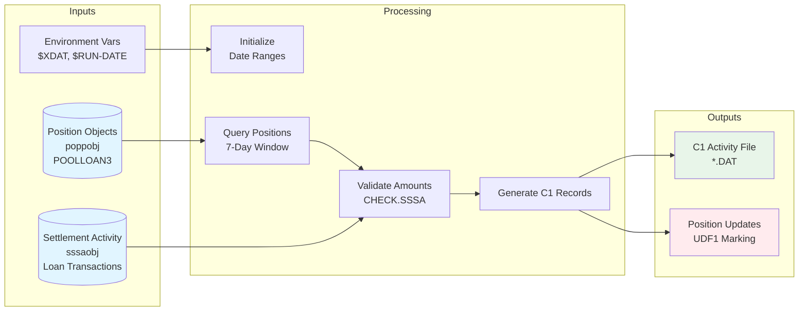

# GAP_NewLoanCash - Program Overview

**Program**: GAP_NewLoanCash.cbl  
**Program Type**: OmniScript Batch Process  
**Last Updated**: February 4, 2026  
**Lines of Code**: 75

---

## Executive Summary

GAP_NewLoanCash is a batch reconciliation program that generates C1 cash activity records for loan purchase transactions. It reads Plan Position Accounts from the last 7 calendar days, identifies POOLLOAN3 (loan pool) position records, validates loan activity against Secondary Settlement Activity (SSSA), and creates corresponding cash reconciliation entries.

**Key Functions**:
- Query position accounts for recent loan activity
- Validate loan amounts against settlement records
- Generate C1 activity records for cash reconciliation
- Prevent duplicate processing through idempotency tracking

---

## Business Purpose

### Problem Statement
When loan purchases occur through secondary market transactions, cash must be reconciled to ensure proper accounting. The system needs to:
1. Identify new loan positions requiring cash reconciliation
2. Account for loan reversals (BUYS and SELLS)
3. Generate the "right side" (AC) of cash reconciliation entries
4. Avoid duplicate processing when re-run

### Solution Approach
The program processes position accounts over a 7-day window, validates each loan position's cash impact by checking settlement activity, and generates standardized C1 activity records for the cash reconciliation system. An idempotency mechanism prevents duplicate record generation.

### Business Value
- **Accuracy**: Correctly nets BUY and SELL activity to reflect true cash impact
- **Automation**: Eliminates manual cash reconciliation for loan purchases
- **Reliability**: Idempotent design allows safe re-runs without duplicate entries
- **Auditability**: Timestamped output files provide clear processing trail

---

## Program Flow Overview

```mermaid
flowchart TB
    subgraph Initialization
        A[Initialize Variables] --> B[Build Output Filename]
        B --> C[Open Output File]
        C --> D[Calculate Date Range<br/>7 days ago to last business day]
    end
    
    subgraph Main Processing
        E[Query Position Objects<br/>POOLLOAN3<br/>Date Range] --> F{For Each<br/>Position Record}
        F -->|Next| G[Read Position Data:<br/>Plan, Date, Amounts, Account]
        G --> H{Secondary1Buys<br/>> 0?}
        H -->|Yes| I[CHECK.SSSA:<br/>Validate & Net<br/>BUY/SELL Activity]
        H -->|No| J{Already<br/>Processed?}
        I --> J
        J -->|No - Process| K[Calculate NewLoanUnits<br/>= - Secondary1Buys]
        J -->|Yes - Skip| F
        K --> L[Build C1 Record<br/>Type: C100<br/>Code: 00339]
        L --> M[Write to Output File]
        M --> N[Update Position Object<br/>Mark as Processed]
        N --> F
        F -->|Done| O[End Processing]
    end
    
    subgraph CHECK.SSSA Routine
        P[Validate Input<br/>Plan & Date] --> Q{Valid?}
        Q -->|No| R[Exit]
        Q -->|Yes| S[Initialize WK001 = 0]
        S --> T[Query SSSA Records<br/>Plan + POOLLOAN3 + Date]
        T --> U{For Each<br/>SSSA Record}
        U -->|Next| V{Type = 'XI'<br/>Loan Activity?}
        V -->|Yes| W{BUY or SELL?}
        V -->|No| U
        W -->|BUY 'B'| X[WK001 += Amount]
        W -->|SELL 'S'| Y[WK001 -= Amount]
        X --> U
        Y --> U
        U -->|Done| Z[Update Secondary1Buys<br/>= WK001]
        Z --> R
    end
    
    Initialization --> Main Processing
    I -.Calls.-> CHECK.SSSA Routine
    
    style E fill:#e1f5ff
    style I fill:#fff4e1
    style M fill:#e8f5e9
    style N fill:#ffebee
```

---

## Technical Architecture

### Input Sources
1. **Environment Variables**:
   - `$XDAT`: Base directory for output files
   - `$RUN-DATE`: Processing date (YYYYMMDD format)

2. **Database Objects**:
   - **Position Objects (poppobj)**: Plan position accounts with loan activity
   - **Secondary Settlement Activity (sssaobj)**: Transaction-level BUY/SELL records

### Output Artifacts
1. **C1 Activity File**: Fixed-format text file with cash reconciliation records
   - Filename Pattern: `OTDALY.OMNISCRIPT.C1.NEWLOANOFFSET.{YYYYMMDD}.{HHMMSS}.DAT`
   - Location: `$XDAT` directory
   - Format: 138-character fixed-width records

2. **Database Updates**: Position object UDF1 field (DE 877) updated with processed amount

### Data Flow Architecture



---

## Key Business Rules

### 1. Date Range Selection
- **Window**: 7 calendar days prior to run date through last business day
- **Fallback**: If $RUN-DATE invalid, use current date
- **Rationale**: Captures one week of position activity while ensuring complete settlement

### 2. Security Type Filtering
- **Security ID**: POOLLOAN3 only
- **Purpose**: Focuses on loan pool securities requiring cash reconciliation
- **Exclusions**: Other security types handled by different processes

### 3. Idempotency Control
- **Mechanism**: Compare Secondary1Buys to PriorCashApplied (UDF1 field)
- **Logic**: If amounts match, record already processed → skip
- **Update**: After generating C1 record, set UDF1 = Secondary1Buys
- **Benefit**: Safe to re-run without creating duplicate cash entries

### 4. Reversal Handling
- **Problem**: Original implementation used Secondary1Buys directly from position object
- **Solution**: CHECK.SSSA routine queries actual settlement activity
- **Calculation**: Net BUYS - SELLS = True cash impact
- **Example**:
  - Position shows $100,000 Secondary1Buys
  - SSSA has BUY $100,000 and SELL $25,000
  - Net activity: $75,000 → C1 record for $75,000

### 5. C1 Record Format
- **Record Type**: C100 (positions 1-4)
- **Transaction Code**: 00339 (positions 134-138)
- **Position 92**: Value '2' (changed from '1' per GPD-1704)
- **Amount Sign**: Negative (represents cash outflow for loan purchases)

---

## Database Schema Reference

### Position Object (poppobj) Fields

| Field | DE Number | Description | Data Type | Usage |
|-------|-----------|-------------|-----------|-------|
| RKPlan | 030 | Plan identifier | String(6) | Identifies plan for reconciliation |
| TradeDate | 008 | Trade date | Numeric(8) | YYYYMMDD format, matches to SSSA |
| Secondary1Buys | 741 | Loan buy amount | Numeric | Initial value, may be incorrect |
| PriorCashApplied | 877 | UDF1 - processed flag | Numeric | Idempotency tracking |
| TrustAccount | 01510 | Trust account ID | String(32) | Account for cash reconciliation |

### Secondary Settlement Activity (sssaobj) Fields

| Field | DE Number | Description | Data Type | Usage |
|-------|-----------|-------------|-----------|-------|
| Transaction Type | 011 | Activity type code | String | Filter for 'XI' (loan activity) |
| Buy/Sell Indicator | 009 | Transaction direction | String(1) | 'B' = Buy, 'S' = Sell |
| Amount | 235 | Transaction amount | Numeric | Dollar value of transaction |

---

## Error Handling and Edge Cases

### Handled Scenarios

**1. Invalid Run Date**
- **Detection**: OcDate_Valid(RunDate) returns false
- **Recovery**: Use OcDate_Current() as fallback
- **Impact**: Processing continues with current date

**2. Zero Secondary1Buys**
- **Detection**: Secondary1Buys = 0
- **Handling**: Skip CHECK.SSSA call (optimization)
- **Impact**: No C1 record generated (correct behavior)

**3. Already Processed Records**
- **Detection**: PriorCashApplied = Secondary1Buys
- **Handling**: Skip C1 generation and position update
- **Impact**: No duplicate records created

**4. Empty SSSA Results**
- **Detection**: sssaobj_next() returns no records
- **Handling**: WK001 remains 0, Secondary1Buys set to 0
- **Impact**: No C1 record generated (position has no settlement activity)

**5. Invalid Plan or Date in CHECK.SSSA**
- **Detection**: RKPlan = '' or TradeDate = 0
- **Handling**: Early exit via GOBACK
- **Impact**: Secondary1Buys unchanged, uses original value

### Unhandled Scenarios (Potential Issues)

**1. Database Connection Failures**
- **Risk**: poppobj_view() or sssaobj_view() fails
- **Impact**: Program would crash or produce incomplete results
- **Mitigation**: Assumes database availability

**2. File Write Failures**
- **Risk**: OcFile1_Write() fails (disk full, permissions)
- **Impact**: Lost C1 records, inconsistent reconciliation
- **Mitigation**: Assumes file system availability

**3. Missing Environment Variables**
- **Risk**: $XDAT undefined
- **Impact**: Filename construction could fail or write to unexpected location
- **Mitigation**: Assumes proper environment setup

**4. Data Type Mismatches**
- **Risk**: Non-numeric data in numeric fields
- **Impact**: Calculation errors or program crash
- **Mitigation**: Assumes clean data

---

## Performance Characteristics

### Query Complexity
- **Position Query**: Single query with date range filter
- **SSSA Queries**: One query per position with non-zero Secondary1Buys
- **Optimization**: Secondary1Buys guard reduces unnecessary SSSA calls
- **Indexes Required**:
  - Position: securityid + trade date
  - SSSA: plan + securityid + date

### Expected Volume
- **7-Day Window**: Captures one week of position activity
- **Position Records**: Varies by portfolio size (estimated 100-1000 per day)
- **SSSA Records**: Typically 1-5 per position (most have single BUY)
- **C1 Output**: Subset of positions (only new, unprocessed loans)

### Runtime Estimate
- **Small Portfolio**: Seconds
- **Large Portfolio**: Minutes
- **Bottleneck**: SSSA queries (one per position)

### Memory Footprint
- **Variables**: Minimal (11 global variables)
- **Cursors**: Two database cursors (sequential processing)
- **Output Buffer**: Single record (138 bytes)

---

## Integration Points

### Upstream Dependencies
1. **Position Loading**: Assumes POOLLOAN3 positions loaded from TRUSTTRANS.P1
2. **SSSA Population**: Requires secondary settlement activity records current
3. **Environment Setup**: Requires $XDAT and $RUN-DATE configured

### Downstream Consumers
1. **Cash Reconciliation System**: Reads C1 activity files
2. **File Format**: 138-character fixed-width records
3. **Processing Frequency**: Batch (typically daily)

### Cross-System Dependencies
- **Position Management**: Source of POOLLOAN3 positions
- **Settlement System**: Source of SSSA transaction records
- **Cash Accounting**: Consumer of C1 activity records

---

## Change History

### Major Changes

**09/25/2024 - Gary Matten**
- Added CHECK.SSSA routine to handle loan reversal activity
- Fixed issue where BUYS and SELLS not netted correctly
- Secondary1Buys now reflects true net activity

**06/27/2024 - Gary Matten (GPD-1704)**
- Changed position 92 in C1 record format from '1' to '2'
- Reason: [Requires business context from experts]

**12/21/2023 - Gary Matten**
- Initial OmniScript creation
- Implemented basic loan cash reconciliation logic

---

## Configuration and Setup

### Environment Variables
```bash
export XDAT="/data/omniscript"           # Output file directory
export RUN-DATE="20260204"               # Processing date (YYYYMMDD)
```

### File Permissions
- **Output Directory**: Write access required
- **Database**: Read access to poppobj and sssaobj
- **Database**: Write access to poppobj for updates

### Execution
```bash
# Run via OMNISCRIPT interpreter
omniscript GAP_NewLoanCash.cbl
```

---

## Testing and Validation

### Test Scenarios

**1. Normal Processing**
- Input: Positions with loan activity in 7-day window
- Expected: C1 records generated, UDF1 fields updated

**2. Re-run (Idempotency)**
- Input: Same positions as Test 1
- Expected: No C1 records (all already processed)

**3. Reversals**
- Input: Position with BUY $100k and SELL $25k
- Expected: C1 record for $75k net amount

**4. Full Reversal**
- Input: Position with matching BUY and SELL
- Expected: No C1 record (net zero activity)

**5. Invalid Run Date**
- Input: $RUN-DATE = invalid value
- Expected: Uses current date, processing continues

**6. Empty Date Range**
- Input: No positions in 7-day window
- Expected: No C1 records, no errors

### Validation Checks
1. C1 file created with correct timestamp
2. C1 record count matches expected (new, unprocessed loans)
3. C1 amounts match net SSSA activity (BUYS - SELLS)
4. Position UDF1 fields updated with Secondary1Buys values
5. Re-run produces no additional C1 records

---

## Maintenance and Support

### Monitoring
- **Output File**: Check for daily file creation
- **Record Counts**: Compare to expected loan activity volume
- **Error Logs**: Review OMNISCRIPT interpreter logs

### Common Issues

**Issue**: No C1 records generated
- **Cause 1**: No new loan activity in 7-day window
- **Cause 2**: All positions already processed (UDF1 matches)
- **Cause 3**: Secondary1Buys all zero (no settlement activity)

**Issue**: Duplicate C1 records
- **Cause**: UDF1 field not updating (database write failure)
- **Fix**: Verify poppobj_update() succeeding

**Issue**: Incorrect C1 amounts
- **Cause**: SSSA records missing or incomplete
- **Fix**: Verify SSSA loading process completed

### Code Locations Reference
- **Output Filename**: Line 16
- **Date Range Logic**: Lines 21-29
- **Main Processing Loop**: Lines 31-57
- **Idempotency Check**: Line 40
- **C1 Record Format**: Lines 45-52
- **CHECK.SSSA Routine**: Lines 59-75
- **Reversal Netting**: Lines 65-69

---

## Security and Compliance

### Data Sensitivity
- **Trust Account IDs**: PII - must be protected
- **Dollar Amounts**: Financial data - audit trail required
- **Plan Information**: Confidential - restricted access

### Audit Trail
- **Timestamped Filenames**: Each run produces unique output file
- **Position Updates**: UDF1 field tracks processing history
- **Change History**: Comments document all code modifications

### Access Control
- **Database**: Requires read/write permissions to position and SSSA objects
- **File System**: Write access to $XDAT directory
- **Execution**: Should run under service account with minimal privileges

---

## Related Documentation

- [Data Dictionary](GAP_NewLoanCash_DATA_DICTIONARY.md) - Complete variable reference
- [Call Graph](GAP_NewLoanCash_CALL_GRAPH.md) - Control flow and database operations
- [CHECK.SSSA Procedure](procedures/CHECK_SSSA.md) - Detailed routine documentation

---

## Questions for Expert Review

1. **GPD-1704 Change**: What business requirement drove position 92 change from '1' to '2'?
2. **Transaction Code 00339**: What does this code represent in the cash accounting system?
3. **UDF1 Field Usage**: Is DE 877 (PriorCashApplied) officially designated for this program's use?
4. **'XI' Transaction Type**: Confirm 'XI' specifically means loan activity (vs. other interpretations)?
5. **Date Range Justification**: Why 7 calendar days? Could this be configurable?
6. **Error Handling**: Should there be alerts for database connection failures or missing SSSA records?
7. **Volume Expectations**: What is typical daily/weekly loan activity volume?

---

**Review Status**: Generated by automated analysis - **REQUIRES EXPERT VALIDATION** of business rules, transaction codes, and field interpretations before production use

**Generated**: February 4, 2026  
**Parser Version**: omniscript_grammar_parser.py  
**Source File**: /temp-repos/santized/GAP_NewLoanCash.cbl
