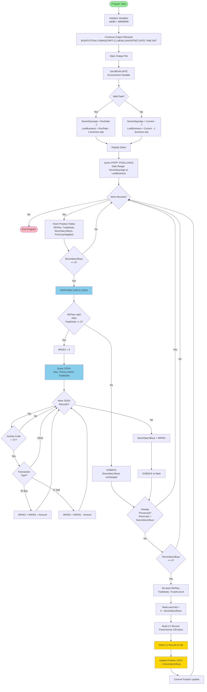

# GAP_NewLoanCash Program Overview

## Program Identification

- **Program Name**: GAP_NewLoanCash
- **Original Script**: NewLoanCash.txt
- **Language**: OmniScript
- **Program Type**: Batch processing / Cash reconciliation
- **Business Domain**: Trust accounting / Retirement plan administration
- **Source File**: GAP_NewLoanCash.cbl

---

## Executive Summary

GAP_NewLoanCash is a batch reconciliation program that processes secondary market loan purchases for retirement plan positions. It reads Plan Position Accounts from the last 7 calendar days, identifies POOLLOAN3 (loan pool) securities, calculates net loan activity after accounting for reversals, and generates C1 activity records for cash reconciliation.

### Key Business Value
- **Cash Reconciliation**: Ensures accurate tracking of cash requirements for loan purchases
- **Reversal Recognition**: Properly nets buy and sell transactions to reflect true loan exposure
- **Idempotency**: Prevents duplicate processing through UDF field tracking
- **Audit Trail**: Generates fixed-format C1 activity records for downstream reconciliation

### Processing Scope
- **Date Range**: Last 7 calendar days (calculated from $RUN-DATE or current date)
- **Security Type**: POOLLOAN3 (loan pool securities)
- **Database Sources**: 
  - POPP (Plan Position Accounts)
  - SSSA (Secondary Market Activity)
- **Output**: Timestamped C1 activity file in $XDAT directory

---

## Program History

| Date | Author | Change Description | Reference |
|------|--------|-------------------|-----------|
| 12/21/2023 | Gary Matten | Initial OmniScript creation | Initial version |
| 06/27/2024 | Gary Matten | Corrected position 92 from '1' to '2' | GPD-1704 |
| 09/25/2024 | Gary Matten | Added logic to recognize loan reversal activity and net activity correctly when there are BUYS and SELLS | Enhancement |

---

## Business Context

### Problem Statement
When retirement plans purchase loans on the secondary market, cash must be allocated to cover those purchases. The Secondary1Buys field in position records reflects the total loan purchase amount from trust transactions (loaded from TRUSTTRANS.P1). However, some loans may be reversed (sold back) after the initial purchase. Without accounting for these reversals, cash reconciliation overstates the required cash allocation.

### Solution Approach
1. **Query Position Records**: Find all POOLLOAN3 positions in the 7-day window
2. **Check for Reversals**: For each non-zero loan purchase, query secondary activity (SSSA) to find offsetting sell transactions
3. **Calculate Net Activity**: Sum buy transactions minus sell transactions to get true loan exposure
4. **Generate Offsetting Entry**: Create C1 activity record with negative amount to offset the loan purchase
5. **Mark Processed**: Update position record UDF1 field to prevent duplicate processing

### Business Rules
- Only process POOLLOAN3 securities (loan pool)
- Only process records with non-zero Secondary1Buys amounts
- Skip records already processed (PriorCashApplied = Secondary1Buys)
- Use last business day as activity date in C1 records
- Apply activity code 00339 for loan offset entries
- Set position 92 to '2' in C1 records (per GPD-1704)

---

## Program Structure

### Overall Flow Diagram



### Program Sections

#### Section 1: Initialization (Lines 13-19)
- Set return code (sd080 = 99999999)
- Define global variables
- Construct output filename with timestamp
- Display filename
- Open output file

#### Section 2: Date Calculation (Lines 21-29)
- Retrieve $RUN-DATE environment variable
- Validate date or fallback to current date
- Calculate SevenDaysAgo (7 calendar days back)
- Calculate LastBusiness (1 business day back)
- Display calculated dates

#### Section 3: Main Processing Loop (Lines 31-57)
- Query plan positions for POOLLOAN3 in date range
- For each position record:
  - Fetch RKPlan, TradeDate, Secondary1Buys, PriorCashApplied
  - If Secondary1Buys > 0: Call CHECK.SSSA to calculate net activity
  - If not already processed and amount still non-zero:
    - Build C1 record with offset amount
    - Write C1 record to file
    - Update position UDF1 field
    - Commit position update

#### Section 4: CHECK.SSSA Routine (Lines 59-75)
- Validate entry parameters (RKPlan, TradeDate)
- Initialize accumulator (WK001 = 0)
- Query SSSA for matching plan/security/date records
- For each 'XI' (External In) activity:
  - Add buy ('B') amounts to accumulator
  - Subtract sell ('S') amounts from accumulator
- Assign net amount to Secondary1Buys
- Return to main program

---

## Data Flow

### Input Data Sources

#### 1. Environment Variables
- **$RUN-DATE**: Processing date (optional; falls back to current date)
- **$XDAT**: Output directory path (required)

#### 2. POPP Database (Plan Position)
- **Query Filter**: 
  - Security ID = 'POOLLOAN3'
  - Trade Date >= SevenDaysAgo
  - Trade Date <= LastBusiness
- **Fields Retrieved**:
  - DE 008: TradeDate
  - DE 030: RKPlan (Plan ID)
  - DE 741: Secondary1Buys (loan purchase amount)
  - DE 877: UDF1 / PriorCashApplied (processing flag)
  - DE 01510: TrustAccount

#### 3. SSSA Database (Secondary Activity)
- **Query Filter**:
  - Plan = RKPlan
  - Security ID = 'POOLLOAN3'
  - Date = TradeDate
- **Fields Retrieved**:
  - DE 009: Transaction Type (B/S)
  - DE 011: Activity Code (XI)
  - DE 235: Transaction Amount

### Output Data

#### C1 Activity File
- **Location**: `$XDAT/OTDALY.OMNISCRIPT.C1.NEWLOANOFFSET.YYYYMMDD.HHMMSS.DAT`
- **Format**: Fixed-width, 138 bytes per record
- **Contents**: Loan offset activity records for cash reconciliation

**Record Structure**:
```
Pos 1-4:    'C100'                        (Record Type)
Pos 5-10:   RKPlan                        (Plan ID)
Pos 31-38:  LastBusiness (YYYYMMDD)      (Activity Date)
Pos 40-71:  TrustAccount                  (Trust Account)
Pos 73-92:  '000000000000000    2'       (Type/Position)
Pos 115:    '0'                           (Sign Flag)
Pos 116-130: NewLoanUnits (Z,12V2-)      (Negative Amount)
Pos 134-138: '00339'                      (Activity Code)
```

#### Database Updates
- **POPP DE 877 (UDF1)**: Updated with Secondary1Buys amount to mark record as processed

### Data Transformations

1. **Date Calculations**:
   - Input: RunDate or Current Date
   - Transform: Subtract 7 days (calendar), subtract 1 business day
   - Output: SevenDaysAgo, LastBusiness

2. **Net Activity Calculation**:
   - Input: SSSA buy/sell transactions
   - Transform: Sum(Buys) - Sum(Sells)
   - Output: Net Secondary1Buys amount

3. **Amount Negation**:
   - Input: Secondary1Buys (positive amount)
   - Transform: 0 - Secondary1Buys
   - Output: NewLoanUnits (negative offset)

4. **Record Formatting**:
   - Input: Plan ID, dates, accounts, amounts
   - Transform: Fixed-width text positioning
   - Output: 138-byte C1 record

---

## Database Interactions

### POPP (Plan Position Object)

**Purpose**: Retrieve and update plan position records for loan securities

**Query Pattern**:
```omniscript
poppobj_view(securityid:'POOLLOAN3' datelo:SevenDaysAgo datehi:LastBusiness);
loop while poppobj_next();
   RKPlan = poppobj_de(030);
   TradeDate = poppobj_numde(008);
   Secondary1Buys = poppobj_numde(741);
   PriorCashApplied = poppobj_numde(877);
   TrustAccount = poppobj_de(01510);
   ...
   poppobj_setde(denum:877 value:Secondary1Buys);
   poppobj_update();
endloop;
```

**Access Pattern**: Sequential scan within date range  
**Read Operations**: 5 field retrievals per record  
**Write Operations**: 1 field update per qualifying record  
**Transaction Model**: Auto-commit per update (no explicit transaction management)

**Fields Used**:
| Data Element | Field Name | Type | Usage |
|--------------|------------|------|-------|
| DE 008 | TradeDate | Numeric | Query filter, reversal lookup |
| DE 030 | RKPlan | String | Plan identifier |
| DE 741 | Secondary1Buys | Numeric | Loan purchase amount |
| DE 877 | UDF1 / PriorCashApplied | Numeric | Processing flag (read & write) |
| DE 01510 | TrustAccount | String | Trust account number |

---

### SSSA (Secondary Activity Object)

**Purpose**: Retrieve detailed buy/sell transactions for reversal calculation

**Query Pattern**:
```omniscript
sssaobj_view(PLAN:RKPlan SECURITYID:'POOLLOAN3' DATE:TradeDate);
loop while sssaobj_next();
   if sssaobj_de(011) = 'XI';
      if sssaobj_de(009) = 'B';
         WK001 = WK001 + sssaobj_numde(235);
      end;
      if sssaobj_de(009) = 'S';
         WK001 = WK001 - sssaobj_numde(235);
      end;
   end;
endloop;
```

**Access Pattern**: Lookup by plan/security/date (exact match)  
**Read Operations**: 3 field retrievals per record  
**Write Operations**: None (read-only)  
**Typical Record Count**: 1-3 per position (buy + potential sells)

**Fields Used**:
| Data Element | Field Name | Type | Usage |
|--------------|------------|------|-------|
| DE 009 | Transaction Type | String | Distinguish buy ('B') vs sell ('S') |
| DE 011 | Activity Code | String | Filter for 'XI' (External In) |
| DE 235 | Transaction Amount | Numeric | Dollar amount to add/subtract |

---

## Key Algorithms

### Algorithm 1: Net Activity Calculation (CHECK.SSSA)

**Purpose**: Calculate net loan exposure after accounting for reversals

**Input**: 
- RKPlan (Plan ID)
- TradeDate (Date of original transaction)
- SSSA records (buy/sell transactions)

**Output**: 
- Secondary1Buys (net amount = buys - sells)

**Logic**:
```
1. Validate inputs (RKPlan non-empty, TradeDate non-zero)
2. Initialize accumulator (WK001 = 0)
3. Query SSSA for plan/security/date combination
4. For each SSSA record:
   a. Check if activity code = 'XI' (External In)
   b. If transaction type = 'B' (Buy): Add amount to WK001
   c. If transaction type = 'S' (Sell): Subtract amount from WK001
5. Assign final WK001 value to Secondary1Buys
6. Return to caller
```

**Example**:
- Original buy: $10,000 (Secondary1Buys from DE 741)
- SSSA records: Buy $10,000, Sell $3,000
- WK001 calculation: 0 + 10,000 - 3,000 = $7,000
- Result: Secondary1Buys updated to $7,000

**Edge Cases**:
- No SSSA records: WK001 = 0; Secondary1Buys becomes 0 (may skip C1 generation)
- Full reversal: Buys = Sells; WK001 = 0; no C1 record generated
- Partial reversal: Buys > Sells; net calculated correctly
- Invalid inputs: Early exit; Secondary1Buys unchanged

---

### Algorithm 2: Duplicate Prevention

**Purpose**: Prevent reprocessing of position records already handled

**Input**:
- Secondary1Buys (current loan amount, possibly adjusted by CHECK.SSSA)
- PriorCashApplied (previously stored amount from DE 877)

**Logic**:
```
1. Fetch PriorCashApplied from position record (DE 877)
2. Compare with Secondary1Buys
3. If match: Skip C1 generation and database update
4. If no match: Proceed with C1 generation
5. After successful C1 write: Update DE 877 with Secondary1Buys
```

**Idempotency Guarantee**:
- First run: PriorCashApplied = 0 (or different); C1 generated; UDF1 = Secondary1Buys
- Second run: PriorCashApplied = Secondary1Buys (match); skip processing
- Third run: Same as second (remains idempotent)

**Scenario Handling**:
- New record: No UDF1 value → process
- Already processed: UDF1 matches amount → skip
- Amount changed: UDF1 doesn't match → reprocess (is this intended?)

**Limitation**: If Secondary1Buys changes (data correction), UDF1 check fails and record reprocesses. This may be intentional for data correction scenarios or a bug.

---

### Algorithm 3: C1 Record Construction

**Purpose**: Build fixed-format cash activity record for reconciliation

**Input**:
- RKPlan (Plan ID)
- LastBusiness (Activity date)
- TrustAccount (Trust account number)
- NewLoanUnits (Negative offset amount)

**Output**: 138-byte fixed-width text record

**Logic**:
```
1. Initialize empty string variable (Line)
2. Set position 1-4: 'C100' (record type)
3. Set position 5-10: RKPlan (6 characters)
4. Set position 31-38: LastBusiness formatted as Z8 (YYYYMMDD)
5. Set position 40-71: TrustAccount (32 characters)
6. Set position 73-92: '000000000000000    2' (20 characters)
7. Set position 115: '0' (sign flag)
8. Set position 116-130: NewLoanUnits formatted as Z,12V2- (15 characters)
9. Set position 134-138: '00339' (activity code)
10. Write Line to output file
```

**Formatting Rules**:
- Z8: Zero-filled, 8 digits (dates)
- Z,12V2-: Zero-filled, 12 digits, 2 decimals, with sign (amounts)
- Fixed positions: No delimiters; byte position matters

**Example Record**:
```
C100ABC123                  20260203TRUST12345678901234567890123456000000000000000    20              -10000.0000339
```

---

## Integration Points

### Upstream Dependencies

#### 1. TRUSTTRANS.P1 Load
- **Description**: Trust transaction data loaded into POPP Secondary1Buys field (DE 741)
- **Timing**: Must complete before GAP_NewLoanCash runs
- **Impact**: Missing data results in zero Secondary1Buys amounts; no processing

#### 2. SSSA Load
- **Description**: Secondary market buy/sell activity loaded into SSSA database
- **Timing**: Must be complete and synchronized with POPP data
- **Impact**: Incomplete SSSA data causes incorrect net calculations

#### 3. Business Day Calendar
- **Description**: OmniScript business day function requires holiday calendar
- **Timing**: Must be maintained with current holidays
- **Impact**: Incorrect LastBusiness calculation; wrong activity dates

---

### Downstream Dependencies

#### 1. C1 Activity Processing
- **Description**: Downstream system reads C1 file and posts to cash accounts
- **Format Dependency**: Fixed 138-byte format; activity code 00339
- **Timing**: Expects daily file; processes after GAP_NewLoanCash completes
- **Impact**: Cash reconciliation uses these offset entries

#### 2. Reporting and Reconciliation
- **Description**: Finance uses C1 activity for daily cash reconciliation reports
- **Data Dependency**: UDF1 updates must persist for audit trail
- **Timing**: Reports run after C1 processing completes
- **Impact**: Incorrect amounts cause reconciliation breaks

---

### Configuration Dependencies

#### 1. Environment Variables
- **$XDAT**: Output directory (required)
- **$RUN-DATE**: Processing date (optional; defaults to current date)

#### 2. Database Connections
- **POPP**: Plan position database (required)
- **SSSA**: Secondary activity database (required)

#### 3. File System
- **$XDAT directory**: Must exist with write permissions
- **Sufficient disk space**: Required for output file

---

## Performance Characteristics

### Typical Processing Volume
- **Date Range**: 7 calendar days
- **Estimated Position Records**: 50-500 (varies by plan activity)
- **POOLLOAN3 Records**: 10-20% of total positions
- **Records with Secondary1Buys > 0**: 50-80% of POOLLOAN3 records
- **Records Already Processed (skipped)**: 0-50% (depends on reruns)
- **SSSA Records per Position**: 1-3 (buy + potential reversals)

### Execution Time Estimates
- **Initialization**: <1 second
- **Per Position Record**: ~10-50ms (database fetch + processing)
- **Per CHECK.SSSA Call**: ~20-100ms (SSSA query + calculation)
- **Per C1 Write**: ~5ms (file I/O)
- **Total Execution**: 1-5 minutes (for typical volume)

### Database Query Performance
- **POPP View**: Sequential scan with date range filter
  - Index on (SecurityID, TradeDate) recommended
  - Expected: <500ms for 7-day window
- **SSSA View**: Point lookup by Plan/SecurityID/Date
  - Index on (Plan, SecurityID, Date) recommended
  - Expected: <50ms per query
- **POPP Update**: Single record update
  - Expected: <20ms per update

### File I/O Performance
- **File Open**: Single operation at startup (~10ms)
- **Record Write**: Buffered writes (~5ms each)
- **Expected File Size**: 10-50 KB (100-500 records)

### Optimization Opportunities
1. **Batch Database Updates**: Group position updates instead of one-by-one commits
2. **SSSA Caching**: Cache SSSA query results if same plan/date queried multiple times
3. **Eliminate Redundant Fetches**: Lines 41-42 re-fetch fields already retrieved at lines 33-34
4. **Index Tuning**: Ensure proper indexes on query fields

---

## Error Handling and Data Quality

### Explicit Error Handling
- ✓ Date validation with fallback (Lines 22-28)
- ✓ Zero check before CHECK.SSSA (Line 37)
- ✓ Duplicate prevention (Line 40)
- ✓ Null/zero guard in CHECK.SSSA (Line 60)

### Implicit Error Handling
- ✗ No database connection error handling
- ✗ No file operation error handling
- ✗ No validation for negative amounts
- ✗ No check for SSSA data completeness

### Known Limitations
- Silent failure on database errors
- No operational logging or counters
- No transaction management (updates committed immediately)
- No validation of amount ranges

**See**: [GAP_NewLoanCash Error Handling Analysis](GAP_NewLoanCash_ERROR_HANDLING.md) for comprehensive error handling documentation.

---

## Testing Considerations

### Unit Test Scenarios

#### 1. Date Calculation
- **Test**: Valid $RUN-DATE
- **Expected**: SevenDaysAgo = RunDate - 7, LastBusiness = RunDate - 1 business day
- **Test**: Invalid $RUN-DATE
- **Expected**: Fallback to current date calculations

#### 2. CHECK.SSSA Net Calculation
- **Test**: Buy only ($10,000 buy, no sells)
- **Expected**: Secondary1Buys = $10,000
- **Test**: Partial reversal ($10,000 buy, $3,000 sell)
- **Expected**: Secondary1Buys = $7,000
- **Test**: Full reversal ($10,000 buy, $10,000 sell)
- **Expected**: Secondary1Buys = $0
- **Test**: Multiple transactions ($10,000 + $5,000 buys, $2,000 + $3,000 sells)
- **Expected**: Secondary1Buys = $10,000

#### 3. Duplicate Prevention
- **Test**: First run (PriorCashApplied = 0, Secondary1Buys = $10,000)
- **Expected**: C1 generated, UDF1 updated to $10,000
- **Test**: Second run (PriorCashApplied = $10,000, Secondary1Buys = $10,000)
- **Expected**: Skip processing, no C1 generated

#### 4. C1 Record Format
- **Test**: Validate positions 1-4, 5-10, 31-38, 40-71, 73-92, 115, 116-130, 134-138
- **Expected**: Exact byte positions match specification

### Integration Test Scenarios

#### 1. End-to-End Processing
- **Setup**: Load test POPP and SSSA data
- **Execute**: Run GAP_NewLoanCash
- **Validate**: 
  - C1 file exists and has correct record count
  - UDF1 fields updated in POPP
  - Amounts net correctly
  - File format valid

#### 2. Idempotency Test
- **Setup**: Run program twice with same data
- **Validate**: Second run produces no output; UDF1 unchanged

#### 3. Reversal Handling
- **Setup**: Position with buy + sell in SSSA
- **Validate**: Net amount calculated correctly; C1 shows net

### Edge Case Tests

- Empty result set (no POOLLOAN3 positions)
- All records already processed
- Negative net activity (sells exceed buys)
- Missing SSSA data (position has Secondary1Buys but no SSSA records)
- Invalid RKPlan or TradeDate in CHECK.SSSA

---

## Operational Considerations

### Scheduling Requirements
- **Frequency**: Daily (batch processing)
- **Timing**: After TRUSTTRANS.P1 and SSSA loads complete
- **Duration**: 1-5 minutes (typical volume)
- **Dependencies**: 
  - POPP database available
  - SSSA database available
  - $XDAT directory accessible

### Monitoring and Alerting
- **Success Criteria**: Return code sd080 = 99999999 (or 0 if changed)
- **Output Validation**: C1 file exists and non-empty (unless no activity)
- **Alerts**:
  - Program failure (non-zero return code)
  - Empty output when activity expected
  - Execution time exceeds threshold

### Maintenance Procedures

#### Regular Maintenance
- Monitor disk space in $XDAT directory
- Archive or purge old C1 files (retention policy)
- Review skip counts (high skip rate may indicate issues)

#### Troubleshooting Steps
1. **No Output Generated**:
   - Check POPP for POOLLOAN3 positions in date range
   - Verify $XDAT directory exists and is writable
   - Check for database connectivity
   
2. **Incorrect Amounts**:
   - Verify SSSA data loaded completely
   - Check for missing reversals in SSSA
   - Review CHECK.SSSA logic for transaction type handling
   
3. **Duplicate C1 Records**:
   - Check UDF1 field updates (should prevent duplicates)
   - Verify rerun detected already-processed records

---

## Related Documentation

### Program Documentation
- [GAP_NewLoanCash Data Dictionary](GAP_NewLoanCash_DATA_DICTIONARY.md) - Complete variable definitions with mutation analysis
- [GAP_NewLoanCash Call Graph](GAP_NewLoanCash_CALL_GRAPH.md) - Function call hierarchy and database operations
- [GAP_NewLoanCash Error Handling](GAP_NewLoanCash_ERROR_HANDLING.md) - Error handling analysis and recommendations
- [GAP_NewLoanCash Diagrams](GAP_NewLoanCash_DIAGRAMS.md) - Additional Mermaid visualizations

### Procedure Documentation
- [CHECK.SSSA Procedure](procedures/CHECK.SSSA.md) - Detailed reversal calculation logic

### External References
- GPD-1704: Position 92 correction ticket
- TRUSTTRANS.P1 specification
- SSSA data model documentation
- C1 activity file format specification

---

## Glossary

- **C1 Activity**: Cash activity record format for reconciliation
- **DE**: Data Element (database field identifier)
- **POOLLOAN3**: Security type identifier for loan pool investments
- **POPP**: Plan Position database object
- **Secondary1Buys**: Field tracking secondary market loan purchases
- **SSSA**: Secondary market activity database object
- **UDF1**: User-Defined Field 1 (DE 877); used as processing flag
- **XI**: Activity code for "External In" transactions
- **OmniScript**: Proprietary scripting language for trust/retirement systems
- **GAP**: Likely acronym for business process or system name
- **$XDAT**: Environment variable for data file directory
- **$RUN-DATE**: Environment variable for processing date
