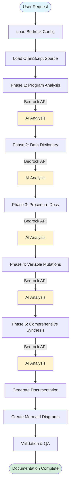

# OmniScript Documenter Infrastructure

This document describes the infrastructure and workflow for using the OmniScript Documentation Module with Claude Code configured to use AWS Bedrock.

## Architecture Overview


## Component Description

### User Environment

- **Claude Code IDE**: VS Code extension configured with AWS Bedrock credentials
- **Workspace Files**: Local project containing the omniscript-documenter module
- **OmniScript Source**: Legacy OmniScript programs to be documented
- **OmniScript Documenter**: AI-assisted documentation generation module
- **Documentation Templates**: Standardized templates for consistent output

### AWS Cloud

- **AWS Bedrock**: Managed AI service providing access to foundation models
- **Claude Sonnet 4.5**: The AI model used for analysis and documentation generation

### Documentation Output

- **Generated Documentation**: Complete markdown documentation organized by repository and program
- **Mermaid Diagrams**: Visual representations of program flow, call graphs, and data flows
- **Validation Reports**: Quality checks and completeness validation results

## Workflow Sequence


## Data Flow



## Configuration Requirements

### AWS Bedrock Setup

1. **AWS Account Configuration**:
   - AWS account with Bedrock access enabled
   - IAM role/user with `bedrock:InvokeModel` permissions
   - Access to Claude Sonnet 4.5 model in desired region

2. **Claude Code Configuration**:
   ```json
   {
     "github.copilot.chat.modelProvider": "bedrock",
     "github.copilot.chat.bedrockConfig": {
       "region": "us-east-1",
       "modelId": "anthropic.claude-sonnet-4-5-v2:0",
       "credentials": {
         "profile": "your-aws-profile"
       }
     }
   }
   ```

3. **AWS Credentials**:
   - Configure AWS CLI with appropriate profile
   - Ensure credentials have Bedrock access
   - Test connectivity: `aws bedrock list-foundation-models --region us-east-1`

### Workspace Setup

1. **Directory Structure**:
   ```
   bokf-poc/
   ├── omniscript-documenter/       # Documentation module
   │   ├── INITIALIZER_PROMPT.md
   │   ├── WORKFLOW.md
   │   ├── CONFIG.md
   │   └── templates/
   ├── temp-repos/                  # Cloned repositories
   │   └── {repo-name}/
   │       └── *.os                 # OmniScript source files
   └── omniscript-documentation/    # Generated documentation
       └── {repo-name}/
           └── {program-name}/
               ├── *_DATA_DICTIONARY.md
               ├── *_CALL_GRAPH.md
               ├── *_COMPREHENSIVE_DOC.md
               └── *_MERMAID_DIAGRAMS.md
   ```

2. **Required Files**:
   - OmniScript source files (*.os, *.omniscript, *.omni)
   - Documentation templates
   - Configuration files

## Security Considerations

### Data Privacy

- **Local Processing**: OmniScript source files remain in your local workspace
- **API Transmission**: Only code snippets are sent to Bedrock for analysis
- **Encryption**: All Bedrock API calls use TLS 1.2+ encryption
- **No Storage**: Bedrock does not store prompts or responses (when opt-out configured)

### Access Control

- **IAM Policies**: Restrict Bedrock access to authorized users only
- **AWS Credentials**: Use temporary credentials or assumed roles
- **Audit Logging**: Enable CloudTrail for Bedrock API call logging

### Compliance

- **Data Residency**: Choose appropriate AWS region for compliance requirements
- **Model Access**: Ensure Claude Sonnet 4.5 availability in your region
- **Documentation**: All generated documentation stays in local workspace

## Performance Considerations

### Optimization Strategies

1. **Batching**: Process multiple OmniScript files sequentially
2. **Chunking**: Large programs are automatically chunked to avoid context limits
3. **Caching**: Reuse analyzed components across documentation phases
4. **Parallel Processing**: Independent analysis tasks run concurrently when possible

### Expected Performance

- **Small Programs** (<500 lines): 2-5 minutes per program
- **Medium Programs** (500-2000 lines): 5-15 minutes per program
- **Large Programs** (>2000 lines): 15-45 minutes per program

*Times vary based on Bedrock API latency, program complexity, and network conditions*

## Cost Considerations

### Bedrock Pricing

- **Model**: Claude Sonnet 4.5 pricing per million tokens
- **Input Tokens**: ~$3 per 1M tokens (varies by region)
- **Output Tokens**: ~$15 per 1M tokens (varies by region)

### Estimation

- **Small Program**: ~50K-100K tokens → $0.10-$0.20 per program
- **Medium Program**: ~100K-300K tokens → $0.20-$0.60 per program
- **Large Program**: ~300K-1M tokens → $0.60-$2.00 per program

*Estimates include all 5 documentation phases plus diagram generation*

## Troubleshooting

### Common Issues

1. **Authentication Errors**:
   - Verify AWS credentials are configured
   - Check IAM permissions for Bedrock access
   - Confirm correct AWS region in configuration

2. **Model Unavailable**:
   - Verify Claude Sonnet 4.5 is available in your region
   - Check Bedrock service quotas
   - Enable model access in Bedrock console if needed

3. **Context Length Errors**:
   - Program is too large for single analysis
   - Documenter automatically chunks large programs
   - Review chunking strategy in WORKFLOW.md

4. **Documentation Quality Issues**:
   - AI-generated documentation requires expert review
   - See WORKFLOW.md for review process
   - Iteratively refine prompts for better results

### Support Resources

- **AWS Bedrock Documentation**: https://docs.aws.amazon.com/bedrock/
- **Claude Code Documentation**: GitHub Copilot documentation
- **OmniScript Documenter**: See README.md and WORKFLOW.md in this repository

## Next Steps

1. **Configure AWS Bedrock**: Set up AWS account and enable Bedrock access
2. **Configure Claude Code**: Add Bedrock configuration to VS Code settings
3. **Review Documentation**: Read INITIALIZER_PROMPT.md and WORKFLOW.md
4. **Start Documenting**: Use @omniscript-documentation-agent or follow manual workflow

---

*Last Updated: January 29, 2026*
