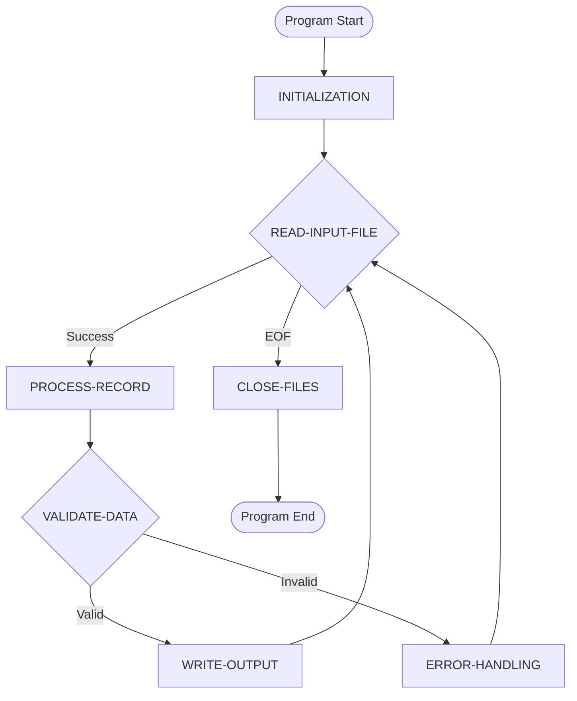
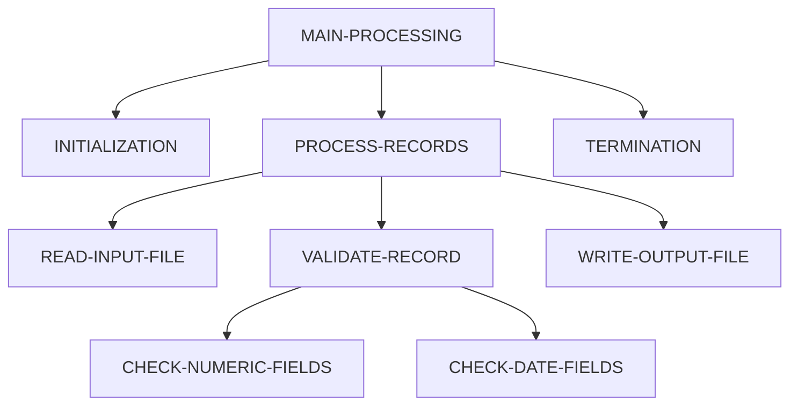
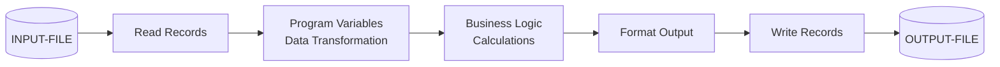
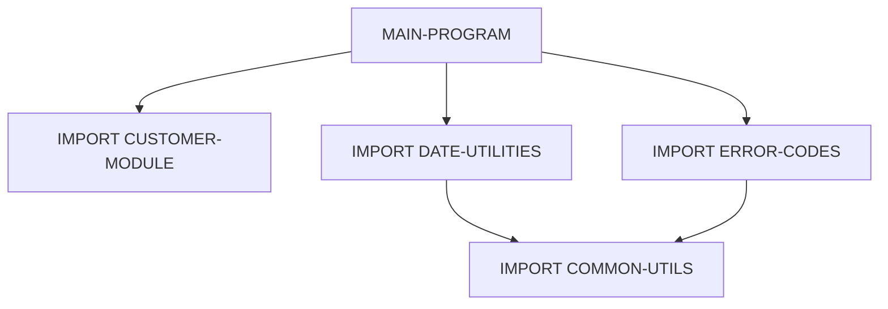
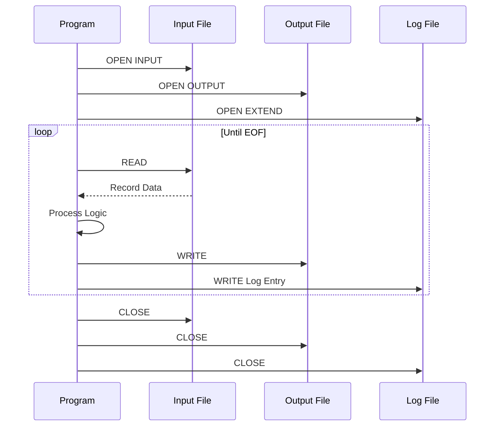
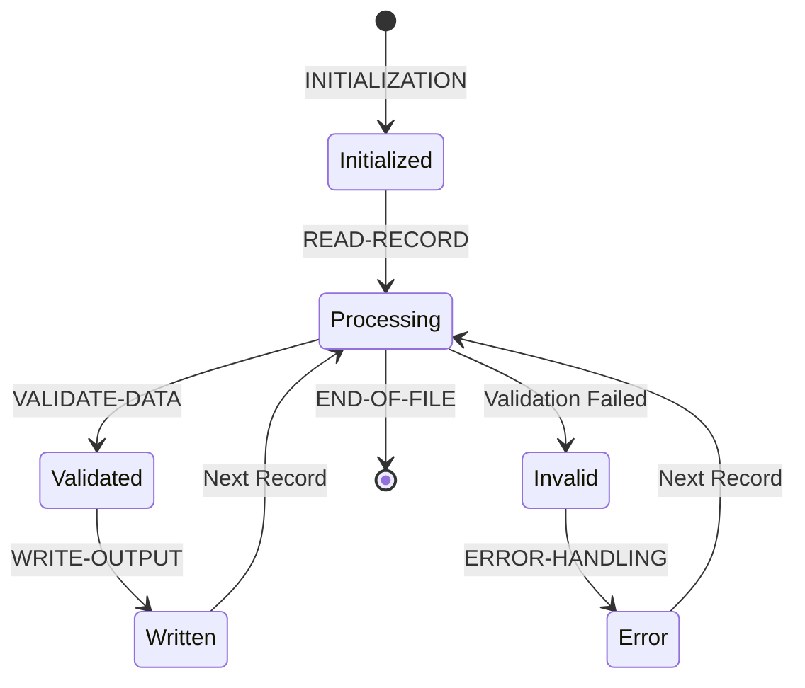
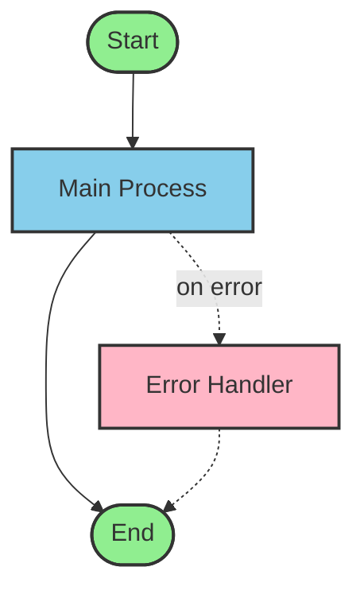

# Mermaid Diagram Generation Guide

**MANDATORY**: Mermaid diagram generation is required for every OMNISCRIPT program documented. These visualizations are essential for understanding legacy code structure, supporting modernization efforts, and enabling knowledge transfer.

## Why Mermaid Diagrams Are Critical

Mermaid diagrams serve multiple essential purposes:
- **Understanding program flow** without reading raw OMNISCRIPT
- **Documenting complex dependencies** for modernization efforts
- **Knowledge transfer** to developers unfamiliar with OMNISCRIPT
- **Identifying refactoring opportunities** and technical debt
- **Compliance and audit documentation** requirements
- **Onboarding new team members** quickly

## Required Diagrams for Each Program

Every documented OMNISCRIPT program MUST include diagrams split between the overview and a separate diagrams file:

### Core Diagrams (Embedded in OVERVIEW.md)

These three essential diagrams are embedded directly in the Program Overview for immediate visual understanding:

### 1. Program Flow Diagram (flowchart)

Shows main program logic from start to termination.

**Includes**:
- Main program logic from start to termination
- Decision points (IF/CASE statements)
- Loop structures
- Major processing sections
- Error handling paths

**Example**:


### 2. Call Hierarchy (graph)

Shows all procedure call relationships.

**Includes**:
- All procedure call relationships
- Nested call structures
- Execution order and dependencies
- Loop procedures vs one-time execution

**Example**:


### 3. Data Flow Diagram (flowchart)

Shows how data moves and transforms through the program.

**Includes**:
- Input files and their processing
- Data transformations through program variables
- Output file generation
- Variable mutations and state changes

**Example**:


### Complex Diagrams (Separate DIAGRAMS.md)

These detailed technical diagrams are placed in a separate file for advanced analysis:

### 4. Module Dependency Graph (graph)

Shows all import/include relationships.

**Includes**:
- All import/include statements and their relationships
- Shared data structures across programs
- Nested module inclusions
- Dependency hierarchy

**Example**:


### 5. File I/O Operations Timeline (sequenceDiagram)

Shows all file operations in execution order.

**Includes**:
- All file operations in execution order
- OPEN/READ/WRITE/CLOSE sequences
- Multi-file coordination
- Transaction boundaries

**Example**:


### 6. Variable Lifecycle State Diagram (stateDiagram-v2)

For complex global variables, shows state transitions.

**Includes**:
- Variable initialization
- State transitions through processing
- Final states and conditions

**Example**:


## Generation Process

Follow these steps for each program:

### Step 1: Analyze Program Structure
Use static analysis and documentation created in previous workflow phases:
- Call graph from Phase 2.3
- Data dictionary from Phase 2.1
- Procedure documentation from Phase 2.2
- Variable mutations from Phase 2.4

### Step 2: Generate Mermaid Code
For each required diagram type, create valid Mermaid syntax using the analysis data.

### Step 3: Validate Rendering
Test all Mermaid diagrams to ensure they render correctly:
- Use online editor: https://mermaid.live
- Or use VS Code Mermaid Preview extension
- Fix any syntax errors

### Step 4: Embed in Documentation
Include Mermaid code blocks in the appropriate location:
- **Core diagrams**: Embed in `omniscript-documentation/{REPO-NAME}/{PROGRAM-NAME}/{PROGRAM-NAME}_OVERVIEW.md`
- **Complex diagrams**: Place in `omniscript-documentation/{REPO-NAME}/{PROGRAM-NAME}/{PROGRAM-NAME}_DIAGRAMS.md`

### Step 5: Cross-Reference
Link diagrams from:
- Overview document (core diagrams embedded, link to complex diagrams)
- Relevant section documentation
- Cross-reference document

## AI Prompt Template

Use this prompt template when generating Mermaid diagrams:

```
Using the call graph, data dictionary, and procedure documentation, generate Mermaid diagrams for this OMNISCRIPT program:

1. Program Flow (flowchart): Main processing logic with decision points
2. Call Hierarchy (graph): All procedure call relationships
3. Data Flow (flowchart): Input → Processing → Output flow
4. Module Dependencies (graph): All import statements and relationships
5. File I/O Timeline (sequenceDiagram): All file operations in order
6. Variable Lifecycles (stateDiagram-v2): For variables [list complex variables]

Ensure all Mermaid syntax is valid and diagrams are clear and readable.

Context:
[Insert call graph]
[Insert data dictionary summary]
[Insert file operations list]
[Insert import statements list]
```

## Output Document Structure

Create the mandatory diagrams document: `{PROGRAM-NAME}_MERMAID_DIAGRAMS.md`

**Document structure**:

```markdown
# {PROGRAM-NAME} Visual Diagrams

## Overview
This document contains visual representations of the {PROGRAM-NAME} program structure, 
flow, and dependencies generated using Mermaid diagrams.

## 1. Program Flow

This flowchart shows the main processing logic from program start to end.

```mermaid
flowchart TD
    [... mermaid code ...]
```

**Key Insights**: 
- Main processing loop handles records until EOF
- Three validation stages before output
- Error handling redirects to logging procedure

## 2. Call Hierarchy

[... continue for all six diagram types ...]

## Tools and Resources

- [Mermaid Live Editor](https://mermaid.live) - Validate syntax
- [Mermaid Documentation](https://mermaid.js.org/intro/)
- VS Code Extension: Mermaid Preview
```

## Mermaid Best Practices

### Keep Diagrams Focused
- Split large programs into multiple diagrams
- No more than 15-20 nodes per diagram
- Use subgraphs to group related components

### Use Consistent Naming
- Match OMNISCRIPT procedure names exactly
- Use uppercase for procedure names
- Maintain consistency with documentation

### Add Meaningful Annotations
- Use comments for complex logic
- Apply styling with `:::className` syntax
- Add notes for business rules

### Link to Documentation
- Link diagram nodes to detailed docs when possible
- Reference line numbers in annotations
- Cross-reference related diagrams

### Color-Code Elements
- **Green**: Entry points, initialization
- **Blue**: Main processing, loops
- **Red**: Error handling, exceptions
- **Yellow**: File I/O, external calls
- **Gray**: Utility procedures, helpers

### Example with Styling



## Troubleshooting

### Diagram Won't Render
- Check for syntax errors at https://mermaid.live
- Ensure all node names are quoted if they contain spaces
- Verify arrow syntax is correct (`-->`, `-->`, `==>`)

### Diagram Too Complex
- Split into multiple diagrams by functional area
- Use subgraphs to organize sections
- Consider creating separate detail diagrams

### Performance Issues
- Limit nodes to 15-20 per diagram
- Avoid deeply nested structures
- Use references instead of duplicating nodes

## Tools and Resources

### Online Tools
- **Mermaid Live Editor**: https://mermaid.live (validate and preview)
- **Mermaid Documentation**: https://mermaid.js.org/intro/
- **Mermaid Cheat Sheet**: https://jojozhuang.github.io/tutorial/mermaid-cheat-sheet/

### VS Code Extensions
- **Mermaid Preview** - Real-time preview in editor
- **Markdown Preview Mermaid Support** - Renders in markdown preview

### Native Rendering
- **GitHub/GitLab**: Native Mermaid rendering in markdown files
- **Confluence**: Mermaid macro available
- **Notion**: Mermaid diagram blocks

## Validation Checklist

Before finalizing Mermaid diagrams:

- [ ] All six required diagram types created
- [ ] Diagrams render correctly in Mermaid Live Editor
- [ ] Consistent naming matches OMNISCRIPT procedures
- [ ] Color coding applied appropriately
- [ ] Annotations explain complex logic
- [ ] Diagrams linked from master index
- [ ] Cross-references added to relevant docs
- [ ] Document saved in correct location
- [ ] Syntax validated (no errors)
- [ ] Business insights documented for each diagram

## Integration with Documentation Workflow

Mermaid diagram generation occurs in **Phase 4.6** of the OMNISCRIPT documentation workflow (see [WORKFLOW.md](./WORKFLOW.md#46-generate-mermaid-diagrams-mandatory)).

**Workflow integration**:
1. Complete Phases 1-3 (analysis, documentation, review)
2. Generate Mermaid diagrams using gathered context
3. Validate all diagrams render correctly
4. Embed in dedicated diagrams document
5. Update master index with diagram links
6. Cross-reference from comprehensive doc

---

**For complete documentation workflow context**, see [WORKFLOW.md](./WORKFLOW.md).
