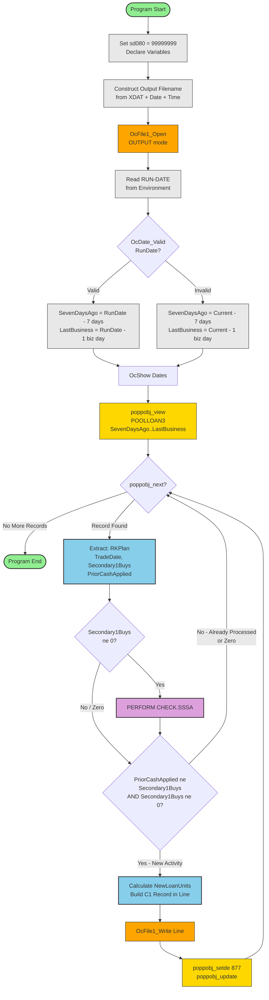
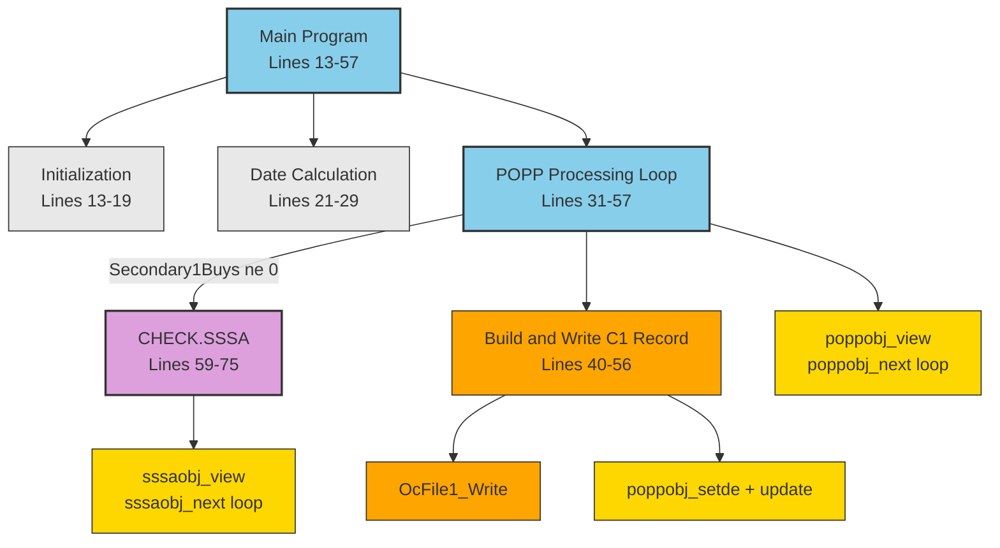
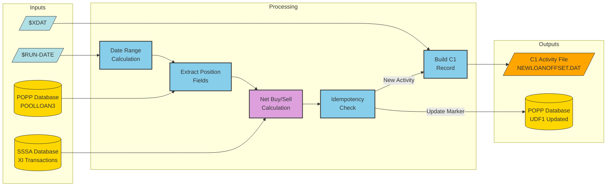
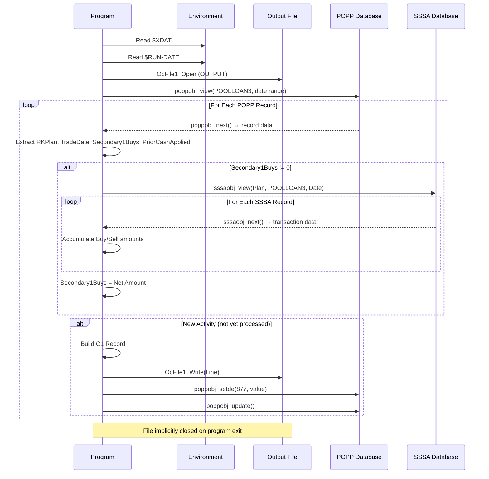
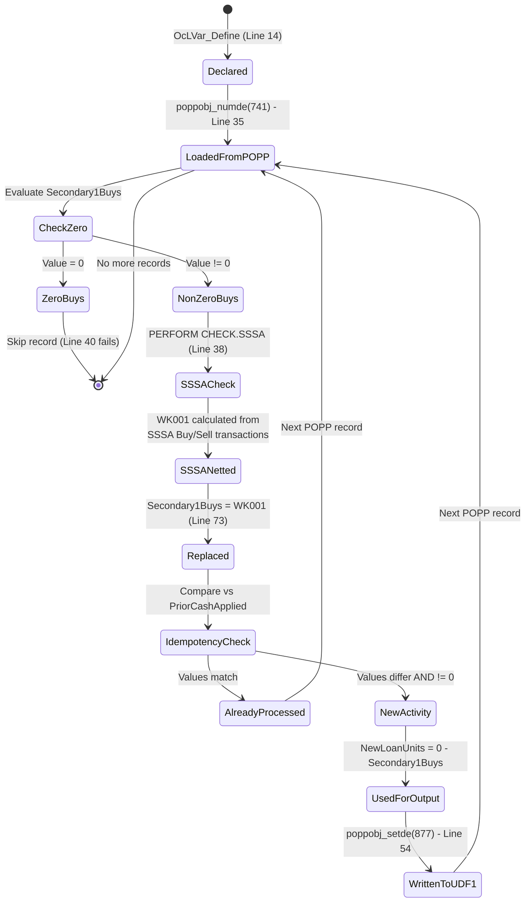
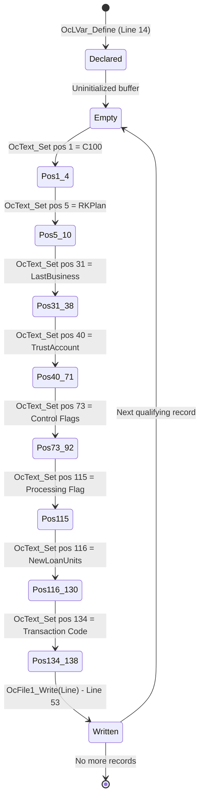

# GAP_NEWLOANCASH Visual Diagrams

## Overview

This document contains visual representations of the GAP_NewLoanCash program structure, flow, and dependencies generated using Mermaid diagrams. Core diagrams (Program Flow, Call Hierarchy, Data Flow) are also embedded in the [Program Overview](./GAP_NEWLOANCASH_OVERVIEW.md). This file contains the complete set including complex/detailed diagrams.

---

## 1. Program Flow Diagram

This flowchart shows the main processing logic from program start to end, including all decision points and the CHECK.SSSA subroutine.

**Key Insights**:
- The main loop processes POPP records until exhausted
- Two guard conditions filter records: non-zero buys and idempotency check
- CHECK.SSSA adjusts Secondary1Buys before the idempotency comparison
- Records that pass both checks get a C1 record written and POPP updated

---

## 2. Call Hierarchy

Shows all procedure call relationships and their conditions.

**Key Insights**:
- Simple two-level hierarchy: Main Program → CHECK.SSSA
- CHECK.SSSA is the only subroutine, called conditionally
- Database operations span both levels (POPP in main, SSSA in subroutine)

---

## 3. Data Flow Diagram

Shows how data moves from inputs through processing to outputs.

**Key Insights**:
- Two database sources feed the processing (POPP positions, SSSA transactions)
- Two outputs: C1 activity file (new data) and POPP database update (idempotency marker)
- Environment variables control output path and processing date window

---

## 4. File I/O Operations Timeline

Shows all file and database operations in execution order.

**Key Insights**:
- Output file is opened once at start, written to multiple times during processing
- SSSA views are opened/closed for each qualifying POPP record (nested I/O)
- POPP updates happen inline within the main POPP read loop
- No explicit file close operation

---

## 5. Variable Lifecycle State Diagram - Secondary1Buys

The most complex variable in the program, with mutations across the main loop and CHECK.SSSA.

**Key Insights**:
- Secondary1Buys undergoes a two-stage transformation: initial load from POPP, then potential replacement by SSSA net amount
- The value flows through three business checks: zero check, SSSA netting, idempotency check
- After processing, the value is persisted back to POPP as the idempotency marker

---

## 6. Variable Lifecycle State Diagram - Line (Output Buffer)

**Key Insights**:
- Line buffer is populated incrementally using positional OcText_Set calls
- Eight fields are set in sequence before each write
- Buffer is reused for each qualifying record (not explicitly cleared between writes)

---

## Tools and Resources

- [Mermaid Live Editor](https://mermaid.live) - Validate and preview diagrams
- [Mermaid Documentation](https://mermaid.js.org/intro/) - Syntax reference
- VS Code Extension: Mermaid Preview - Real-time preview in editor
