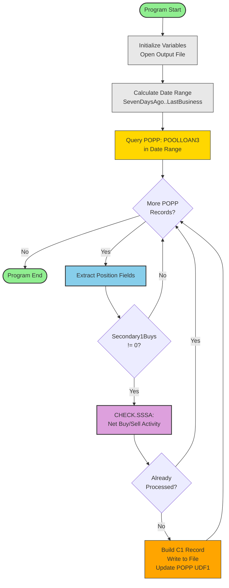
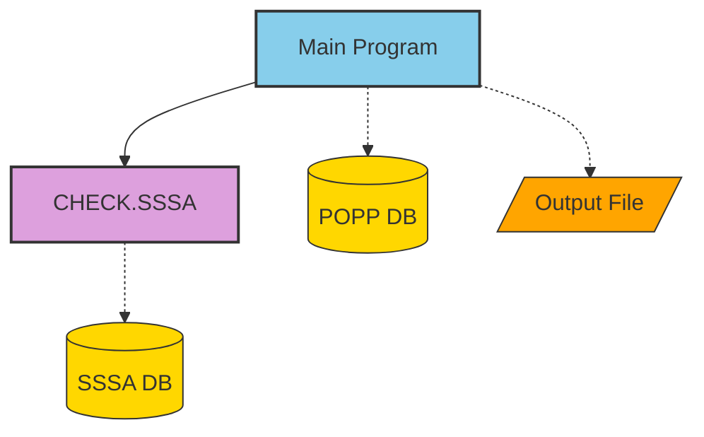
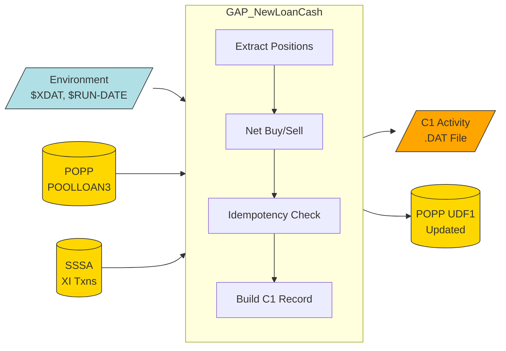

# GAP_NEWLOANCASH Program Overview

## Executive Summary

| Attribute | Value |
|---|---|
| **Program Name** | GAP_NewLoanCash |
| **Source File** | GAP_NewLoanCash.txt |
| **Language** | OmniScript |
| **Lines of Code** | 75 (excluding blank lines) |
| **Procedures** | 1 (CHECK.SSSA) + Main program flow |
| **Author** | Gary Matten |
| **Created** | 12/21/2023 |
| **Last Modified** | 09/25/2024 |
| **Complexity** | Small / Low |

**Purpose**: Reads Plan Position Accounts (POPP) for the last 7 calendar days, finds POOLLOAN3 position records with Secondary1 Buy activity, checks for buy/sell reversals in the SSSA, and generates C1 activity records for the right side (AC) of the cash reconciliation. Includes idempotency protection to prevent duplicate processing.

**Business Value**: Automates the creation of cash reconciliation offset entries for new loan activity in the POOLLOAN3 pool, ensuring accurate daily cash balancing. The program handles reversal scenarios (added 09/2024) to correctly net buy and sell transactions.

---

## Change History

| Date | Author | Reference | Description |
|---|---|---|---|
| 12/21/2023 | Gary Matten | - | Created OmniScript |
| 06/27/2024 | Gary Matten | GPD-1704 | Re-correcting position 92 to be a value of 2 instead of 1 |
| 09/25/2024 | Gary Matten | - | Recognize Loan Reversal Activity and Net Activity Correctly when there are BUYS and SELLS |

---

## Program Structure Index

| Component | Lines | Documentation |
|---|---|---|
| Initialization (variables, file) | 13-19 | [MAIN_PROCESSING](./procedures/MAIN_PROCESSING.md#step-1-environment-initialization) |
| Date Range Calculation | 21-29 | [MAIN_PROCESSING](./procedures/MAIN_PROCESSING.md#step-2-date-range-calculation) |
| POPP Record Processing Loop | 31-57 | [MAIN_PROCESSING](./procedures/MAIN_PROCESSING.md#step-4-record-processing-loop) |
| CHECK.SSSA Routine | 59-75 | [CHECK_SSSA](./procedures/CHECK_SSSA.md) |

---

## Architecture Overview

GAP_NewLoanCash is a small, single-purpose batch program that follows a standard Extract-Transform-Load (ETL) pattern:

1. **Extract**: Query POPP database for POOLLOAN3 positions in a 7-day window
2. **Transform**: Adjust buy amounts by netting against SSSA sell/reversal transactions
3. **Load**: Write C1 activity offset records to a flat file for downstream consumption

The program uses an **idempotency mechanism** (POPP UDF1/DE 877) to safely support re-runs without creating duplicate output records.

---

## Core Flow Diagrams

### Program Flow

### Call Hierarchy

### Data Flow

---

## Key Processing Logic

### 1. Date Range Determination
- Reads `$RUN-DATE` from environment; validates with `OcDate_Valid()`
- Falls back to current system date if invalid
- Lookback window: **7 calendar days** (lower bound) to **last business day** (upper bound)

### 2. POPP Position Extraction
- Queries POPP for security `POOLLOAN3` within the date range
- Extracts: Plan ID (DE 030), Trade Date (DE 008), Secondary1 Buys (DE 741), Prior Cash Applied (DE 877)

### 3. Reversal Netting (CHECK.SSSA)
- For positions with non-zero buy amounts, queries SSSA for the same plan/security/date
- Filters to `XI` transaction type only
- Accumulates: Buy (`B`) amounts are added, Sell (`S`) amounts are subtracted
- The net replaces the original Secondary1Buys value

### 4. Idempotency Check
- Compares `PriorCashApplied` (POPP DE 877) against the (potentially adjusted) `Secondary1Buys`
- If equal: record was already processed in a prior run - **skip**
- If different and non-zero: new or changed activity - **process**

### 5. C1 Record Generation
- Negates buy amount: `NewLoanUnits = 0 - Secondary1Buys` (offsetting entry)
- Builds fixed-width C1 record with plan, date, trust account, amount, and control fields
- Writes to output `.DAT` file

### 6. Idempotency Marker Update
- Sets POPP DE 877 (UDF1) to `Secondary1Buys` value
- Persists via `poppobj_update()`
- Prevents reprocessing on subsequent runs

---

## Business Rules Summary

| Category | Key Rules |
|---|---|
| **Date Range** | 7-day calendar lookback; last business day as activity date |
| **Filtering** | POOLLOAN3 security only; skip zero-amount records |
| **Netting** | SSSA XI buys add, XI sells subtract; net replaces original |
| **Idempotency** | UDF1 (DE 877) stores processed amount; matching values = skip |
| **Output** | C100 record type; transaction code 00339; position 92 = '2' |

Full business rules: [GAP_NEWLOANCASH_BUSINESS_RULES.md](./GAP_NEWLOANCASH_BUSINESS_RULES.md)

---

## Dependencies

### Database Objects

| Object | Access | Purpose |
|---|---|---|
| poppobj (POPP) | Read/Write | Plan position records for POOLLOAN3 |
| sssaobj (SSSA) | Read | Secondary security sub-account transactions |

### Environment Variables

| Variable | Required | Purpose |
|---|---|---|
| `$XDAT` | Yes | Output file directory path |
| `$RUN-DATE` | Optional | Processing date (fallback: current date) |

### Output

| File | Format | Consumer |
|---|---|---|
| `OTDALY.OMNISCRIPT.C1.NEWLOANOFFSET.{date}.{time}.DAT` | Fixed-width text | C1 activity loading process |

---

## Error Handling Summary

| Area | Status |
|---|---|
| RunDate validation | Implemented (fallback to current date) |
| File I/O errors | **Not implemented** (HIGH risk) |
| Database errors | **Not implemented** (MEDIUM risk) |
| Idempotency | Implemented (UDF1 comparison) |
| Atomicity (write + update) | **Not atomic** (HIGH risk for duplicates) |

Full error analysis: [GAP_NEWLOANCASH_ERROR_HANDLING.md](./GAP_NEWLOANCASH_ERROR_HANDLING.md)

---

## Performance Characteristics

- **Record volume**: Bounded by 7-day window and POOLLOAN3 positions
- **Database I/O**: One POPP view + one SSSA view per qualifying record
- **File I/O**: One write per qualifying record
- **Memory**: Low footprint (scalar variables only, no arrays)
- **Bottleneck**: Nested SSSA views within the POPP loop (O(N*M) database calls)

---

## Security Considerations

- No external program calls or user input beyond environment variables
- Database write access required for POPP UDF1 updates
- File system write access required for output directory
- No input sanitization beyond date validation
- No sensitive data handling (financial amounts but no PII)

---

## Testing Strategy

### Standard Tests
- Run with valid `$RUN-DATE` and verify C1 records generated
- Run with invalid/missing `$RUN-DATE` and verify fallback to current date
- Verify idempotency: re-run same date range, confirm no duplicate records

### Edge Cases
- POPP records with Secondary1Buys = 0 (should be skipped)
- SSSA records with only sells (net should be negative)
- SSSA records with matching buy and sell (net = 0, should be skipped)
- No POPP records in date range (empty output file)
- Already-processed records (PriorCashApplied = Secondary1Buys)

### Error Scenarios
- Invalid `$XDAT` path
- Database connection failure mid-processing
- Disk full during file write
- POPP update failure (check for duplicates on re-run)

---

## Maintenance Notes

### Known Issues
- **Dead variable**: `Secondary1Sells` is declared but never used
- **Redundant reads**: `RKPlan` and `TradeDate` are re-read at Lines 41-42 (same values as Lines 33-34)
- **No explicit file close**: Relies on OmniScript auto-close behavior

### Technical Debt
- Missing error handling for file and database operations
- Non-atomic file write + POPP update sequence
- No processing summary/count logging
- No explicit output file close

### Refactoring Recommendations
- Add error handling for all I/O operations
- Consider reversing operation order (update POPP before file write) to prevent duplicates
- Remove unused `Secondary1Sells` variable
- Remove redundant re-reads of RKPlan and TradeDate
- Add processing count logging (records read, processed, skipped)

---

## Navigation Paths

### For New Developers
1. This overview (executive summary and architecture)
2. [Program Flow Diagram](#program-flow) above
3. [MAIN_PROCESSING](./procedures/MAIN_PROCESSING.md) procedure documentation
4. [CHECK_SSSA](./procedures/CHECK_SSSA.md) routine documentation

### For Maintenance Developers
1. [Cross-Reference](./GAP_NEWLOANCASH_CROSS_REFERENCE.md) to find specific variables/operations
2. Relevant [procedure documentation](./procedures/)
3. [Error Handling](./GAP_NEWLOANCASH_ERROR_HANDLING.md) for risk awareness

### For Business Analysts
1. [Business Rules](./GAP_NEWLOANCASH_BUSINESS_RULES.md) for all extracted rules
2. [Data Flow Diagram](#data-flow) above
3. [Data Dictionary](./GAP_NEWLOANCASH_DATA_DICTIONARY.md) for field definitions

### For Auditors
1. [Error Handling](./GAP_NEWLOANCASH_ERROR_HANDLING.md) for risk assessment
2. [Business Rules](./GAP_NEWLOANCASH_BUSINESS_RULES.md) for compliance rules
3. [Integration Guide](./GAP_NEWLOANCASH_INTEGRATION_GUIDE.md) for data flow and controls

### For QA/Testers
1. [Testing Strategy](#testing-strategy) above
2. [Business Rules](./GAP_NEWLOANCASH_BUSINESS_RULES.md) for test case derivation
3. [Error Handling](./GAP_NEWLOANCASH_ERROR_HANDLING.md) for error scenarios

---

## Documentation Artifacts

| Document | Description |
|---|---|
| [GAP_NEWLOANCASH_DATA_DICTIONARY.md](./GAP_NEWLOANCASH_DATA_DICTIONARY.md) | All variables, types, usage, mutations |
| [GAP_NEWLOANCASH_CALL_GRAPH.md](./GAP_NEWLOANCASH_CALL_GRAPH.md) | Call relationships, DB operations, control flow |
| [GAP_NEWLOANCASH_DIAGRAMS.md](./GAP_NEWLOANCASH_DIAGRAMS.md) | All Mermaid diagrams (detailed) |
| [GAP_NEWLOANCASH_ERROR_HANDLING.md](./GAP_NEWLOANCASH_ERROR_HANDLING.md) | Error analysis and risk assessment |
| [GAP_NEWLOANCASH_INTEGRATION_GUIDE.md](./GAP_NEWLOANCASH_INTEGRATION_GUIDE.md) | External interfaces and deployment |
| [GAP_NEWLOANCASH_BUSINESS_RULES.md](./GAP_NEWLOANCASH_BUSINESS_RULES.md) | Extracted business rules |
| [GAP_NEWLOANCASH_CROSS_REFERENCE.md](./GAP_NEWLOANCASH_CROSS_REFERENCE.md) | Variable, procedure, DB, file indexes |
| [GAP_NEWLOANCASH_VALIDATION_REPORT.md](./GAP_NEWLOANCASH_VALIDATION_REPORT.md) | Self-validation and confidence scores |
| [procedures/MAIN_PROCESSING.md](./procedures/MAIN_PROCESSING.md) | Main program flow documentation |
| [procedures/CHECK_SSSA.md](./procedures/CHECK_SSSA.md) | CHECK.SSSA routine documentation |
